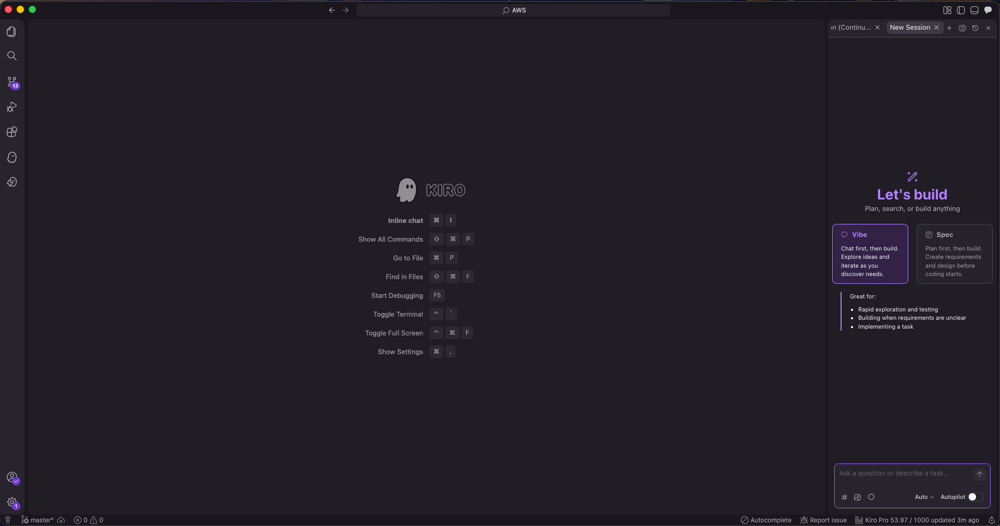
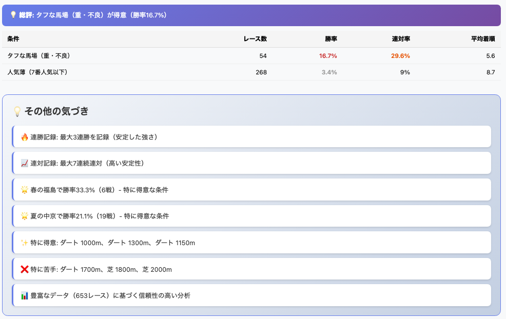

<div class="doc-header">
  <div class="doc-title">Kiroと競馬分析アプリをつくっていたら沼にハマっていっている話</div>
  <div class="doc-author">もつ</div>
</div>

# Kiroと競馬分析アプリをつくっていたら沼にハマっていっている話

## Kiroについて簡単に紹介

みなさんはAWS Kiroをご存知でしょうか。
KiroはAIを使ったIDEでClaude CodeのようにVibe Codingをしたり、Spec機能を使って要件定義から作成とウォーターフォール型の開発をしたり、デバッグしたりすることができます。
もっと多くの機能があり、1つの画面から出来るというのも大きな特徴なのですが、公式のサイトにはKiroの紹介は簡単な1文でした。

[Kiro](https://kiro.dev/) [^Kiro]

>Kiro helps you do your best work by bringing structure to AI coding with spec-driven development.

[^Kiro]: Kiro, https://kiro.dev/

Kiroはクレジットの消費によって利用料がきまっており、無料プランであれば月に50クレジット、PRO以上で1000クレジット以上を利用することが出来ます。数カ月利用してみたところ、無料枠では全然たりずにPROプランに落ち着くことになりました。料金は20$ですが、これらをAIなしに1人で設計から作成、改修をしていことを考えると安いと思います。2026年現在でのプランと料金は以下のとおりです。最新の情報はAWSのサイトをご確認ください。

[新しい料金プランと新エージェント「Auto」の発表](https://aws.amazon.com/jp/blogs/news/new-pricing-plans-and-auto/)

| プラン名 | Free | Pro | Pro+ | Power |
| :-: | :-: | :-- | :-- | :-: |
| 月額料金（ドル） | 0 | 20 | 40 | 200 |
| 利用可能クレジット | 50 | 1000 | 2000 | 10000 |
| 料金形態 | - | 従量課金($0.04 / クレジット) | 従量課金($0.04 / クレジット) | 従量課金($0.04 / クレジット) |

今回はVibe Codingでアプリを作成したときに悪戦苦闘していたときの開発経験談になります。

## Kiroに競馬分析のアプリを作成してもらう
AI分析をしようとするときにほぼ間違いなく出てくるのが「競馬をAIで当てよう」です。日本には他にも公営ギャンブルと呼ばれるものがありますが、圧倒的に競馬がネタになりがちです。最近だとウマ娘というコンテンツから知り新規参入者が増えたというのも1つの理由ですが、それだけでAI学習のネタになるわけではないと思っております。ちょっと競馬というものを紹介しつつどうしてAIでも分析が難しいのかを挙げてみます。
＊本記事は自分の趣味である競馬をネタにしておりますが、公営ギャンブルを推奨する意図はございません。推奨するのはKiroです。

### 競馬はある意味公平に競争してくれる
レースにもよりますが、場所や条件、レースをする馬が大きく変化するのが特徴です。人間で例えると10代から50代の男女が100ｍ走を走ったりマラソンをしたり、陸上トラックを走るかと思いきや砂浜を走らされるようなものでしょうか。こうなるとどこを走るのが適正なのかを見極めるのが難しくなっております。逆に言えば適正があるのにこれまでの戦績で人気しない、つまり買ったら回収率が高い馬を見抜けることにもなります。
他にもある公営ギャンブルのうち、馬は人の意志を完全に汲み取ることなく走るのもあって馬の特徴というのをつかめればデータとして出しやすいです。

### 分析するデータやネタがある程度出揃っている
データ分析するにはデータがそもそも必要です。競馬は血統による適正や調教と呼ばれる走る前までの状態等データとして多くのファクターがあります。人によってどのデータを重視するかでも予想が大きく変わりますし、データは膨大なので分析するアプローチ方法を考えるところから自由度があります。
これらのデータは中央競馬を開催しているJRAが公式にだしているJRA−VANという分析ツールやnetkeibaという最大のサイト、JRAの公式サイトを利用することで得られます。

## Kiroにデータ収集用のアプリを作らせる

KiroはダウンロードすることでWindows、Mac OSで利用することが出来ます。見やすい画面でChat GPTのように使えるので、真っ黒な画面が苦手な人でも入りやすいのが良いです。
開発していったときの流れを思い出しつつ、何をさせていったのかを書いてきます。

### データ収集の方針について
データとして利用する方法はいくつかありますが、今回はnetkeibaのデータを利用することにします。netkeibaのスクレイピングは禁止はされていませんがあまりに負荷のかかるリクエストをかけると利用制限がかかります。
>データベースの閲覧ができない・通信制限がかかった（スクレイビングについて）<br>
>上記は、スクレイピングなどの行為によりサービスの運営に支障をきたす場合も含まれます。
>スクレイピングはご自身の責任で、上記利用規約に抵触しないかを確認をお願いいたします。
バッチ化するのが本来正しいのですが、サイトへの負荷のことも考えて手動運用にします。

### 管理するテーブルの構成について
当初は簡単に終わると思っていたんですが、データ分析をちゃんとすること、人の目を使うことをまだ前提とするアプリなので、以下のような構成になりました。
```
・全体的な血統データ：いわゆる系統を記載するもの
・馬の血統データ：個別の馬の血統データのみ
・馬の経験したレースデータ：それぞれのふりかえりでメモをするため
・コースデータ：上記のレース結果をコース適性に照らし合わせるためのもの
・速報データ：傾向によって結果が大きく変わるため、上記のレースデータとは異なるテーブルで管理
```

### あとは日本語でやりたいこと、解析させたいこと、表示させたい方法を伝えながらアプリ開発をする
これらを入力しながら逐一やりとりをしていきます。どの言語を使うかまで指定しなかったので今回はTypeScriptで実装しました。ドラフト版ができあがるまで30分もかからなかったです。

### Kiroに作ってもらった分析アプリ

詳細を載せて良いのか怪しいので具体的には伏せますが、結構なデータを分析・評価できるまでになりました。データ量が膨大になったのでこれを自分で分析するには骨がおれますし、名前検索だけでここまでちゃんとした結果を出力してくれて思っている以上でした。

## アプリ作成していて出てきた課題達
Kiroはとても便利で、上記で紹介したDBとやりたいこと、netkeibaからどんな情報をとってきてどうすれば負荷をかけずにできるかを日本語で要件をまとめていけばコードがかけなくてもあっという間に形にしてくれます。
ただし、さくっと出来ると思ってやったらそうもいかず、躓いたところと反省点を幾つか書いていこうと思います。

### 何度もやることはmdファイルでまとめること
プロンプトを送る時に何度も記載することを書いたとしても無視されます。自分の場合はバックアップを何度も取得するように指示したにもかかわらず、無視されてバックアップとったとってないで喧嘩しました（笑）
Kiro以外にも言えることですが、開発や分析で固定するものは必ずどこかに記載して読み込ませるようにさせるべきです。「こんなことしたい」とふわっとした内容でも形にしてくれて優秀なんですが、プロンプトでは指示を忘れてしまうのは多々ありました。

### UIは画像で指示したほうが早く進む
一覧にしてほしいもの、表示してほしいもの、逆に不要なデータをどうしてほしいかを文章や位置で示しても伝わらないですし、なんなら自分でつくったものを無視して勝手に改善し始めます。
多少めんどくさくてもイメージ図とそれぞれのカラムを指定して渡すとすんなりと受け取ってもらえました。設計書と構成図が大事なのは人もAIも同じでした。

### 競馬についてはまるで素人だった
当然といえば当然なのですが、AIに競馬はわかりません。人には気づかないようなデータ分析を求める一方で、全くと言って良いほど意味のないデータを使って結果を出してきます。
ある程度はどういうものがほしいのか、どういった観点のデータをだしてほしいのかを指示して上げる必要があり、結局のところこれまで利用していた競馬の知識をインプットさせていく必要があります。
クラスタリングさせた結果を示すようにして、データにはない情報を人間で照らし合わせて情報を随時追加していくことでこの辺は精度が高まることを期待しています。

## Kiroでアプリ開発のハードルがぐっと下がったのは良いですね。
実際の映像を見ないとわからないレース展開、馬の調子等データ化されてないものをどうやってデータに落とし込むか、分析の精度をどうやって引き上げるかを悩んでいるところです。データ収集のみではこれらは無理そうなので映像を解析させるか、そういう部分も含めて予測してある程度考えてもらえないかは今後の課題です。
とはいってもここまでのアプリを作るのに仕事終わりの時間を利用して半月で出来上がったのもすごいなと感じました。Kiroには他にも趣味で使っている自作キーボードの機能作成をしてもらったり、ネタアプリをつくったりとまだまだ使い倒したとは言えないのでどんどん使っていこうと思います。
