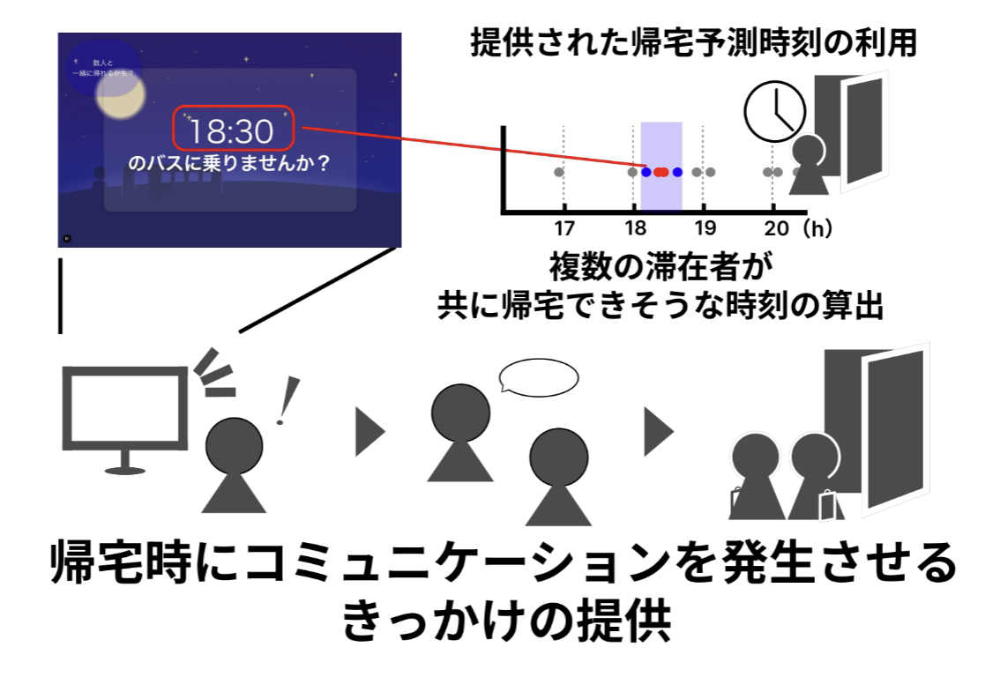

<div class="doc-header">
  <div class="doc-title">AndroidでiBeacon(BLEビーコン)の送受信をしてみる</div>
  <div class="doc-author">牧野遥斗</div>
</div>

# はじめに

みなさん、BLEビーコンを知っていますでしょうか。BLEビーコンは Bluetooth の一種で、近距離通信を利用して位置情報や識別情報を発信する小型のデバイスです。スマートフォンと連携して、店舗のクーポン配信や屋内測位など、さまざまな用途で活用されています。
BLEビーコンを用いると、自分の状態を簡単に伝播させたり、BLEビーコンの電波情報を使用して端末の位置情報を取得できるようになります。
実際に、コロナ禍で利用された接触確認アプリ「COCOA」も BLE を活用していました。端末同士が近づいた記録を電波で交換し、後から通知を行う仕組みです。
このように BLE を使うと、ユーザーの「近さ」や「すれ違い」といった物理的な体験をアプリに取り込めます。
この章では、そんなBLEビーコンの簡単な説明と活用例、Androidでの実装方法をざっくり紹介します。

今回BLEの活用方法を中心とした構成となっているため、具体的な技術説明をかなり飛ばしながら進めていきます。BLE の通信プロトコルやビーコンの仕組みについて詳しく知りたい方は、堤修一・松村礼央著『iOS×BLE Core Bluetooth プログラミング』（ソシム、2015 年）を参照してください。BLE の規格から iPhone での実際の送受信の仕方までわかりやすく書かれた本です。本章では仕組みの解説は最小限にとどめ、Android と Jetpack Compose で iBeacon の送受信を実装する方法に絞って解説します。

[^ble-book]: 堤修一・松村礼央『iOS×BLE Core Bluetooth プログラミング』ソシム、2015 年

## iBeacon とは

iBeacon は Apple が 2013 年に発表した BLE ビーコンの規格です[^ibeacon-apple]。ビーコンが発信するパケットには次の識別子が含まれています。

| フィールド | サイズ | 説明 |
| :-- | :-: | :-- |
| UUID | 16バイト | サービスを識別する一意の ID |
| Major | 2バイト | UUID の下位グループ（0～65535） |
| Minor | 2バイト | Major のさらに下位グループ（0～65535） |
| Measured Power | 1バイト | 1m 地点での RSSI 基準値 |

受信側は UUID、Major、Minor でビーコンを識別し、RSSI と Measured Power の差分から距離を推定します。

[^ibeacon-apple]: Getting Started with iBeacon - Apple https://developer.apple.com/ibeacon/Getting-Started-with-iBeacon.pdf

# BLEビーコンの活用例

## クーポンの発行

店舗に BLE ビーコンを設置し、来店した顧客のスマートフォンにクーポンやセール情報をプッシュ配信するシステムはビーコンの代表的な活用例です。

LINE は「LINE Beacon」をリリースし、自分のいる場所と連動したメッセージや情報がその場でLINEに届くシステムを提供しています[^line-beacon]。その「LINE Beacon」を用いて広告を発生させるサービスとして「LINE POP Media」を提供し、ビーコンを設置した店舗に近づくと、LINE アプリがクーポンやイベント情報を通知していました。LAWSONやミニストップなどの大手コンビニチェーンも導入していましたが、2024年10月以降サービスは終了してしまいました。[^line-pop-media]。

[^line-beacon]: LINE Beacon https://guide.line.me/ja/account-and-settings/settings/line-beacon.html
[^line-pop-media]: LINE POP Media https://www.lycbiz.com/jp/service/line-pop-media/

## 滞在管理システム

BLE ビーコンはオフィスのフリーアドレス化やテレワークの普及に伴い、社員の所在管理に活用されています。
愛知工業大学 梶研究では、ビーコンを活用した滞在管理システムを開発し、学生の出席管理や施設利用状況の把握に利用しています[^stay-watch]。学生にBLEビーコンタグを持ち歩いてもらい、施設に設置されているビーコンの受信機がタグの電波を検知することで、学生の滞在状況をリアルタイムで把握できます。これにより、研究室内にいる学生の人数や滞在時間を自動的に集計し、誰がどこにいるかを管理することができます。さらに、滞在時間のデータを分析することで、施設の利用状況や学生の行動パターンを把握し、誰がいつ帰りそうかを予測することも可能になります。この行動パターンを利用して、学生が帰るタイミングとシャトルバスの時間を利用して、一緒に帰る人をマッチングしてコミュニケーションを促進させる機能も開発しています[^leaving-match]。



[^stay-watch]: 愛知工業大学 梶研究 情報処理学会 第82回全国大会にて「滞在ウォッチにおける管理コストの削減」を発表しました https://kajilab.net/post/2020-03-25/
[^leaving-match]: 愛知工業大学 行動情報科学研究室の学生2名がWiNF2025で受賞 https://www.ait.ac.jp/lab-news/detail/0000875.php

## すれ違い通信

新型コロナウィルスの感染拡大を受けて、厚生労働省が 2020 年に公開した接触確認アプリ「COCOA」は、BLE の Advertising 信号を活用した代表的な事例です[^cocoa]。Google と Apple が共同開発した Exposure Notification API を基盤としています。スマートフォンが BLE で周囲のデバイスへ定期的に信号を送受信することで、おおむね 1m 以内で 15 分以上の接触を検知・記録しました。

[^cocoa]: COCOA 接触確認アプリの仕組み https://www.watch.impress.co.jp/docs/topic/1260404.html

## 屋内測位

GPS が利用できない屋内環境において、BLE ビーコンを複数設置して三点測位を行い、現在地を推定する技術です。東京駅では構内に 160 箇所の BLE ビーコンが設置され、利用者の位置を数メートル単位で特定する屋内ナビゲーションアプリが提供されています[^tokyo-station]。世界各地の空港でも導入が進んでおり、ガトウィック空港（イギリス）では 2,000 個のビーコンが設置されています[^airport-beacon]。

[^tokyo-station]: DNP 東京駅構内ナビゲーション https://www.dnp.co.jp/news/detail/1188040_1587.html
[^airport-beacon]: 空港内ビーコン活用事例 https://iridge.jp/blog/201706/15267/

## 忘れ物トラッカー

Apple の AirTag は BLE を活用した忘れ物トラッカーです。AirTag は BLE 信号を常時発信し、周囲の Apple デバイスが Find My ネットワーク経由でその位置を中継します[^airtag]。位置情報はエンドツーエンドで暗号化されており、所有者の Find My アプリのみが復号できます。BLE の到達距離は約 10m ですが、世界中の Apple デバイスが中継に参加するため、Bluetooth の範囲を超えた追跡を実現しています。

[^airtag]: How Do Apple AirTags Work https://www.connectivity.technology/2025/03/how-do-apple-airtags-work.html


# 実装準備

本章では **Android Beacon Library** を使用します[^altbeacon-lib]。AltBeacon プロジェクトが提供するライブラリで、iBeacon を含むさまざまなフォーマットのビーコンを扱えます。

[^altbeacon-lib]: Android Beacon Library https://github.com/AltBeacon/android-beacon-library

## ライブラリの導入

本章では Gradle の Version Catalog を使用して依存関係を管理します。まず `gradle/libs.versions.toml` にライブラリを追加します。

```toml
# gradle/libs.versions.toml
[versions]
androidBeaconLibrary = "2.21.2"

[libraries]
android-beacon-library = {
  module = "org.altbeacon:android-beacon-library",
  version.ref = "androidBeaconLibrary"
}
```

次に `app/build.gradle.kts` の `dependencies` ブロックに追加します。

```kotlin
// app/build.gradle.kts
dependencies {
    // ... 他の依存関係 ...
    implementation(libs.android.beacon.library)
}
```

[^altbeacon-releases]: Android Beacon Library Releases https://github.com/AltBeacon/android-beacon-library/releases


## Bluetoothパーミッションについて

Android で BLE を使用するためには、複数のパーミッションが必要です。特に **Android 12（API 31）以降**では Bluetooth 関連のパーミッションが大きく変更されました[^bt-permissions]。

[^bt-permissions]: Android Developers - Bluetooth permissions https://developer.android.com/develop/connectivity/bluetooth/bt-permissions

### Android 12 以降で追加されたパーミッション

Android 12 からは、Bluetooth の操作ごとに細分化されたランタイムパーミッションが導入されました。

| パーミッション | 用途 |
| :-- | :-- |
| `BLUETOOTH_SCAN` | 周囲の BLE デバイスをスキャンする |
| `BLUETOOTH_ADVERTISE` | 自端末を BLE デバイスとしてアドバタイズする |
| `BLUETOOTH_CONNECT` | ペアリング済みの Bluetooth デバイスと通信する |

これらは**ランタイムパーミッション**です。`AndroidManifest.xml` への宣言に加えて、実行時にユーザーへ許可を求める必要があります。

### Android 11 以前のレガシーパーミッション

Android 11（API 30）以前では、次の 2 つのパーミッションで Bluetooth 操作をカバーしていました。

| パーミッション | 用途 |
| :-- | :-- |
| `BLUETOOTH` | BLE を含むすべての Bluetooth 通信を行う |
| `BLUETOOTH_ADMIN` | デバイス検出や Bluetooth 設定の変更を行う |

Android 12 以降をターゲットにする場合は `android:maxSdkVersion="30"` を指定します。これにより、Android 12 以降では自動的に無視されます。

### 位置情報パーミッション

BLE スキャンは周囲のデバイス情報を取得するため、位置情報に関するパーミッションも関係します。

| パーミッション | 用途 |
| :-- | :-- |
| `ACCESS_FINE_LOCATION` | BLE スキャン結果から位置を推定する場合に必要 |
| `ACCESS_COARSE_LOCATION` | おおまかな位置情報の取得に使用 |

Android 12 以降では、BLE スキャンで位置情報を推定しない場合に `BLUETOOTH_SCAN` へ `neverForLocation` フラグを付与できます。このフラグを付けると位置情報パーミッションの要求を省略できます。ただし、一部のビーコンはフィルタされることがあります。

### Compose でのランタイムパーミッション

Jetpack Compose では `rememberLauncherForActivityResult` を使ってパーミッションをリクエストします。送信と受信で必要なパーミッションは異なります。

```kotlin
// 送信に必要なパーミッション
private fun sendPermissions(): Array<String> {
  val perms = mutableListOf<String>()
  if (Build.VERSION.SDK_INT >= Build.VERSION_CODES.S) {
    perms.add(Manifest.permission.BLUETOOTH_ADVERTISE)
  }
  return perms.toTypedArray()
}

// 受信に必要なパーミッション
private fun receivePermissions(): Array<String> {
  val perms = mutableListOf(
    Manifest.permission.ACCESS_FINE_LOCATION
  )
  if (Build.VERSION.SDK_INT >= Build.VERSION_CODES.S) {
    perms.add(Manifest.permission.BLUETOOTH_SCAN)
    perms.add(Manifest.permission.BLUETOOTH_CONNECT)
  }
  return perms.toTypedArray()
}
```


Compose 画面内でパーミッションの確認とリクエストを行います。

```kotlin
@Composable
fun BeaconScreen() {
  val context = LocalContext.current
  var granted by remember {
    mutableStateOf(hasPermissions(context))
  }

  // パーミッションリクエスト用ランチャー
  val launcher = rememberLauncherForActivityResult(
    ActivityResultContracts.RequestMultiplePermissions()
  ) { result ->
    granted = result.values.all { it }
  }

  if (!granted) {
    Button(onClick = {
      launcher.launch(requiredPermissions())
    }) {
      Text("パーミッションを許可する")
    }
  } else {
    // ビーコンの送信/受信UI
  }
}
```

## BeaconManager の初期化

`MainActivity` で `BeaconManager` を初期化し、iBeacon のパーサーを登録します。

```kotlin
class MainActivity : ComponentActivity() {
  private lateinit var beaconManager: BeaconManager

  override fun onCreate(savedInstanceState: Bundle?) {
    super.onCreate(savedInstanceState)

    // BeaconManagerの初期化
    beaconManager = BeaconManager
      .getInstanceForApplication(this)

    // iBeaconパーサーの登録
    beaconManager.beaconParsers.add(
      BeaconParser().setBeaconLayout(
        "m:2-3=0215,i:4-19,i:20-21,i:22-23,p:24-24"
      )
    )

    enableEdgeToEdge()
    setContent {
      AppContent(beaconManager)
    }
  }
}
```

`setBeaconLayout` に渡す文字列は iBeacon フォーマットのパーサーレイアウトです。`0215` は iBeacon のプレフィックスを表します。`i:4-19` は UUID、`i:20-21` は Major、`i:22-23` は Minor、`p:24-24` は Measured Power のバイト位置です。


# BLEビーコンの送信方法

`BeaconTransmitter` を使って iBeacon 信号を送信します。フォアグラウンドサービスを使わずに、Compose の画面から直接送信できます。

```kotlin
@Composable
fun BeaconSendScreen() {
  val context = LocalContext.current
  var uuid by remember {
    mutableStateOf(
      "2f234454-cf6d-4a0f-adf2-f4911ba9ffa6"
    )
  }
  var major by remember { mutableStateOf("1") }
  var minor by remember { mutableStateOf("1") }
  var isTransmitting by remember {
    mutableStateOf(false)
  }
  var transmitter by remember {
    mutableStateOf<BeaconTransmitter?>(null)
  }

  // 画面離脱時に送信を自動停止する
  if (isTransmitting) {
    DisposableEffect(Unit) {
      onDispose {
        transmitter?.stopAdvertising()
        transmitter = null
      }
    }
  }

  // UUID / Major / Minor の入力フィールド（省略）

  Button(onClick = {
    if (isTransmitting) {
      // 送信停止
      transmitter?.stopAdvertising()
      transmitter = null
      isTransmitting = false
    } else {
      // ビーコンデータの構築
      val beacon = Beacon.Builder()
        .setId1(uuid)
        .setId2(major)
        .setId3(minor)
        .setManufacturer(0x004C) // Apple
        .setTxPower(-59)
        .build()

      // パーサーの作成と送信開始
      val parser = BeaconParser().setBeaconLayout(
        "m:2-3=0215,i:4-19,i:20-21,i:22-23,p:24-24"
      )
      val tx = BeaconTransmitter(context, parser)
      tx.startAdvertising(beacon)
      transmitter = tx
      isTransmitting = true
    }
  }) {
    Text(
      if (isTransmitting) "送信停止" else "送信開始"
    )
  }
}
```

`Beacon.Builder` で UUID、Major、Minor を設定し、`setManufacturer(0x004C)` で Apple の Company ID を指定します。`setTxPower(-59)` は 1m 地点での RSSI 基準値です。`DisposableEffect` を使うことで、画面を離れたときに送信を自動停止できます。


# BLEビーコンの受信方法

受信側では `BeaconManager` と `RangeNotifier` を使ってビーコンをスキャンします。

```kotlin
@Composable
fun BeaconReceiveScreen(
  beaconManager: BeaconManager
) {
  var beacons by remember {
    mutableStateOf<List<Beacon>>(emptyList())
  }
  var isScanning by remember {
    mutableStateOf(false)
  }

  // スキャン中のみ RangeNotifier を登録
  if (isScanning) {
    DisposableEffect(Unit) {
      val region = Region(
        "ibeacon-region", null, null, null
      )
      val notifier = RangeNotifier {
        detected, _ ->
          beacons = detected.toList()
      }
      beaconManager.addRangeNotifier(notifier)
      beaconManager.startRangingBeacons(region)

      onDispose {
        beaconManager.stopRangingBeacons(region)
        beaconManager.removeRangeNotifier(notifier)
        beacons = emptyList()
      }
    }
  }

  Button(onClick = { isScanning = !isScanning }) {
    Text(
      if (isScanning) "スキャン停止" else "スキャン開始"
    )
  }

  // 検出結果の表示
  LazyColumn {
    items(beacons) { beacon ->
      Card {
        Column(modifier = Modifier.padding(12.dp)) {
          Text("UUID: ${beacon.id1}")
          Text("Major: ${beacon.id2}")
          Text("Minor: ${beacon.id3}")
          Text("RSSI: ${beacon.rssi}")
          Text(
            "距離: ${"%.2f".format(beacon.distance)}m"
          )
        }
      }
    }
  }
}
```

## 受信コードの解説

### Region（リージョン）

`Region` はビーコンのフィルタリング条件を定義するクラスです。コンストラクタの引数は次のとおりです。

```kotlin
Region(uniqueId, id1, id2, id3)
// uniqueId: リージョンを識別する一意の文字列
// id1: UUID でフィルタ（nullで全UUID）
// id2: Major でフィルタ（nullで全Major）
// id3: Minor でフィルタ（nullで全Minor）
```

すべて `null` を指定すると、周囲のすべての iBeacon を検出します。特定の UUID のビーコンのみを検出したい場合は `id1` に UUID を指定します。

### RangeNotifierとDisposableEffect

`RangeNotifier` はビーコンのスキャン結果を受け取るコールバックです。`addRangeNotifier` で登録し、`startRangingBeacons` でスキャンを開始します。Compose の `DisposableEffect` を使うことで、画面を離れたときに `stopRangingBeacons` と `removeRangeNotifier` で後片付けを行います。検出された各 `Beacon` オブジェクトからは UUID（`id1`）、Major（`id2`）、Minor（`id3`）、RSSI、推定距離（`distance`）を取得できます。

# まとめ

本章では、Android Beacon Library と Jetpack Compose を使った iBeacon の送受信を実装しました。`BeaconTransmitter` で送信し、`BeaconManager` と `RangeNotifier` で受信するというシンプルな構成です。Android 12 以降のパーミッション対応を押さえておけば、BLE ビーコンを使ったアプリ開発に取り組めます。ぜひ試してみてください。
