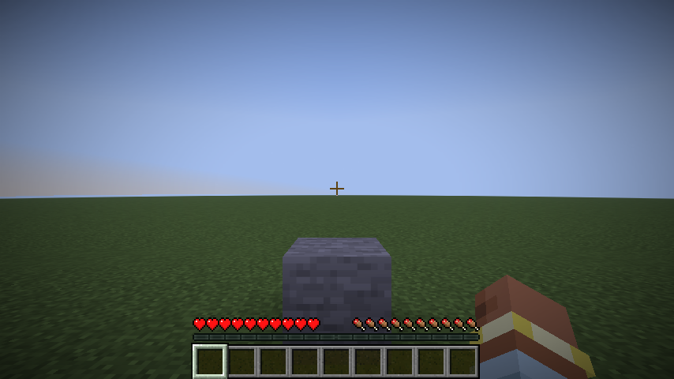

<div class="doc-header">
  <div class="doc-title">Minecraft Moddingの話</div>
  <div class="doc-author">k_kojima</div>
</div>

# Minecraft Moddingの話

## 注意点

この記事の内容は2026年初頭の情報に基づいています。
技術的に複雑な内容を含むため、間違いや正確ではない表現が含まれている可能性があります。
歴史の話であったり昔の話をする部分もありますが、記憶を頼りに記載しているので間違っているかもしれません。

主に Minecraft Java Edition 1.21.11 に対しての内容になります。

この記事はすべて人手で書かれていますが、推敲や調整には AI が使われています。

### Modの危険性について

Mod の導入は本質的に他人の書いたコードを手元の環境で動かす行為にあたります。
Minecraft では実行環境の分離などはされていないため、 Mod には常にユーザーと同じ権限が付与されます。
Java のプロセスとしてできることはすべて Mod にも許可されています。
任意のコードの実行が Mod として可能だということです。
そのため信頼できない発行元からのダウンロードや実行はユーザー環境を危険に晒す可能性があります。
ユーザーからの許諾などなくともファイルシステムにアクセスできます。

Mod 開発者は一般的に Mod 配布用のサイトにファイルをアップロードすることが多いですが、悪意あるサイトが勝手に二次配布している場合があります。
この時元のファイルが改変されウイルスが仕込まれている場合があります。
開発者が公式だと表明していない箇所からのダウンロードはしないようにしてください。

また、 Minecraft Mod を対象としたマルウェアが過去に配布されていたことがあります。
悪意あるソフトウェアを実行してしまうリスクについて十分に理解するようにしてください。
Mod の配布プラットフォーム上でも既知のマルウェアについてチェックなどされているようですが、新しい仕組みであったり隠された悪意あるコードの検知はされない可能性があります。
有名な箇所で配布されているからといって安全というわけではありません。

Minecraft は一般的な Java アプリケーションと同じく、使用しているライブラリの脆弱性の影響を受けます。
2021年に発見された Log4j の脆弱性は任意のコードを実行可能とするものでした。
一般的に Mod が外部のライブラリに依存していることは少ないのですが、 Minecraft 自体の依存関係や、Mod 同士の依存関係により脆弱性のあるライブラリが導入されることがあることに注意してください。

## Minecraft について

公式サイト

https://www.minecraft.net/ja-jp

言わずと知れた PC ゲームとして非常に有名なタイトルです。
開発元が Microsoft に買収されており、公式ページには Microsoft のロゴも掲載されています。
Google 検索して気づきましたが、 Minecraft と検索するとちょっとしたお楽しみ要素が検索ページに実装されているようです。
それほどにも有名なタイトルということです。

Minecraft は大きく分けて2つの版があります。
Java 版と、 Bedrock 版です。

Java 版は15年以上前から開発が続いている、その名の通り Java 上で動作するバージョンになります。
そのため動作環境は PC のみです。 OS は選ばず、 Windows, Mac, Linux どの環境でも動作します。
今回の主題である Mod をインストールできるのはこちらです。
Minecraft Java Editionと呼ばれたりもします。
Java 版は Bedrock 版よりも要求される PC のスペックが低いようです。

Bedrock 版は PC だけではなく家庭用ゲーム機などでも動作するバージョンです。
別名として統合版と呼ばれることもあります。単に Minecraft とだけ呼ばれていることもあります。
異なるゲーム機であってもクロスプラットフォームなマルチプレイができたり、公式がマルチプレイするためのサーバーを提供していることが特徴です。
Windows には対応していますが Mac, Linux には対応していません。
対応する GPU を積んだマシンであればレイトレーシングが使えます。非常に綺麗です。
詳しくは https://www.minecraft.net/ja-jp/about-minecraft を参照ください。

公式サイトにはいかに Bedrock 版の対応要素が多いかを表す表が載っているのですが、その中でも唯一 Bedrock 版が対応していない要素が Mod です。
このたった一つの要素は他の全てをひっくり返すことができます。
Mod は Minecraft の規約上有料では配布できません。そのため、無料で配布されています。

Bedrock 版にも実は Addon という機能があるのですが、公開されている数は Mod に比べて少ないように思います。
また、調べて気づきましたが有料の Addon が多いです。

https://minecraft.wiki/w/Add-on

Minecraft Wikiはたくさん検索に引っかかりますが、今更新されているのは以下の2種類です。

* [Minecraft 公式 Wiki(日本語版)](https://ja.minecraft.wiki/): https://ja.minecraft.wiki/
* [Minecraft Japan Wiki(非公式Wiki)](https://minecraftjapan.miraheze.org/wiki/Minecraft_Japan_Wiki): https://minecraftjapan.miraheze.org/wiki/Minecraft_Japan_Wiki

前者は公式 Wiki と呼ばれているもので、日本語や英語を含め多言語のページがあります。
後者は非公式日本語 Wiki と呼ばれていたと記憶しています。

### Minecraftのバージョニングについて

今の最新バージョンは `1.21.11` です。一見セマンティックバージョニングに見えますが、実際には異なります。
先頭の1は固定値です。Minecraftが正式版になってからずっと1のままです。
次の21の箇所が事実上のmajorに当たります。
最後の11の箇所がminor, patchに相当します。

ただ近年minorばかりが上がり続け、minorらしからぬ変更点が多数含まれるようになりました。
Minecraft自体のリリースサイクルが変わったことが原因ですが、それとバージョンづけの相性が良くないように思います。
そのためか、次期バージョンからはリリース年をベースとした命名に変更されるようです。

つまり `1.21.11` の次のバージョンは `26.1` (2026年の1回目のリリース) になります。

https://www.minecraft.net/ja-jp/article/minecraft-new-version-numbering-system

### Javaのバージョンについて

Minecraftのバージョンごとに、動作に必要なJavaのバージョンも異なります。
Minecraft 1.16.5まではJava 8が必要でした。
次のMinecraft 1.17からはJava 16が必要になったのですが、公開日は2021/06/08です。それ以前までは新しいJavaの機能や恩恵を受けられていなかったのです。
その頃ちょうど、 `var` によるローカル変数定義や、interfaceへのprivateメソッド追加、 `List.of` のような便利関数など、Java 9〜11では大幅な拡張がなされていました。やっと使えるようになったのを喜んだ記憶があります。
Java 16ではRecordが使えるので、よりコードがすっきりしていきました。
Java 8が必要になったのは Minecraft 1.12 の2017/06/07からなので、4年も同じJavaバージョンが必要とされていたようです。
ちなみにJava 11のリリースは2018/09/25なので、新機能が使えるとの告知を3年弱は歯噛みしながら見ていたことになります。

Minecraft 1.21.11ではJava 21を使っています。次期バージョンではJava 25を使えるようです。

## Mod の立ち位置

以下では、 Mod の入っていない環境のことを Vanilla (バニラ) 環境と呼びます。

### Modとは

Mod は非公式なゲーム拡張です。
公式サイトに Mod について言及自体はあるので、公式からも認知はされているようですが、 Mod を使ったプレイは公式サポートの対象外になります。

Java で動くコードなので、 Java でできることは何でもできます。
その他、 Minecraft 単体や、 Mod 開発用のプラットフォームでサポートされていることができます。
例えばブロックを追加したり、アイテムを追加したり、新しい敵を追加したり、新しい建造物やディメンションを追加したり、プレイヤーに属性を追加したり、アイデア次第で何でもできます。
それどころか、素の Minecraft で定義されていた動作そのものを変えることすらできます。

実体は Jar ファイルのことがほとんどで、昔はまれに Zip ファイルのことがありました。
Jar は Zip として開くことができるので、ダウンロードしてきた Mod の拡張子を `.zip` に変更すると中身が見られます。

有名な Mod 配布プラットフォームとして、 [CurseForge](https://www.curseforge.com/) や [Modrinth](https://modrinth.com/) があります。 Modrinth の方が後発です。
どちらのプラットフォームもデスクトップで動作するランチャーを配布しており、そこから簡単に Mod を導入することができます。
単に Jar ファイルをダウンロードすることもできます。

### Datapackとの違い

Java 版にはバニラで使える拡張として、Datapackがあります(Modでも使えます)。
こちらは Minecraft 公式が用意している拡張方法です。
Minecraft 側で定義された動作を組み合わせ、新しいアイデアを実現していく方法になります。
例えば Mob のドロップを変更したり、エンチャントを追加したり、レシピを変更したり、進捗を追加したりできます。

[https://ja.minecraft.wiki/w/データパック](https://ja.minecraft.wiki/w/%E3%83%87%E3%83%BC%E3%82%BF%E3%83%91%E3%83%83%E3%82%AF)

Datapack 自体は Mod と対立するものではありません。 Mod にも Datapack に準拠したファイルは入っていますし、バニラで動く Datapack は Mod 環境でも動作する可能性があります(しないこともあります)。

Datapack は JSON で記載することがほとんどです。
Minecraft が提供している DSL のルールに則り記述していきます。
AWS CloudFormation用のJSONを書いているのと感覚的には同じです。

バニラでは Minecraft が提供している「動作」のみ記述できます。
それを組み合わせることによって Datapack の制作者は目的となる挙動を実現していきます。
Mod ではこの「動作」を新しく定義したり、拡張できます。

例えばレシピのシステムを考えます。
Minecraft 単体では、作業台のレシピであったり、かまどのレシピを定義できます。
作業台でも、3x3で固定配置のレシピや、配置を問わないレシピであったり、地図を拡張するような特別なレシピもあります。
Mod で追加されたアイテムのレシピを追加する際、単に固定配置のレシピでよければバニラと同じシステムを使いまわせます。
もし Mod で追加される独自ロジックのレシピを追加したければ、 Datapack から Mod 独自のレシピを呼び出すような移譲の仕組みをとって開発します。

鉄ピッケルのレシピは以下のJSONで表されます。

```json
{
  "type": "minecraft:crafting_shaped",
  "pattern": [
    "XXX",
    " # ",
    " # "
  ],
  "key": {
    "#": {
      "item": "minecraft:stick"
    },
    "X": {
      "item": "minecraft:iron_ingot"
    }
  },
  "result": {
    "item": "minecraft:iron_pickaxe"
  }
}
```

[https://ja.minecraft.wiki/w/レシピ](https://ja.minecraft.wiki/w/%E3%83%AC%E3%82%B7%E3%83%94) より引用

Mod で追加したアイテムを同じ仕組み追加したければ、 `result.item` の箇所を Mod のアイテムに変更し、 `pattern` や `key` を変更すればレシピを定義できます。
独自ロジックのレシピを追加するのであれば、 `type` として使える要素を Mod で追加し、 JSON には追加した `type` の記述をしてレシピの定義をする形になります。

Datapack は Mod と相反するものではなく、相互に関わりがあるものです。
これ自体がさらに Mod をわかりにくくしている一因かもしれませんが。

## Modのフレームワーク

Mod 開発には Mod 開発用のフレームワークを使うことが一般的です。
1.21.11で使われているフレームワークは主に3つあります。

* Forge (https://github.com/MinecraftForge/MinecraftForge)
* Fabric (https://github.com/FabricMC/fabric-api , https://github.com/FabricMC/fabric-loader)
* NeoForge (https://github.com/neoforged/NeoForge)

NeoForge は Forge から派生しているので、大元の仕組みは同じです。
Fabric は Forge, NeoForge と全く異なる仕組みで動作しています。

フレームワークの役割は、 Mod の動作に必要な機能を提供することです。
もともと Minecraft は Mod を読み込めるようになっているわけではないので、フレームワーク側に Mod を読み込む処理や、ブロックやアイテムなどを追加するための仕組みが備わっています。
その仕組みを実現するための方法が、フレームワークごとに異なります。
既存の Minecraft の処理を改変しブロックなどの追加をしている点は同じですが、その改変のやり方が異なっています。

MinecraftのJarは難読化されています。
Minecraftの開発チームが開発する際にはもちろん人が読める形式の名付けやパッケージ分けがされているのでしょうが、リリースされるバイナリでは難読化が施され、クラスを開いてもクラス名やメソッド名は短縮された意味のない表記になっています。
Proguardによって処理されていると[FabricのWiki](https://wiki.fabricmc.net/ja:tutorial:reflection)には記載があります。
そこで必要なのが、難読化された名前と人が読める形式の名付けのマッピングです。
大きく2つの種類があり、mojmapとyarnがあります。
前者は公式によって提供されているマッピングです。後者はFabricのチームが管理、メンテナンスしてきた、コミュニティ主導のマッピングです。mojmapにはメソッドの引数のパラメーター名の情報はないため、デコンパイラによりますが適当な名前をつけられます。
次期バージョンからはMinecraft自体の難読化がされなくなるようです。そのため今後はこのようなマッピングはなくなります。
yarnは R.I.P. とのことです。 https://fabricmc.net/2025/10/31/obfuscation.html
両方のマッピングの変数名を見てやっと意味がわかるような変数もあったので、寂しいところです。

今からmoddingを始めるのであれば、mojmapを使っていくのが今後のためになるかと思われます。
フレームワークによって対応状況は異なります。

リフレクションでprivateフィールドやメソッドを呼び出すことはよく行われていたのですが、ここの難読化の対応を間違えると開発環境では動作するのに実際の環境では動作しないといったことが起こります。
最近はMixinで対応することが増えたのでリフレクションを触る機会は減ったのですが、依然として手軽なテクニックではあります。

どのフレームワークもGradle用のプラグインを提供しています。
そのプラグインを導入することでmoddingを始められます。
公式が提供しているexampleから始めたり、GitHubに公開されているModのビルド設定を真似するのがよいです。
細かい点を直そうとするとPluginの非常に細かい部分を確認したり設定を色々変更する必要が出てくることがあります。
こだわりは程々にしつつ、開発しやすい環境構築が大事です。

JVMで動く言語であれば理論上どれでもModに使用できます。
最近はKotlinで書かれる作者が増えたように思いますが、まだまだJavaも使われています。
Modのフレームワークが公式で共通にサポートしているのはJavaだけですし、動作確認もJavaだけだろうと思われます。
別言語で書いていきたいと考えている人は、その言語で動かすにはどのような仕組みが必要なのか調べるところから始めることになります。
Fabricは公式がKotlinに対するサポートを出しているので、手取り早く始めるにはちょうどいいです。

### Forgeの仕組み

Forge では、 Minecraft の Jar ファイルをでコンパイルして一度ソースコードに変換し、そこにパッチを当て、パッチされたコードをコンパイルしています。
成果物として改変された Minecraft および Forge のソースコードが入った Jar ができあがります。
Mod の読み込み自体は別のライブラリ(modlauncher)で行われていて、そこから Minecraft + Forge の Jar のエントリーポイントを呼び出す形になっています。
パッチされたコードから成果物ができているので、コードのデバッグは難しくなく、通常のJava開発と同じ流れになります。
難読化用のマッピングとして、Forgeではmojmapに対応しています。クロスフレームワーク用のアーキテクチャを導入するとyarnも使用できますが、難読化が外される以上yarnに今から強く依存する選択はされないでしょう。
パッチを当てる方法の弱点として、Minecraft自体のバージョンが上がり元のソースコードが変更された際、意図しない挙動をするようなパッチの当たり方をしてしまうことがあります。
そうなってもパッチの適用自体はうまくいくので、問題の発見が遅れてしまうことがあります。

Forgeはイベントシステムが豊富に実装されていることが特徴です。
イベントは特定の動作が起きたことをフレームワーク側からお知らせしてくれる仕組みです。
イベントをサブスクライブしておくことで、イベントが発生した時に処理を発生させることができます。
これにより、Minecraftの既存の動作への介入が容易になりました。
Forgeというフレームワークが提供している機能なため、ある程度後方互換性があり、バージョンアップした際に壊れにくいのも特徴です。
あらかじめ用意されているイベントは数多く、ほとんどの需要は満たせます。
時折イベントでは手が届かない部分を変更したいことがあります。その際にはASMによる動的な変更をしたり、Mixinのシステムを使ったりすることで対応します。Mixinは主にFabricで使われているため、Fabricの項で説明します。
あまりMinecraft自体のシステムに介入することは多くはないのですが、Mixin以前と比べて介入のハードルが劇的に下がっています。
昔と比べて非常にmoddingしやすくなったなと思います。

### Fabricの仕組み

Fabricでは、Mixinというシステム(https://github.com/SpongePowered/Mixin, https://github.com/FabricMC/Mixin)でMinecraftに対し改変を行なっています。
Mixinは動的なクラス変更を可能にするツールです。任意の場所に任意のコードを注入し、処理を置き換えることができます。
https://github.com/SpongePowered/Mixin/wiki にMixin公式による説明があります。
一度読みましたが正直非常に難解で、仕組みを理解できたかというと怪しいです。
ですがMixinは仕組みではなく使い方を理解していれば使えるツールなので、実用的な例を参照したり実際のコードをみると使い方や使い所が理解できます。
動的なクラス変換なため、どのように変換されているかはソースコードとして明示的には現れません。
つまり通常のJava開発よりもデバッグが困難です。IDEでbreak pointを設置したとしても、その行にMixinの介入が入っていれば実行されないこともあります。
IDEでみられるコードは実体を表していないことがあり、追跡が非常に困難です。
Mixin自体のデバッグモードを有効にすると、Mixinの処理がなされた後のclassファイルが出力されるためそこから辿ることもできますが大変です。

一例にはなりますが、定義されたコードを紹介します。

```java
@Mixin(Ingredient.class)
public class IngredientMixin implements FabricIngredient {
	@Mutable
	@Shadow
	@Final
	public static Codec<Ingredient> CODEC;

	@Inject(method = "<clinit>", at = @At("TAIL"))
	private static void injectCodec(CallbackInfo ci) {
		Codec<CustomIngredient> customIngredientCodec = CustomIngredientImpl.CODEC.dispatch(
				CustomIngredientImpl.TYPE_KEY,
				CustomIngredient::getSerializer,
				CustomIngredientSerializer::getCodec);

		CODEC = Codec.either(customIngredientCodec, CODEC).xmap(
				either -> either.map(CustomIngredient::toVanilla, ingredient -> ingredient),
				ingredient -> {
					CustomIngredient customIngredient = ingredient.getCustomIngredient();
					return customIngredient == null ? Either.right(ingredient) : Either.left(customIngredient);
				}
		);
	}
}
```

(https://github.com/FabricMC/fabric-api/blob/1bd9c6c09eeb8d118a5aefe10253da18832eaf8c/fabric-recipe-api-v1/src/main/java/net/fabricmc/fabric/mixin/recipe/ingredient/IngredientMixin.java より引用し、改変)

このコードはIngredientのクラスにおける、Codecを変換するコードを挿入しているものです。
CodecはJSONなどをSerialize, Deserializeするための定義です。
もともと `public static final Codec<Ingredient> CODEC` として定義されているフィールドを `@Mutable` で書き換えられるようにし、新しいCodecに差し替えています。
ほかにも、 `FabricIngredient` をimplementすることで `Ingredient implements FabricIngredient` と定義しています。
このようにすでにあるクラスを変更できるのがMixinの強みです。
フレームワーク側で提供されていない機能であっても自分で改変し機能を追加できる、しかもバイトコードの書き換えよりも非常に簡単という点で当時はびっくりしました。
Mixinはコンパイル時にある程度injectionが動作するかチェックされます。
有志によるIDEのプラグインも開発されており、必要なメソッドの引数を自動で入力してくれたり、コードの挿入場所の指定を候補から選べるようにしてくれたりと非常にmixinを書きやすい環境は揃っています。

FabricでModをロードする仕組みはFabric Loaderが担っています。
Fabric LoaderはMinecraftへのバージョン依存がないように作られており、どのMinecraftのバージョンでも同じLoaderのバージョンを使えるため、バージョンごとの動作の差異が起こりにくいのが特徴です。
ForgeなどではForgeの依存関係としてLauncherのバージョンが決まっているため、Forgeのバージョンが上がるとModの読み込みやライブラリの読み込みに失敗するということが起きることがありました。

Fabricでは難読化のマッピングとしてmojmapとyarnに対応しています。公式の例ではyarnが使われていることが多い印象です。

### NeoForgeの仕組み

NeoForgeはForgeからフォークされたプロジェクトです。そのためModのロードの仕組みはForgeとほぼ同じです。
開発が活発であり、最近ではNeoForgeとFabricのみに対応しているmodも増えたと思います。
フォークなのでベースは同じですが、NeoForgeになってから改良された部分も多く、Forgeと同じ方法ではうまくいかない部分も多くなってきています。

個人的な印象としては、ForgeをベースにしつつもFabricの特徴も取りいれており、Forgeのアーキテクチャをより改善したフレームワークだと思っています。

### クロスフレームワーク

Architectury (https://github.com/architectury) というフレームワーク(言葉の選びが適切ではないかもしれませんが、ここではフレームワークと呼称します)があります。
Architecturyでは1つのコードベースから、各種フレームワークに対応したビルドができます。
また、Architectury自身もAPIを提供しており、各環境で実装を共通化するための仕組みを備えています。
もちろんArchitecturyが提供している範囲を超えるものは各フレームワークごとのコードを用意する必要がありますが、複数の環境に対応するための手段として有用です。

Fabricに近いGradleプラグインを提供しているので、プラグインの設定の手間を減らすという意味でも効果があるかもしれません。

## 開発環境

### Minecraftのソースコードについて

ここは法律的な観点を含むため間違った解釈をしている可能性があります。

Modを開発する以上、Minecraftのコードを参考にすることがあります。
BlockなどはMinecraftで定義されているクラスを継承することになるので、ソースコードを見てシグニチャや挙動を判断する必要があります。

Minecraftの配布物は著作権によって守られています。
アイコンやテクスチャはもちろん著作物です。
ゲーム本体であるJarファイルも、二次配布されることのないよう各フレームワークは慎重に扱っています。
また、Jarをデコンパイルして得られるソースコードも、それそのものが公開されることはありません。
ソースコードがあればコンパイルしてJarを再現できてしまうため訴訟のリスクがあると考えられます。
フレームワークのリポジトリではMinecraftそのもののコードは公開されていませんし、その成果物が公開されていることはありません。
Forgeなどのインストールでも、毎回ユーザーの端末上でパッチやコンパイルなどの処理が行われています。
FabricではMinecraftのソースコードに対して直接改変は行っておらず、実行時の動的な書き換えをしているのでソースコードがらみの問題は起こりにくいと考えられます。

### クライアントとサーバー

Minecraftはクライアントとサーバーに分かれています。
ゲームなので一般的なWebサーバーとは少し意味が異なりますが、それでもクライアントとサーバーが通信しているのは同じです。

クライアントは描画を担当します。
Minecraftを起動して出てくる画面がクライアントのウィンドウです。
サーバーは実際の処理の計算を担当します。
クライアントでの入力をもとに、Minecraftの世界に反映していきます。
シングルプレイヤーでも、サーバー自体は存在していて、内部的にはマルチプレイと同じくサーバーとクライアントの通信によって動作しています。
同じJVMなのでstaticフィールドで状態を共有することはできてしまうのですが、マルチプレイで動かなくなるので御法度とされています。

クライアントを動かすにはディスプレイが必要です。
サーバーのみであればヘッドレスの環境で動作します。
Dockerでも動作するので、コミュニティにてdocker composeのファイルが公開されています。

### テスト

テストは大事です。
Minecraftのバージョンアップなどに追従していくと、既存の機能が壊れていたり、ソースコードはコンパイルできるけど想定とは異なる動きをしているということはよくあります。
その際に動作を自動で検証し担保してくれるシステムとしてテストは有効です。

Javaで広く使われているテスト用ライブラリとして、JUnitがあります。
Unitテストとして広く動作を検証できれば安心して公開できます。
座標を表す `BlockPos` くらいシンプルなものであればUnitテストで扱えます。
ただ、純粋なロジックだけならともかく、Minecraftのリソースを読み込む必要のがあるテストは単純には実行できません。
Minecraft上のブロック1つとっても、インスタンスを作るだけでさまざまな処理が走ってしまいます。
そこで通常の起動フローに則っていないがためにエラーになってテストを実行できないというのはよくあることです。
フレームワークとして、JUnitを活用して実際のMinecraftの起動フローを実行し、リソースを使ったテストができるように工夫されている場合があります。
FabricやNeoForgeで提供されています。
そのような場合には実際のサーバーを活用して動作を検証できます。JUnitなのでテスト結果の表示などは既存の仕組みを使いまわせます。
対応していない場合でも、BeforeAllなどを活用しリソースの読み込みだけは行なってその部分のテストができるように工夫することがあります。

Minecraft用のテスト機構として近年登場したのが、ヘッドレスで動作するGameTestです。
実際のサーバー環境でテストされるため、テストできる範囲が広いのも特徴です。
ブロックをおいてプレイヤーに右クリック相当の操作をさせたり、Mobを呼び出してどのような経路を取るか検証したり、天気を変更した際の挙動を確認したりと様々なテストができます。
Minecraftの公式の仕組みとして搭載されています。つまりどのフレームワークであっても使用できます。
そのためJUnitで課題だった実際のMinecraftの起動フローに沿っていないという問題が完全に解決されています。

下記の例は石ブロックを設置し、ワールドにブロックが配置されているか確認するテストになります。

```java
public final class PlaceBlockTest {
    @GameTest()
    public void placeStoneBlock(GameTestHelper helper) {
        helper.setBlock(0, 1, 0, Blocks.STONE);
        helper.assertBlockState(new BlockPos(0, 1, 0), Blocks.STONE.defaultBlockState());
        helper.succeed();
    }
}
```

実行すると以下のように成功ログが出力されます。

```text
[21:19:24] [Server thread/INFO] [minecraft/GameTestRunner]: Running test environment 'minecraft:default' batch 0 (1 tests)...
[21:19:24] [Server thread/INFO] [minecraft/GameTestServer]: [+]
[21:19:24] [Server thread/INFO] [minecraft/GameTestServer]: ========= 1 GAME TESTS COMPLETE IN 1.330 s ======================
[21:19:24] [Server thread/INFO] [minecraft/GameTestServer]: All 1 required tests passed :)
[21:19:24] [Server thread/INFO] [minecraft/GameTestServer]: ====================================================
```

弱点としてはテストを起動するのに時間がかかる点や、描画そのもののテストができない点があります。
CIでのテスト結果はコンソール上に表示されるので、例えば自動テストの結果をPRのコメントに載せたいなどの要望がある際には実装してそれに使える結果を出力させることが必要です。
標準で搭載されている機能でできるかもしれませんし、Mixinでごりごりと変更を加えることでできるかもしれません。

FabricではCI上でVisual Regression Test(VRT)をするために、Minecraftクライアントの操作をコードでかけるテストが提供されています。
CIで仮想ディスプレイを用意すれば実際にスクリーンショットを撮り、差分の比較ができます。
そのほかにもクライアント側でしか描画されないスクリーンの操作や、画面のスクロールといった要素もテストできるようになりました。
使っている感じ何度も実行しているとそもそもの起動ができなかったりとやや不安定な部分もありますが、それでも自動で操作しテストできるようになったというのは画期的でした。

以下では、プレイヤーの目線の先に石ブロックを設置し、そのスクリーンショットを取得しています。
このテストではJava 21を使っているのでListの先頭の要素の取得に `getFirst` が使えます。

```java
public final class DemoStoneTest implements FabricClientGameTest {
    private static final Logger LOGGER = LoggerFactory.getLogger(DemoStoneTest.class);

    @Override
    public void runTest(ClientGameTestContext context) {
        LOGGER.info("Running test: {}", getClass().getSimpleName());
        try (var singlePlayerContext = context.worldBuilder().create()) {
            singlePlayerContext.getServer().runOnServer(server -> {
                var level = server.getLevel(Level.OVERWORLD);
                assert level != null;
                var player = server.getPlayerList().getPlayers().getFirst();
                var direction = player.getDirection();
                var pos = player.getOnPos().above();
                level.setBlock(pos.relative(direction, 3), Blocks.STONE.defaultBlockState(), Block.UPDATE_ALL);
            });
            singlePlayerContext.getClientWorld().waitForChunksRender();
            context.waitTicks(10);
            context.takeScreenshot("demo-stone");
        }
    }
}
```

このようにスクリーンショットを撮ることができます。画像が得られればあとは好きな方法でVRTできますし、FabricとしてもVRT用の比較方法を提供しています。



## おわりに
