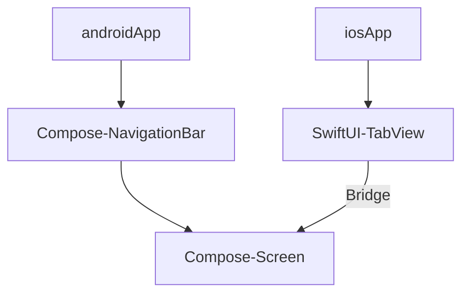
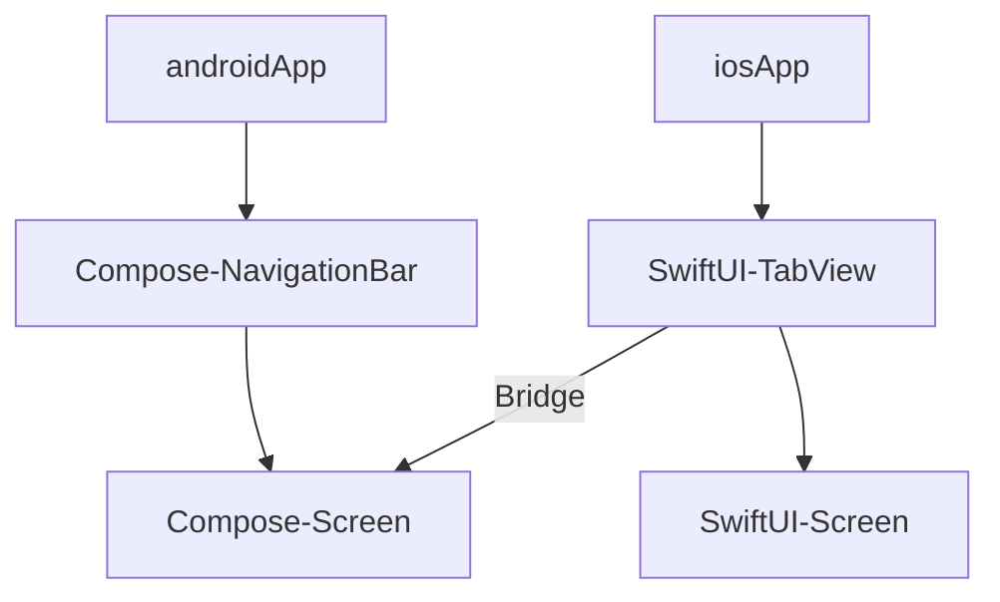

# はじめに
Android アプリ開発では、Jetpack Compose（以下、Compose）によって UI を記述します。

https://developer.android.com/compose

2010年代、複雑化する Android アプリにおいて、開発しやすくする Android Jetpack が2018年にリリースされました。以下は、リリース時の開発ブログからの引用です。

> Last year, we launched Android Jetpack, a collection of software components designed to accelerate Android development and make writing high-quality apps easier. Jetpack was built with you in mind -- to take the hardest, most common developer problems on Android and make your lives easier.
>
> https://android-developers.googleblog.com/2019/05/whats-new-with-android-jetpack.html

Jetpack Compose は、この Jetpack シリーズの一つとして UI を容易にそして高品質に開発できるようにと登場しました。Jetpack には、加速する願いが込められていて、Android のマスコットキャラ Droid 君がロケットを携えて描かれていたりします。

[Jetpack Droid画像]

この Compose はマルチプラットフォームに対応しており、Compose Multiplatform として iOS Desktop Web での動作もサポートしています。略称として CMP と呼ばれることもあります。

https://kotlinlang.org/compose-multiplatform/

## 対象の読書
- モバイルアプリ開発に関わる人
- Compose Multiplatform の採用を考えている人

## 扱うプラットフォーム
ここでは、Android と iOS を扱います。

# プラットフォームとは
プラットフォームとは、アプリが動作する基盤環境と定義します。
モバイルアプリにおいては、Android と iOS を指します。
この二大プラットフォームがモバイル市場を独占している状態となっていて、昨年はスマホ新法が施行されたことも記憶に新しいです。

DroidKaigi 2025 で公正取引委員会からこれに関するセッションもありました。

https://2025.droidkaigi.jp/timetable/981378/

セッションのタイトルの通り「スマホ新法って何？」と気になった人はアーカイブの視聴をおすすめします。

[動画の QRコード]

前述の通り、市場の独占状態にあり、ユーザおよび開発者に対して、不利益や不利な条件を強制することも可能になっているとの懸念から、もしそういった悩みや実害がある場合には相談を上げてもらい、公正取引委員会が是正措置に動くという内容でした。（もう少し柔らかい表現に見直す）

プラットフォーム側でアプリを配信するためには審査があり、これの承認があって配信できるようになります。
プラットフォームごとにガイドラインは明示されており、これに準拠する必要があります。

https://m3.material.io/

https://developer.apple.com/jp/design/human-interface-guidelines

## iOS 対応

Compose Multiplatform を採用すると、つまり、Android アプリ向けのコードで iOS 上でも動作します。
しかし iOS もターゲットとする際には注意が必要です。
前述の通り、ガイドラインはプラットフォームごとに策定されており、同一のコードでガイドラインに準拠するのは限界があります。

さらに iOS 26 から Liquid Glass が発表されました。マルチプラットフォームを採用せずに iOS アプリの環境で開発している場合、OS 側で標準のコンポーネントに対して適宜適合してくれます。

Compose Multiplatform では、Compose が描画した内容を一つの `UIViewController` として返します。そのため、各 UI コンポーネントを iOS 側から区別することはできません。

https://developer.apple.com/documentation/UIKit/UIViewController

https://developer.apple.com/documentation/uikit/displaying-and-managing-views-with-a-view-controller

UIViewController について少し補足すると、
複雑化した Android アプリに Jetpack Compose が登場したように iOS アプリでも同じように複雑化し、SwiftUI が登場しました。それ以前は UIKit ベースの `UIViewController` が画面単位のライフサイクルを管理していました。SwiftUI であれば、様々な `View` を組み合わせて記述しますが、Compose Multiplatform では、一つの `UIViewController` として返ってくるため、一つの `View` で記述していると捉えてもらうとイメージしやすいと思います。

そのため、前述の OS 側で Liquid Glass に適合する恩恵を受けることができません。

## Compose Multiplatform の Liquid Glass 対応
ここからは具体的に Compose Multiplatform に Liquid Glass を対応する方法について解説します。

### SwiftUI から Compose へのブリッジ

Compose `NavigationBar` の部分を SwiftUI `TabView` に置き換えたら Liquid Glass 対応できます。実際に `TabView` の中に表示する部分は Compose で共通利用したいです。そこで SwiftUI から Compose へのブリッジを用意します。図解すると以下のようなイメージになります。

こういったケースでは、Compose Multiplatform が用意している `ComposeUIViewController` を使うことで SwiftUI から Compose を `UIViewController` として利用できるようになります。

https://kotlinlang.org/docs/multiplatform/compose-swiftui-integration.html#use-compose-multiplatform-inside-a-swiftui-application

今回のケースでは、`HomeScreen` と `SettingsScreen` にそれぞれブリッジを用意しました。

## Liquid Glass 対応
これで Liquid Glass 対応の準備ができました。

1. Compose `NavigationBar` の部分を SwiftUI 側で `TabView` の宣言を追加する
2. SwiftUI からブリッジを経由して Compose Screen を呼ぶ

これによってプラットフォームの OS に合わせてシステム側が表現を調整してくれるようになります。

## 設定画面

たとえば、設定画面のように OS に近い部分で、プラットフォームの表現に近づけたい場合やプラットフォーム固有のロジックが多い場合は、丸ごと Swift で書いてしまう方法もあります。

ここまで見てきた構成であれば、 `TabView` で Compose Screen ではなく、SwiftUI で記述した Screen を割り当てるだけで良いです。

# まとめ

このようにプラットフォームでの表現に合わせてマルチプラットフォームの境界を定めることができます。
