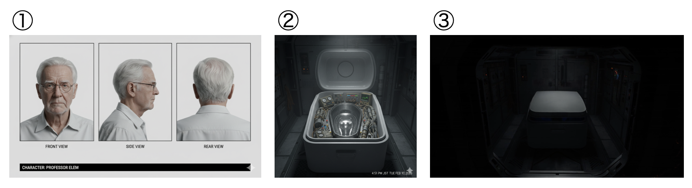

<div class="doc-header">
  <div class="doc-title">AI映画祭で優勝（するつもり）の、AI映画の作り方</div>
  <div class="doc-author">岸本悠佑_AIサムライ</div>
</div>

# AI映画祭で優勝（するつもり）の、AI映画の作り方

## AI 映画「宇宙灯台守」

この映画で優勝しました（のつもり、記事執筆時点では応募完了・結果は未発表です）。7 分の短編。ちょろっとご覧ください。

映画「宇宙灯台守」<span class="footnote">https://www.youtube.com/watch?v=8Pn-xKKQboo</span>

{width=100}

応募したのは「World AI Film festival 2026 in Kyoto」のベストAIフィルム賞（Best AI Film）、Short Film（5〜10 分）です。<span class="footnote">https://worldaifilmfestival.jp</span>

## 結論

小手先の技術や発想だけでは、小手先の映画にしかなりません。
AIは「表現を加速する装置」であって、物語そのものを生み出すわけではないからです。

私自身は、内在する「作りたいという衝動の火」、そして「長年のアイデアの発酵」、これが全てでした。

とはいえ、ツールや方法は色々あるので、この記事で何をやったか解説していきます。
**①再現性のある箇所**はほぼ 100% アイデアを流用できるので、活用してください。
同時に、**②再現性のない箇所**についてもめいっぱい解説していきますね。

## この記事で学べること

- Kling AI を使った動画生成の、実際に使ったプロンプト例
- 一貫性のあるキャラクター／背景をAIで作る手法
- 短編AI映画を 4 日で仕上げるために何をしたのか
- AI映像制作に必要な"技術以外の核"の話（創作衝動とアイデアの発酵）

## ①再現性のある箇所

### 使った AI ツール

- **画像生成 AI：Gemini（nano banana）**
  人物、宇宙空間、建造物、背景美術など、動画生成ソースとなるビジュアルの生成に使用。
- **動画生成 AI：初代 Sora**
  プロンプトをもとに、映像シーンの生成、同時に声の生成に使用。
- **動画・音声生成 AI：Kling AI**
  生成したコンセプト画像やプロンプトをもとに、映像の生成、同時に声の生成に使用。
- **音楽生成 AI：Suno**
  BGM の生成に使用。
- **テキスト生成 AI：ChatGPT**
  物語構成案、台詞案、字幕作成の補助として使用。

### 最初の制作は初代 Sora でした

最初のシーンは、初代 Sora が出た 2024 年末に、プロンプトだけで作りました。<span class="footnote">https://zenn.dev/acntechjp/articles/71a7538a0ab408</span>

ここでは、「キャラクターの一貫性」は、頑張ってプロンプトのみでクリアしました。
ステレオタイプ的なキャラクター（コーカソイド系のメガネの老人）、複数回生成して同じ人物っぽく見えるやつ（確率 1/4 くらい）だけを選別する、といった地道な方法を取ってました。

ただ、この方法だと、どうしてもキャラクターや設備や背景の一貫性を保ったまま、下記のシーンを作るのが難しかったんですね。（下記の内容を「いや何言ってるのかわからん」という方、一旦読み飛ばしていただいて大丈夫です）

- おじいちゃんがコールドスリープ装置に入る、出る
- 孫娘人格コピーと全知能統合ネットワークの中の精神世界で邂逅する

### Kling AI による技術革命

Kling AI には 2 つのブレイクスルー、そして大きな価格メリットがあります。

1. 複数の画像を参照して、1 つの動画に統合する機能
2. 音声（声、BGM）と動画を同時に生成する機能

- 価格メリット：1 万円くらい課金して招待コード利用すれば、初回は 12000 クレジットもらえる。
  （1080p 15 秒の動画を 100 本くらい、秒数や画質をコントロールすれば本数は増やせる）

※Sora2 や Veo3 も音声＆動画が超強いのですが、どちらもウォーターマークを消して生成するには多大な API 利用料が嵩んでいきます。

これらの機能を、1 万円台（もっと少ないなら 10 ドルくらいでもいけます）でここまで使えるっていうのが今までにないものでした。なのでこれを使って、技術的に詰まった点を制作することにしました。

### どうやって作ったのか？コールドスリープの実例

動画でいうと 3:00 からのシーンです。

**Q. まずコールドスリープって何？**

A. 近未来の技術です。低体温状態で人を「人工冬眠」させることで、長期の宇宙旅行（数年〜数百年）とかを「ちょっと眠って起きる」体感だけで目的地に着くようにするものです。

で、このシーンは次の 3 つの画像を組み合わせて作りました。

| 目的 | 使った画像 | Kling への指定 |
| :-- | :-- | :-- |
| おじいちゃんの顔一貫性維持 | 画像 1（三面図） | @画像1 を人物参照に |
| 装置の内部統一 | 画像 2（コールドスリープ内部） | @画像2 を背景参照に |
| 装置の蓋の形状統一 | 画像 3（蓋が閉じた状態） | @画像3 を"初期フレーム"の基準に |

{width=200}
*左から：画像 1（初代 Sora のスクショから Gemini で生成したおじいちゃんの三面写真）、画像 2（Gemini で作ったコールドスリープ装置内部）、画像 3（Kling が 1・2 を組み合わせて生成した、装置の蓋が閉じた状態のスクショ）*

まずは、1、2 を組み合わせて、「コールドスリープ装置におじいちゃんが入って蓋が自動で閉まる」というシーンを Kling で作成しました。

<!-- textlint-disable -->

**プロンプト例 1：コールドスリープマシンに乗り込んだら蓋が閉じる**

```
@画像1 The background is an old spaceship. The man goes into @画像2 the cold-sleep machine. He lays his body down into the machine's silver area. The lid of the machine closes automatically. The camera gradually zooms out, and the lighting gradually goes darker, ending up complete black.
```

<!-- textlint-enable -->

それで生成された動画から 3 の画像をスクショし、1、2、3 を再度 Kling に参照用画像として渡して、動画を生成させました。
その結果、「3. さっきと同じ閉じた蓋」→「2. 開いた内部の装置がさっきと同じ」→「1. おじいちゃんが起き上がる」という、人物も背景も一貫性を保った動画を作れました。

<!-- textlint-disable -->

**プロンプト例 2：コールドスリープマシンが開く**

```
The lid @画像1 of the coldsleep machine @画像2 opens. the man @画像3 slowly raises his upper body.
```

<!-- textlint-enable -->

孫娘との邂逅シーンも同様です。動画でいうと 4:30 からの一連のシーンです。

{width=100}
*左：孫娘の設定画像、右：ふわふわした世界の画像（全知能統合ネットワークに接続した人はこんなのが見えるというつもり）*

<!-- textlint-disable -->

**プロンプト例 3：おじいちゃんと孫娘の邂逅**

```
The man @画像1 is in the warm light space @画像3 The baby girl @画像2 appears from the light. The man and baby girl is talking in a calm mood. The babyTelling him "Finally, you're here, Grampa." The man says, "you are..." the baby then says "yes, your grand daughter." He says "but you are dead, aren't you?" She says "Yes, but my, how to say, spirit is here. in the unified intelligence network." He sats "hmm..." The camera moves from the back of the man, moving toward the baby until it shows the while body of the baby. ** DO NOT use the @画像1 for the first frame.**
```

**プロンプト例 4：孫娘を抱いているシーン**

```
the man: @画像1 , the baby girl: @画像2. The two are talking in calm tones, in the warm light space: @画像3. The man holds the baby and says "Yes... yes of course. Together, let's make Daddy and Mommy, happy." **DO NOT use the @画像1 for the first frame.** **NO background music.**
```

<!-- textlint-enable -->

※このあたりは、言わないといらんものを出してきたので追加しています。

- `** DO NOT use the @画像1 for the first frame.**`
- `**DO NOT use the @画像1 for the first frame.** **NO background music.**`

### あ、音楽は適当に言ったら出ます

Suno v5 でやってください。
なんか雑に ChatGPT で「水中の感じの BGM」とか「悲しい中に救いがあるピアノ」とか Suno 用のプロンプト作らせて、ぶち込めば勝ちです。
あの映画の音楽、制作時間は 5 分くらいです。音楽の時間より短いという矛盾。

<!-- textlint-disable -->

**ChatGPT 用プロンプト例：BGM 案の生成**

```
退屈な生活の中にたまに感動がある、みたいな曲をsunoで作りたい。プロンプト案を出せ。ピアノのインスト曲。
```

**Suno 用プロンプト例：実際に使ったプロンプト（ChatGPT 生成そのまま。最初の BGM になった）**

```
Instrumental, solo piano, cinematic minimalism.
Theme: A monotonous, boring daily life with long stretches of emotional flatness, interrupted by rare, quiet moments of deep emotion.
Simple repetitive piano motifs that slowly evolve.
Occasional harmonic shift that feels like a sudden realization.
Mood: restrained, reflective, quietly moving.
Tempo: slow to mid.
```

<!-- textlint-enable -->

### で、最後は編集を頑張る

Mac の Final Cut Pro という編集ツールで頑張りました。
映像を切ったり、音楽を載せたり、字幕つけたり。
（調べるとやり方出てくるので、本記事では割愛します）
で、なんとか AI まつりに間に合わせて上映。サイコー。

### 最後は、映画祭のフォーマットに合わせる

この映画祭に応募しました。<span class="footnote">https://worldaifilmfestival.jp</span>
「え？制作手記？監督プロフィール？いやそんなもんないない」という。
頑張って ChatGPT に「これ出せ」「そうじゃない直せ」って作りましたね。
で、**映画の字幕は全て英語じゃないとダメ**と。
自分で喋った英語を、自分でリスニングして、自分でライティングするという奇妙な体験をしました。

ちなみに、AI まつりが終わった日の 23:59 が締め切り。鬼スケジュールかよ。

<!-- 強制改ページ -->
<hr class="page-break"/>

## ②再現性のない箇所

さて、ここからは全く再現性がないんですが、私のこの作品作りの中核となる、「作りたいという衝動の火」、そして「長年のアイデアの発酵」の話をしていきます。

### ある日突然、降ってきたストーリー

皆さん、頭の中にある日突然、ストーリーが降ってくることってありません？
（人によると思いますが）

たぶん SF 映画の、『2001 年宇宙の旅』とか『インターステラー』とか大好きだからだろうなぁ。
私はある日、ぼーっとしてたら、こんなのが突然降ってきたんですよ。
確か 2020 年くらいに。

- 宇宙灯台守のおじいちゃんが、ある日世界中のネットワークと接続して「知能を拡張し会話できる」ようになった 2 歳の孫とメールをやり取りして、
- 会うのを期待してコールドスリープで数年かけて帰ったらもう孫は病気で死んでいて、
- しかしネットワーク上にバックアップされた、幼い孫の人格（と接続した全ての人の知覚の融合体）と再会でき、そしておじいちゃん自体も孫含む知能融合体と一体化する

さて、こんなのが降ってきちゃったら作りたいじゃないですか。
でも作れないんですよ。当時は AI なんてないので。残念。
でもその分、妄想は捗ります。

### アイデアの発酵

妄想してるうちに、これってこんな設定だよな〜と色々考えていきました。
（たぶんいろんな映画や小説や科学雑誌の知見を重ね合わせた結果ですね）

- 宇宙旅行が当たり前になっていて、宇宙灯台の保守が、生産性の低い人員があてがわれるルーチンワーク化している（宇宙灯台守）。
- コールドスリープ（人工冬眠）による宇宙航行が日常茶飯事になっている。
- BMI（Brain Machine Interface、脳を機械と繋げるための機械）によって、赤ちゃんでも脳をネットワークに直結できる。
- 地球は全知能統合ネットワーク（UIN: Unified Intelligence Network）に覆われていて、ネット接続できる全知能を統合しているので思考力が接続だけで神の領域に達する。
- 全知能統合ネットワークに接続すると、当然ながらその接続した人格は他の人格と混ざり合いつつも、1 個体として独自の人格を持ち、それのコピーがネットワーク内に保存されていく。

### 初代 Sora による、発火と、挫折

そして、2024 年末に Sora の登場。
「あれ、これ使ったら宇宙灯台守を作れるじゃん！！！」と思って、火がついてしまい。
年末に祖母の家で暇してたので、半日くらいみっちり作って、冒頭 1 分のシーンを作りました。

なお、当時の Sora には音を生成する機能がなかったので、**自分で英語音声をアフレコしてくぐもり声エフェクトをかけています。**

{width=100}
*宇宙灯台のシーン。*

作れた。しかし同時に、複雑なシーンを一貫性を持って作るのは難しいことがわかりました。当時の Sora（というより動画生成 AI 一般）は画像レファレンス機能がなく、プロンプトだけで全てを一貫して指定するのは無理だったからです。
人物は、Sora の学習バイアスに上手く乗って「コーカソイドのくたびれたヒゲのおじいちゃん」って感じにして、確率的に 1/4 くらいは使えるのが出てました。
でも、コールドスリープ装置とかはどうやっても無理。

加えて、最後のキモになる「孫娘が喋る」シーン、これはどうやっても当時の技術では不可能でした。私がアフレコするのも無理だし。

その後も、Runway, Midjourney, Sora2, Veo3 など色々試してはみたものの。
技術的に無理、あるいは金がかかりすぎる、こういった側面で諦めてました。

2026 年 2 月、AI まつりの 5 日前までは。

### Kling AI の出会い、そして 3 日の突貫工事による完成

私は 2026 年 2 月 15 日に、「札幌すごい AI まつり」というイベントを企画していました。<span class="footnote">https://matsuri.sugoiai.org</span>

その中で、「AI 芸術祭」に出す AI 動画を募集していたところ、こんな人が現れました。
「私は最近話題の Kling AI というツールを使って、三国志を作りました。これ流してください」

それを見ると、三国志の人物が一貫性を持って登場し、しかも喋っている。あれあれ、これって宇宙灯台守の残りのシーン作れるんじゃね？

そして、この動画をイベント 5 日前に渡された時、長さが 1 分だったんですね。
めちゃめちゃ先進的ですが、しかしこれをまつりの締めにするのは、運営として忍びない。

そして、「これ宇宙灯台守の残り作れるんじゃ？」という火がメラメラと燃え上がってしまい。
Kling の 12000 クレジット（1 万円分、15 秒の動画約 100 本分）を 3 日で溶かし切って、宇宙灯台守を誕生させました。死ぬかと思った。

そして、無事に AI まつり当日、締めの映画として「宇宙灯台守」を流すことができました。ちょっと涙ぐんでる人とかいたの、印象的だったなぁ。

### 再現性のないように見える"衝動の火"にも、実は再現できる構造があります

① 長期的インプット（20 年の SF 体験）
　→ 作品の世界観の"骨格"になる
② ある日突然くる"核シーンの発火"
　→ この 1 シーンが物語全体を引っ張る
③ 技術の進化によって突然《作れる》段階に到達する
　→ 2024 年：Sora で発火
　→ 2026 年：Kling で完成

この 3 ステップは、おそらく多くの AI クリエイターに共通していて、実は「誰でも再現し得る創作エンジン」。

日頃からインプットし、発酵させ、衝動が来た時に身を任せられるようにしておきましょう。
インプットとか大それたことを書きましたが、「好きなものを沢山見る」が一番かと。

### なんで英語で作ったの？

かっこいいからですw

## 終わりに

以上で分かる通り、映画「宇宙灯台守」は、「初代 Sora で 1 日」「Kling AI で 3 日」、制作期間は実質 4 日でした。
ただし、その裏には数年単位のアイデアの発酵があります。

そして、今回の受賞は技術力というより、
「AI をどう組み合わせれば、**作品**として成立させられるか」
という設計が評価されたのだと捉えています。
（と、出版後に優勝できてて書けていたらかっこいいなぁ...。）

皆さんもぜひ Kling AI 触ってみてください。こいつはすごい。無料体験枠もあり〼。
