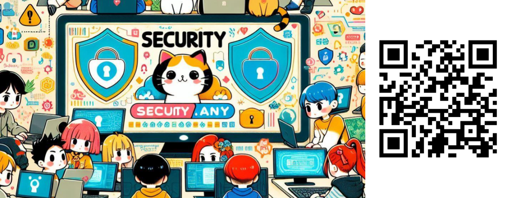
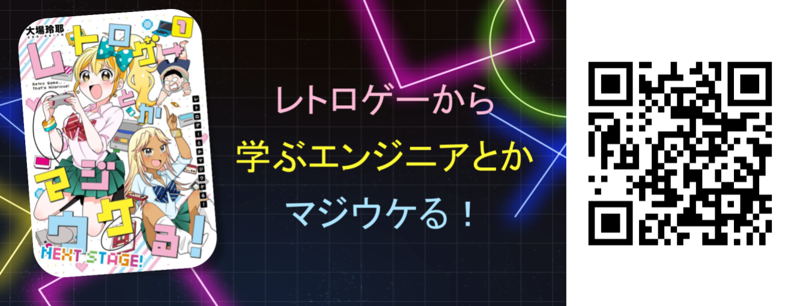

<div class="doc-header">
  <div class="doc-title">WebエンジニアのためのSecOps超入門</div>
  <div class="doc-author">キタジー</div>
</div>

# WebエンジニアのためのSecOps超入門

## ― SIEM / XDR / SOAR を流れで理解する ―

> 監視だけでは守れない時代に、
> SIEMで気付き、XDRで点を線にし、SOARで動く。
> その全体像をWebエンジニア向けに整理してみました。

## はじめに ― 「ログはある」は、本当に守れているでしょうか

Webエンジニアとして、きっと多くの方が

* メトリクスを可視化し
* ログを集約し
* アラートを設定している

そんな環境を整えていると思います。

障害が起きれば検知できますし、原因調査もできます。

では、こう聞かれたらどうでしょう。

深夜の管理者ログインに気付けていますか。
IAMの権限変更を追えていますか。
APIの不自然な呼び出しを、横断的に見られていますか。

オブザーバビリティが扱うのは「壊れた」です。
SecOpsが扱うのは「狙われた」です。

障害は偶発的に起きます。
攻撃は意図を持って行われます。

この違いを意識することが、SecOpsの入り口だと思っています。

## SecOpsとは何か ― 攻撃を前提にした運用

SecOps（Security + Operations）は、
侵害が起きることを前提にした運用の考え方です。

やることはとてもシンプルです。

* 兆候に気付く
* 何が起きているかを理解する
* 影響を止める
* 再発を防ぐ

ここで伝えたいのは、特定の製品を覚えることではありません。

これは、何か特別なツールを買う話ではなく、
**いま動いているサービスをどう守るかという運用の話です。**

### <!-- 図：SecOpsの位置関係 -->

```
開発 → リリース → 運用
                   ↓
                SecOps
          （攻撃の検知と対応）
```

クラウドも、Kubernetesも、ID基盤も、
すべて攻撃の対象になります。

SecOpsは、どこか遠い世界の話ではありません。

## SIEM ― まず“違和感”に気付く

SIEMは、さまざまなログを集約し、相関させる仕組みです。

Webエンジニアに身近なログを並べてみると、次のようなものがあります。

| 種類     | 例                |
| ------ | ---------------- |
| アクセスログ | Nginx, ALB       |
| アプリログ  | 認証成功・失敗、API呼び出し  |
| クラウドログ | CloudTrail       |
| コンテナ   | Kubernetes Audit |
| 防御装置   | WAFログ            |

普段は別々に見ているこれらのログも、
攻撃のときにはつながりを持ちます。

ログイン失敗が増え、その後に成功し、
さらに管理画面へアクセスされる。

個々のイベントは小さくても、
組み合わせると「違和感」になります。

SIEMは、その“点”に気付くための仕組みです。

## XDR ― 点を線にする

XDRは、検知されたイベントを横断的に関連付けます。

Webサービスの侵害は、ひとつのログだけで完結しません。

たとえば、

1. 不審IPからログイン成功
2. IAMポリシー変更
3. S3バケット一覧取得
4. 外部への通信増加

これらは別々の領域に記録されます。

XDRは、それらをつなぎ合わせて、

「これは一連の行動ではないか」

と可視化します。

XDR自体が直接ブロックするわけではありません。
実際に止めるのは、EDRやFirewall、IAM制御などです。

XDRは、守るための視界を広げる仕組みです。

SIEMが点に気付くなら、
XDRはその点を線にします。

## SOAR ― 気付いたあとにどう動くか

攻撃者は自動化しています。

ボットは休まず、総当たりも横展開も高速です。

そこで必要になるのがSOARです。

SOARは、対応を自動化します。

| 状況     | 自動対応の例         |
| ------ | -------------- |
| 不審IP検知 | WAFへ自動登録       |
| 権限昇格検知 | IAMユーザー凍結      |
| 不審Pod  | Kubernetes隔離   |
| 重大アラート | Slack通知＋チケット起票 |

対応をプレイブックとして定義し、APIで実行します。

SIEMが気付き、
XDRが関連付け、
SOARが動く。

ここまでつながって、SecOpsは機能します。

## 3つを流れで理解する

横並びの製品比較ではなく、
流れとして整理すると分かりやすくなります。

| フェーズ | 役割         |
| ---- | ---------- |
| 検知   | SIEMが点に気付く |
| 分析   | XDRが点を線にする |
| 対応   | SOARが止める   |

この流れが回り続けることが、SecOpsだと思っています。

## ミニストーリー ― SaaSで起きた侵害未遂

ある日、海外IPからログイン成功が発生しました。

普段なら見逃していたかもしれません。

しかしSIEMが違和感を拾い、XDRがその後の権限変更とデータアクセスを結び付けました。

SOARが自動でアカウントを凍結し、WAFにIPを登録しました。

被害は最小化されました。

どれか1つだけでは、防ぐことはできません。

## まとめ ― 守る仕組みは、少しずつ作れる

Webエンジニアとして、私たちはすでに多くのログを扱っています。

そこに「攻撃かもしれない」という視点を少し足すだけでも、
見える景色は変わります。

* SIEMは気付く
* XDRは点を線にする
* SOARは止める

いきなりすべてを導入する必要はありません。

まずは、「狙われる」という前提を持つこと。
そこからSecOpsは始まるのだと思います。

## さいごに

私自身、セキュリティを専門に扱うようになってまだ日は浅いですが、セキュリティに携わっていない方にも身近に感じていただき、セキュリティを意識する第一歩にしていただけたらうれしいです。

今回の寄稿のきっかけは、趣味のコミュニティ活動でできたつながりから受けた刺激でした。この寄稿が、同じようにちょっと別のレイヤーで交流するきっかけになればうれしいです。

また、そんな思いから次の二つの勉強会コミュニティを立ち上げました。こちらも、皆さんの交流のきっかけになれば幸いです。

<hr class="page-break"/>

### Security.any

セキュリティという幅広い話題で初心者からベテランまで、エンジニアからリサーチャーまで、セキュリティに興味がある人、みんなが笑いながら情報交換し交流出来る場を目指しています。



### レトロゲーから学ぶエンジニアとかマジウケる！

ITエンジニアがレトロゲームから得た学びの『アウトプット』を通して人との『繋がり』や学ぶこと自体を『楽しむ』コミュニティです！！


