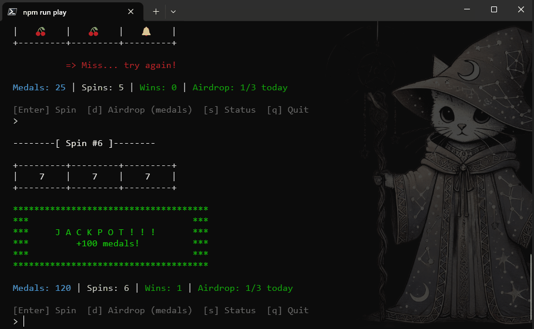
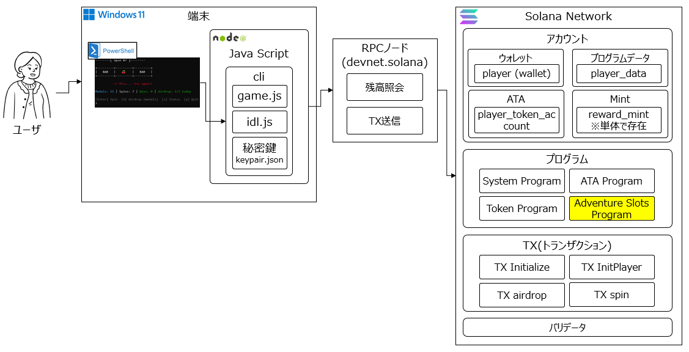
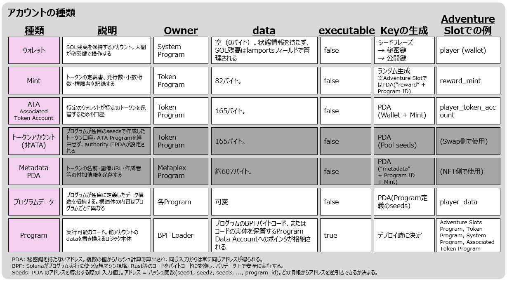
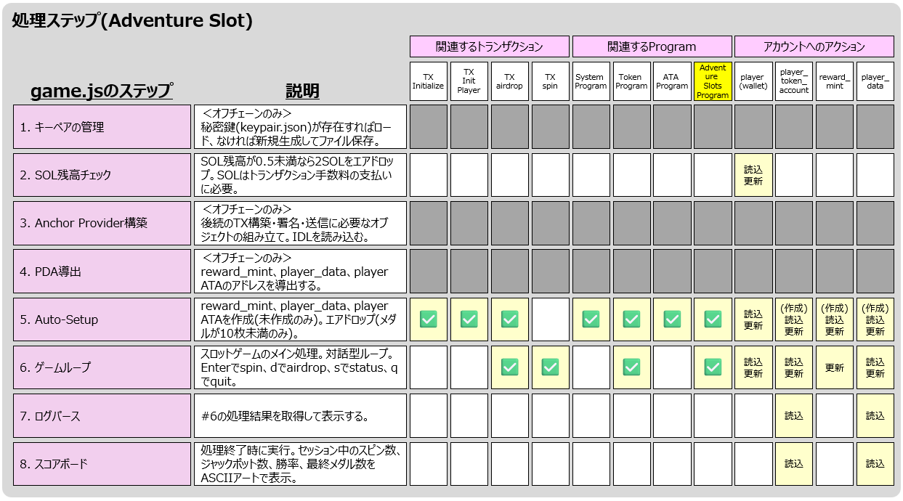

<div class="doc-header">
  <div class="doc-title">Anchor 開発入門：Hello World から Adventure Slot まで</div>
  <div class="doc-author">マッサン</div>
</div>

# Anchor 開発入門：Hello World から Adventure Slot まで

## はじめに：自分で Program を書く

前章までで、Solana のアカウント構造、NFT 発行の 5 つの Instruction、SOL → USDC スワップの 8 ステップを解き明かしました。これらはすべて、**既存の Program（Token Program、ATA Program、Metaplex Program、Raydium CLMM）を呼び出す** ことで実現していました。

<!-- textlint-disable spellcheck-tech-word -->

本章では、いよいよ **自分自身で Program を書く** 側に回ります。Anchor フレームワークを使い、Hello World から始めて、最終的には **SPL Token を操作するオンチェーンスロットマシン「Adventure Slot」** を構築します。

「スロットを回す」という一見シンプルな操作の裏側では、**トークンの Mint（発行）と Burn（焼却）、PDA によるアクセス制御、CPI（Cross-Program Invocation）による複数 Program の連携** が動いています。これらは DeFi や NFT マーケットプレイスの基盤技術そのものであり、前章までに学んだ知識の集大成です。

<!-- textlint-enable spellcheck-tech-word -->

### 本章の構成

本チャプターは 2 部構成です。

**第 1 部：Hello World** では、Anchor フレームワークの基本構造を最小限のコードで理解します。Solana Playground を使い、ブラウザだけで Build・Deploy・実行まで完了します。

<!-- textlint-disable spellcheck-tech-word -->

**第 2 部：Adventure Slot** では、Hello World の知識を発展させ、SPL Token を操作する本格的な Anchor プログラムを構築します。4 つの Instruction、PDA Mint、CPI、Node.js CLI クライアントまで、コードの 1 行 1 行がチェーン上で何をしているかを分解して解説します。

<!-- textlint-enable spellcheck-tech-word -->

### この章で得られること

- Anchor フレームワークの基本構造と、素の Rust との違い
- Solana Playground でのビルド・デプロイ・実行の一連の流れ
- Anchor プログラムの 4 つの Instruction（initialize / initPlayer / airdrop / spin）の設計と実装
- SPL Token の Mint/Burn の仕組みを「メダル」という具体物で理解
- PDA（Program Derived Address）の実践的な使い方（Mint PDA、PlayerData PDA）
- CPI（Cross-Program Invocation）による Token Program/System Program との連携
- Node.js CLI からオンチェーンプログラムを操作するクライアント実装

### 前提知識

本章は、前章までの内容を前提としています。特にアカウントの 5 つのフィールド、owner/authority/ATA/PDA の概念、CPI の概念、Token Program の役割を理解していることが望ましいです。

> 本章のソースコードは GitHub に公開しています。
> GitHub: Adventure Slot <span class="footnote">https://github.com/Masa1984a/solana-adventure-slots</span>

---

<!-- 強制改ページ -->
<hr class="page-break"/>

## 第 1 部：Hello World — Anchor の基本を掴む

## Anchor とは何か

<!-- textlint-disable spellcheck-tech-word -->

Solana のプログラム（スマートコントラクトのロジック部分）は Rust 言語で書かれ、BPF（Solana 独自の形式）にコンパイルされます。素の Rust で書くこともできますが、「アカウントの検証コード」「エラーハンドリング」「シリアライズ/デシリアライズ」などを毎回自分で書く必要があり、かなり大変です。

Anchor はそのあたりをすべて吸収してくれるフレームワークで、本質的なロジックだけに集中できる状態を作ってくれます。Web 開発で例えるなら、素の Rust で Solana プログラムを書くのが「素の Node.js で HTTP サーバーを書く」ことだとすれば、Anchor を使うのは「Express.js や Next.js を使う」感覚です。

<!-- textlint-enable spellcheck-tech-word -->


*図１：Hello World の全体構成*

## 開発環境：Solana Playground

Anchor の開発環境は Linux か Mac が前提ですが、今回はブラウザだけで Rust コードを書いてビルド・デプロイまでできる **Solana Playground** <span class="footnote">https://beta.solpg.io</span> を使います。ローカルに Anchor CLI や Rust をインストールする必要はありません。

<!-- textlint-disable spellcheck-tech-word -->

Playground にアクセスしたら、左下の「● Not connected」をクリックして Playground Wallet を作成し、Solana Faucet <span class="footnote">https://faucet.solana.com</span> から Devnet SOL を取得しておきます。このウォレットはブラウザのローカルストレージに保存されるため、テストと開発のみで使用します。

<!-- textlint-enable spellcheck-tech-word -->

---

<!-- 強制改ページ -->
<hr class="page-break"/>

## Hello World のコード

「+ Create a new project」から Anchor(RUST) プロジェクトを作成し、`lib.rs` を以下のコードに書き換えます。

```rust
use anchor_lang::prelude::*;

declare_id!("11111111111111111111111111111111111111111111");

#[program]
pub mod hello_world {
    use super::*;

    pub fn say_hello(ctx: Context<SayHello>) -> Result<()> {
        msg!("Hello, World!");
        Ok(())
    }
}

#[derive(Accounts)]
pub struct SayHello {}
```

各パートの役割は次のとおりです。`use anchor_lang::prelude::*;` は Anchor のライブラリをまとめてインポートするおまじないです。`declare_id!("1111...");` はこのプログラムのアドレス（ID）で、ビルドすると自動で書き換わります。`#[program]` と `pub mod hello_world` は「ここからプログラムの本体」という Anchor への宣言です。`say_hello` 関数の中の `msg!` は Solana のログに文字を出力するマクロで、トランザクションログに「Hello, World!」が記録されます。`ctx: Context<SayHello>` はこの命令に関わる全アカウントへのアクセス窓口ですが、Hello World では使いません。最後の `#[derive(Accounts)] pub struct SayHello {}` は必要なアカウント一覧の定義で、今回は空です。

## ビルド・デプロイ・実行

「Build」ボタンをクリックすると BPF にコンパイルされ、「Deploy」で Solana Devnet にデプロイされます。デプロイ費用として約 2.5 SOL が使われますが、Devnet なので本物のお金ではありません。

次に `client.ts` を以下のコードに書き換え、「Run」をクリックします。

```typescript
const txSignature = await pg.program.methods
  .sayHello()
  .rpc();

console.log("トランザクションID:", txSignature);
console.log("Solana Explorerで確認:");
console.log(`https://explorer.solana.com/tx/${txSignature}?cluster=devnet`);
```

<!-- textlint-disable spellcheck-tech-word -->

Solana Explorer でトランザクションを確認すると、以下のログが記録されています。

<!-- textlint-enable spellcheck-tech-word -->

```
> Program logged: "Instruction: SayHello"
> Program logged: "Hello, World!"
> Program consumed: 443 of 200000 compute units
> Program returned success
```

自分で書いた Rust コードが、Solana Devnet 上で実行されて、「Hello, World!」がブロックチェーンに刻まれました。

## Hello World から見える Anchor の基本パターン

Hello World はシンプルですが、Anchor プログラムの基本パターンが凝縮されています。`#[program]` で Instruction（命令）を定義し、`#[derive(Accounts)]` でその Instruction が必要とするアカウント一覧を宣言する。クライアントからは `program.methods.関数名().rpc()` で呼び出す。この構造は、次の Adventure Slot でもまったく同じです。違いは、アカウント一覧が空ではなくなり、CPI や PDA が加わることだけです。

---

<!-- 強制改ページ -->
<hr class="page-break"/>

## 第 2 部：Adventure Slot — SPL Token を操作する Anchor プログラム

## なぜ「スロットマシン」をオンチェーンで動かすのか

スロットマシンをオンチェーンで動かすと、**メダルの移動（誰がいくら消費し、いくら獲得したか）、なぜ移動したのか（スロットの当たり判定）、いつ Spin されたのか（タイムスタンプ）** がすべてチェーン上に記録され、誰でも検証可能になります。

この「お金の流れと、その理由を透明化する」という思想は、前章で解説した DEX スワップの透明性と同じ設計哲学です。今回のスロットマシンはあくまで教育用ですが、「資金の入出とその根拠をオンチェーンで可視化する」という構造は、ポイントプログラムの不正検知、補助金の使途追跡、ゲーム内経済の監査など、実務における透明性ユースケースのヒントになります。

> 実際に CLI でプレイしている画面です。Enter キーでスロットを回し、3 つ揃えばメダル獲得。777 でジャックポットです。


*図２：Node.js CLI でスロットを回している様子。ASCII アートでリール結果が表示され、メダル残高がリアルタイムで変化する*

---

<!-- 強制改ページ -->
<hr class="page-break"/>

## 2-1. Adventure Slot の業務要件

ゲームとはいえ、トークン発行・消費・日次制限など、実務のポイントプログラムやリワードシステムと同じ構造を持っています。

### 機能要件

| # | 機能 | 説明 |
| :-: | :-- | :-- |
| 1 | メダル定義 | ゲーム内通貨「メダル」を SPL Token として定義する（decimals=9） |
| 2 | プレイヤー登録 | 初回プレイ時にプレイヤーの統計データとメダル口座を自動作成する |
| 3 | メダル配布 | プレイヤーにメダルを配布する。不正な大量取得を防ぐため 1 日 3 回・最大 100 枚の制限を設ける |
| 4 | スロットプレイ | メダル 5 枚を消費してスロットを回す。3 リールが一致すれば報酬を獲得する |

### 報酬テーブル

| リール結果 | 報酬 |
| :-- | :-- |
| 777 | +100 メダル（ジャックポット） |
| BAR ×3 | +20 メダル |
| BELL ×3 | +10 メダル |
| CHERRY ×3 | +5 メダル |
| 不一致 | 0（5 メダルは消費済み） |

### 非機能要件

| 項目 | 仕様 |
| :-- | :-- |
| ネットワーク | Solana Devnet |
| トランザクション手数料 | 約 0.000005 SOL/回 |
| リセット | 新 Keypair を生成するだけで新規プレイヤーとして再開可能 |
| 乱数 | Clock::slot のビットシフトによる擬似乱数（教育用。本番では VRF 推奨） |

---

<!-- 強制改ページ -->
<hr class="page-break"/>

## 2-2. システム全体構成

<!-- textlint-disable spellcheck-tech-word -->

システムは **端末（CLI）→ RPC ノード → Solana Network** の 3 層で構成されています。前章のスワップと同じ 3 層アーキテクチャですが、Raydium SDK の代わりに Anchor SDK を使い、既存 Program を呼ぶ代わりに自作 Program を呼ぶ点が異なります。

<!-- textlint-enable spellcheck-tech-word -->


*図３：ユーザが Windows 端末の CLI（game.js）から RPC ノード経由で Solana Devnet と通信する。オンチェーンには 4 種類のアカウントと 4 つの Program が存在する*

### 技術スタック

| レイヤー | 技術 | 役割 |
| :-- | :-- | :-- |
| オンチェーンプログラム | Rust + Anchor Framework | ゲームロジック（4 つの Instruction） |
| CLI クライアント | Node.js + Anchor SDK | TX 構築・署名・送信・結果表示 |
| 開発・デプロイ | Solana Playground | ブラウザ上で Build & Deploy |
| ネットワーク | Solana Devnet | トランザクション処理 |

第 1 部の Hello World では Solana Playground の client.ts だけで完結していましたが、Adventure Slot ではローカルで動く対話型 CLI も用意しています。

### 動作確認環境

本章は Solana Playground（beta.solpg.io）上で動作確認しています。

<!-- textlint-disable spellcheck-tech-word -->

| 項目 | バージョン |
| :-- | :-- |
| Anchor | v0.29.0（Playground 内蔵） |
| Solana devnet クラスタ | v3.1.x |
| CLI 版: @coral-xyz/anchor | v0.29.0 |
| CLI 版: @solana/web3.js | v1.91.0 |
| CLI 版: @solana/spl-token | v0.3.11 |

<!-- textlint-enable spellcheck-tech-word -->

> **💡ポイント:** Solana Playground は内部で Rust 1.75.0 を使用しており、ローカルに Anchor CLI や Rust をインストールする必要はありません。CLI 版（cli/game.js）を動かす場合は Node.js 18+ と `npm install` が必要です。Solana のバージョニングは 1.x → 2.x（Agave）→ 3.x と急速に変わっていますが、Playground を使う限りクラスタ互換性は Playground 側が吸収してくれます。

---

<!-- 強制改ページ -->
<hr class="page-break"/>

## 2-3. アカウントの全体像

前章までで解説した Solana のアカウント種類のうち、Adventure Slot では 4 種類が登場します。


*図４：Solana のアカウント種類と、Adventure Slot での具体的な対応。Mint は通常ランダム生成だが、本プロジェクトでは PDA として作成する*

### 本プロジェクトで登場する 4 つのアカウント

**① player（ウォレット）** — プレイヤーの SOL ウォレット。署名者であり手数料の支払い元。owner は System Program で、data は空（0 バイト）。前章の Dev Wallet と同じ役割です。

**② reward_mint（Mint PDA）** — ゲーム全体で 1 つだけ存在するメダルの定義書。`seeds=["reward"]` で PDA 導出されます。前章の NFT 発行ではランダムな Keypair で Mint を作成しましたが、本プロジェクトでは **PDA として作成** し、mint_authority を PDA 自身に設定しています。これにより、プログラム内部からの CPI でのみ Mint/Burn が実行可能になります。

**③ player_token_account（ATA）** — プレイヤーのメダル残高を保持するトークン口座。Mint + Wallet から一意に導出される、前章までに解説した ATA そのものです。

**④ player_data（プログラムデータ PDA）** — Adventure Slot Program が owner の独自データ構造。`seeds=["player", pubkey]` で導出されます。プレイヤーの統計情報（スピン回数、勝利数、エアドロップ制御）を格納します。

> **💡ポイント:** PDA アドレスの導出には `seeds + program_id` が使われるため、同じ seeds でもプログラムが異なれば完全に別のアドレスになります。他のプログラムが偶然同じ seed を使っていても衝突しません。

---

<!-- 強制改ページ -->
<hr class="page-break"/>

## 2-4. 関与する Program（CPI 関係）

Adventure Slot Program は、単独ではアカウント作成やトークン操作ができません。Solana の標準 Program に **CPI（Cross-Program Invocation）** で処理を委譲します。前章のスワップで Raydium CLMM が Token Program に CPI で Transfer を依頼していたのと同じ構造です。

```
Adventure Slot Program（lib.rs）
  ├─ CPI → System Program     : アカウント作成（initialize, initPlayer 時）
  ├─ CPI → Token Program      : mint_to / burn（airdrop, spin 時）
  └─ CPI → ATA Program        : ATA 作成（initPlayer 時）

直接書き込み:
  └─ player_data（owner = Adventure Slot 自身 → 直接変更可能）
```

Solana の根本ルールは **「owner だけが data を書き換えられる」** です。reward_mint や ATA の owner は Token Program なので、Adventure Slot は直接書き換えられません。だから Token Program に CPI で依頼します。player_data だけは owner が自分自身なので直接書き込めます。前章のスワップで、Vault の owner が Token Program であり、Raydium CLMM が CPI で Transfer を依頼していたのとまったく同じ原理です。

---

<!-- 強制改ページ -->
<hr class="page-break"/>

## 2-5. オンチェーンプログラム（lib.rs）の詳細

ここからは `lib.rs` のコードを 1 つずつ分解していきます。

### 2-5-1. initialize — PDA Mint を作成

ゲーム開始前に 1 回だけ呼ぶ命令です。メダル（SPL Token）の定義となる Mint アカウントを PDA として作成します。

```rust
pub fn initialize(_ctx: Context<Initialize>) -> Result<()> {
    msg!("=== Adventure Slot ===");
    msg!("reward_mint PDA created (seeds=[\"reward\"])");
    Ok(())
}
```

関数自体はログを出すだけですが、実際の処理は Anchor の **アカウント制約** が担っています。

```rust
#[derive(Accounts)]
pub struct Initialize<'info> {
    #[account(mut)]
    pub admin: Signer<'info>,

    #[account(
        init,                         // ← 新規作成
        seeds = [b"reward"],          // ← PDA の seed
        bump,                         // ← bump 自動導出
        payer = admin,                // ← Rent 支払い者
        mint::decimals = 9,           // ← 小数点以下 9 桁
        mint::authority = reward_mint, // ← authority = PDA 自身
    )]
    pub reward_mint: Account<'info, Mint>,

    pub token_program: Program<'info, Token>,
    pub system_program: Program<'info, System>,
}
```

`init` 制約により、Anchor が System Program への CPI で 82 バイトのアカウントを自動作成し、Token Program への初期化 CPI も自動で行います。`mint::authority = reward_mint` がポイントで、**Mint PDA 自身が authority** になることで、外部からの不正なトークン発行を防いでいます。

> **💡ポイント:** 前章の NFT 発行では `createInitializeMintInstruction` で adminKeypair を mint_authority に設定していました。Adventure Slot では **PDA 自身が authority** です。これにより「人間の署名」なしにプログラムからのみ Mint できる、より厳格なアクセス制御を実現しています。前章のスワップで Vault の authority が Pool State PDA だったのと同じ設計思想です。

### 2-5-2. initPlayer — プレイヤー初期化

各プレイヤーが初回に 1 度だけ呼ぶ命令です。**PlayerData PDA（統計情報）と ATA（メダル口座）の 2 つを同時に作成** します。

```rust
pub fn init_player(ctx: Context<InitPlayer>) -> Result<()> {
    let player_data = &mut ctx.accounts.player_data;
    player_data.player = ctx.accounts.player.key();
    player_data.spins = 0;
    player_data.wins = 0;
    player_data.airdrop_count = 0;
    player_data.last_airdrop_ts = 0;
    Ok(())
}
```

PlayerData の構造体は以下のとおりです。

```rust
#[account]
#[derive(InitSpace)]
pub struct PlayerData {
    pub player: Pubkey,        // 32 バイト — 紐づくウォレット
    pub spins: u32,            //  4 バイト — 累積スピン回数
    pub wins: u32,             //  4 バイト — 累積ジャックポット数
    pub airdrop_count: u8,     //  1 バイト — 当日の airdrop 回数
    pub last_airdrop_ts: i64,  //  8 バイト — 最後に airdrop した日時
}
```

PDA 導出の seeds が `["player", pubkey]` なので、**ウォレットごとに独立した PlayerData が作られます**。エアドロップの日次制限もウォレット単位で管理されます。

---

<!-- 強制改ページ -->
<hr class="page-break"/>

### 2-5-3. airdrop — メダル配布（1 日 3 回制限）

```rust
pub fn airdrop(ctx: Context<Airdrop>, amount: u64) -> Result<()> {
    require!(amount > 0 && amount <= 100, ErrorCode::InvalidAmount);

    let player_data = &mut ctx.accounts.player_data;
    let clock = Clock::get()?;
    let now = clock.unix_timestamp;

    // 日付が変わっていればカウンターをリセット
    let last_day = player_data.last_airdrop_ts / 86400;
    let current_day = now / 86400;
    if current_day > last_day {
        player_data.airdrop_count = 0;
    }

    require!(player_data.airdrop_count < 3, ErrorCode::AirdropLimitReached);

    // Token Program に CPI: MintTo
    let bump = ctx.bumps.reward_mint;
    let seeds: &[&[u8]] = &[b"reward", &[bump]];
    let signer_seeds = &[seeds];

    token::mint_to(
        CpiContext::new_with_signer(
            ctx.accounts.token_program.to_account_info(),
            MintTo {
                mint: ctx.accounts.reward_mint.to_account_info(),
                to: ctx.accounts.player_token_account.to_account_info(),
                authority: ctx.accounts.reward_mint.to_account_info(),
            },
            signer_seeds,  // ← PDA 署名
        ),
        amount.checked_mul(1_000_000_000).unwrap(),
    )?;

    player_data.airdrop_count += 1;
    player_data.last_airdrop_ts = now;
    Ok(())
}
```

日次制限の仕組みは `last_airdrop_ts / 86400` と `now / 86400` の整数除算で比較しています。商が変わる＝日付が変わったとみなし、airdrop_count を 0 にリセットします。シンプルですがタイムゾーン非依存で動作します。

CPI 呼び出しの `signer_seeds` に `[b"reward", &[bump]]` を渡すことで、「この PDA の持ち主はこのプログラムである」ということをランタイムに証明しています。前章のスワップで Raydium CLMM が `invoke_signed` で Vault の authority（Pool State PDA）の署名を提供していたのと同じ仕組みです。

### 2-5-4. spin — スロットマシン（メインゲーム）

ゲームの核心です。**メダル 5 枚を Burn し、擬似乱数でリールを回し、当たれば報酬を Mint** します。

```rust
pub fn spin(ctx: Context<Spin>) -> Result<()> {
    // --- ① Burn 5 medals ---
    token::burn(
        CpiContext::new(
            ctx.accounts.token_program.to_account_info(),
            Burn {
                mint: ctx.accounts.reward_mint.to_account_info(),
                from: ctx.accounts.player_token_account.to_account_info(),
                authority: ctx.accounts.player.to_account_info(),
            },
        ),
        5_000_000_000,  // 5 メダル（decimals=9）
    )?;

    // --- ② 擬似乱数でリール生成 ---
    let clock = Clock::get()?;
    let slot = clock.slot;
    let player_byte = ctx.accounts.player.key().to_bytes()[0] as u64;

    let reel1 = (slot % 4) as u8;
    let reel2 = ((slot >> 2) % 4) as u8;
    let reel3 = (((slot >> 4).wrapping_add(player_byte)) % 4) as u8;

    // --- ③ 判定 & 報酬 ---
    player_data.spins += 1;
    let is_triple = reel1 == reel2 && reel2 == reel3;

    if is_triple {
        let payout: u64 = match reel1 {
            0 => 100,  // 777
            1 => 20,   // BAR ×3
            2 => 5,    // CHERRY ×3
            _ => 10,   // BELL ×3
        };

        // Token Program に CPI: MintTo（報酬支払い）
        token::mint_to(/* ... */, payout * 1_000_000_000)?;

        if reel1 == 0 { player_data.wins += 1; }
    }
    Ok(())
}
```

<!-- textlint-disable spellcheck-tech-word -->

Burn はプレイヤー自身が署名者（authority）なので PDA 署名は不要です。一方、MintTo は reward_mint PDA が authority なので、signer_seeds が必要になります。この「誰が authority か」によって CPI の呼び方が変わる点は、前章のスワップでユーザーの wSOL ATA（ユーザーが authority）と Vault（PDA が authority）で署名の仕組みが異なっていたのと同じ構造です。

擬似乱数は `Clock::slot` のビット位置をずらして 3 リールを独立生成しています。player_byte を加算してプレイヤーごとに結果を変えていますが、バリデータは slot を知っているため **本番では Switchboard VRF などの検証可能な乱数を使うべき** です。

<!-- textlint-enable spellcheck-tech-word -->

---

<!-- 強制改ページ -->
<hr class="page-break"/>

## 2-6. CLI クライアント（game.js）の詳細

game.js は Node.js + Anchor SDK で構築された対話型 CLI です。8 つの処理ステップで構成されています。まず全体像を俯瞰してから、各ステップのコードに入ります。


*図５：game.js の 8 ステップと、各ステップで使用するトランザクション・Program・アカウントのマッピング。Step 1-4 はオフチェーン処理、Step 5 以降がオンチェーンとのやりとり*

### 2-6-1. キーペア管理 & SOL 残高チェック（Step 1-2）

```javascript
function loadOrCreateKeypair() {
  if (fs.existsSync(KEYPAIR_PATH)) {
    const data = JSON.parse(fs.readFileSync(KEYPAIR_PATH, "utf8"));
    return Keypair.fromSecretKey(new Uint8Array(data));
  }
  const keypair = Keypair.generate();
  fs.writeFileSync(KEYPAIR_PATH, JSON.stringify(Array.from(keypair.secretKey)));
  return keypair;
}
```

keypair.json が存在すればロード、なければ新規生成。この Keypair が以降の全操作の起点になります。SOL 残高が 0.5 未満なら devnet faucet から 2 SOL をエアドロップします。これはゲーム内のメダルエアドロップとは全く別物で、トランザクション手数料の確保が目的です。

### 2-6-2. Anchor Provider 構築 & PDA 導出（Step 3-4）

```javascript
// 後続の TX 構築・署名・送信に必要なオブジェクトの組み立て
const provider = new anchor.AnchorProvider(connection, wallet, {
  commitment: "confirmed",
});
const program = new anchor.Program(idl, programId, provider);

// 3 つのアドレスを事前計算
const [rewardMintPDA] = PublicKey.findProgramAddressSync(
  [Buffer.from("reward")], programId
);
const [playerDataPDA] = PublicKey.findProgramAddressSync(
  [Buffer.from("player"), keypair.publicKey.toBuffer()], programId
);
const playerATA = getAssociatedTokenAddressSync(rewardMintPDA, keypair.publicKey);
```

<!-- textlint-disable spellcheck-tech-word -->

`Connection`（RPC ノードへの接続先）と `Wallet`（署名に使う Keypair）を `Provider` にまとめ、`IDL`（プログラムの命令定義）と組み合わせて `Program` オブジェクトを作ります。以降は `program.methods.spin().accounts({...}).rpc()` のように type-safe な呼び出しが可能になります。

前章のスワップでは Raydium SDK が `raydium.clmm.swap()` のような抽象化を提供していましたが、Adventure Slot では Anchor SDK が `program.methods.spin()` のような抽象化を提供します。どちらも IDL（Interface Definition Language）に基づいて type-safe な呼び出しを実現する点は同じです。

<!-- textlint-enable spellcheck-tech-word -->

### 2-6-3. Auto-Setup（Step 5）

```javascript
// 冪等な初期化 — 存在チェックしてから作成
const mintInfo = await connection.getAccountInfo(rewardMintPDA);
if (!mintInfo) {
  await program.methods.initialize().accounts(initAccounts).rpc();
}

const playerInfo = await connection.getAccountInfo(playerDataPDA);
if (!playerInfo) {
  await program.methods.initPlayer().accounts(initPlayerAccounts).rpc();
}

let medals = await getMedalBalance();
if (medals < 10) {
  await program.methods.airdrop(new anchor.BN(50)).accounts(airdropAccounts).rpc();
}
```

`getAccountInfo()` で null チェックし、未作成の場合のみ TX を送信します。何度実行しても安全な冪等設計です。

### 2-6-4. ゲームループ & ログパース（Step 6-7）

```javascript
// spin TX 送信 → 署名ハッシュ（Transaction ID）が返る
const txSig = await program.methods.spin().accounts(gameAccounts).rpc();

// 署名をキーに RPC 経由で確定済み TX の詳細を取得
const tx = await connection.getTransaction(txSig, { commitment: "confirmed" });
const logs = tx.meta.logMessages;
// ログから "SPIN: [7] [BAR] [🍒]" をパースして表示
```

spin の結果はオンチェーンの `msg!()` マクロで記録されます。CLI は TX 送信後にログを RPC で取得し、正規表現でリール結果と勝敗を抽出して表示します。ログパースに失敗した場合は、アカウント状態の差分（wins 差分、メダル差分）から結果を推定するフォールバックも実装されています。

### 処理ステップのポイント整理

改めて処理ステップ表を振り返ると、以下の構造が見えてきます。

**Step 1-4 はオフチェーン処理のみ**。キーペア管理、SOL 確保、Anchor オブジェクト構築、PDA 導出はすべてブロックチェーンとの通信なしに完了します。

**Step 5（Auto-Setup）は最大 3 つの TX を送信**。initialize → initPlayer → airdrop の順に、未作成のアカウントだけを条件付きで作成します。System Program、Token Program、ATA Program の 3 つが関与するのはこのステップだけです。

**Step 6（ゲームループ）は Token Program と Adventure Slot Program の 2 つだけ**。spin と airdrop の実行時にはアカウント作成が発生しないため、System Program や ATA Program は不要です。

**Step 7-8 は RPC 読取のみ**。新たに TX を送信せず、確定済み TX のログやアカウント状態を読み取るだけです。

---

<!-- 強制改ページ -->
<hr class="page-break"/>

## 2-7. まとめ：本章で学んだこと

第 1 部の Hello World から第 2 部の Adventure Slot へと、Anchor プログラム開発の主要パターンを一通り網羅しました。

| 学んだ概念 | Adventure Slot での使い方 | 実務での応用例 |
| :-- | :-- | :-- |
| **PDA Mint** | メダルの定義書。authority=自身でプログラム専用 | ポイントプログラム、ゲーム内通貨 |
| **CPI: mint_to / burn** | メダルの発行と消費 | リワード配布、ステーキング |
| **PlayerData PDA** | プレイヤーごとの統計管理 | ユーザープロファイル、オンチェーン設定 |
| **日次制限** | airdrop_count + last_airdrop_ts | レート制限、クーポン配布制御 |
| **冪等な初期化** | getAccountInfo() → 未作成時のみ CREATE | 安全なオンボーディングフロー |

### 前章からの発展

| 前章（NFT 発行・スワップ） | 本章（Anchor 開発） |
| :-- | :-- |
| 既存 Program（Token, ATA, Metaplex, Raydium）を呼び出す | **自分で Program を書く** |
| TypeScript/SDK で Instruction 構築 | Rust で Instruction 定義 + TypeScript/SDK で呼び出し |
| Mint の authority は admin の Keypair | Mint の authority = **PDA 自身**（より厳格） |
| CPI は意識しない（SDK が抽象化） | CPI を **自分で書く**（signer_seeds 指定） |
| アカウント構造は既存定義を利用 | **独自データ構造（PlayerData）** を定義 |

前章の NFT 発行ではスマートコントラクトを書かずに Token Program/Metaplex Program で実装しました。本章の Adventure Slot は、その知識を統合し、**実際にトークンを操作する Anchor プログラム** へとステップアップした形です。

次のステップとしては、擬似乱数を VRF（Verifiable Random Function）に置き換えることで、オンチェーンゲームとしての公平性を担保する方向が考えられます。

---

## 参考リンク

- Anchor 公式ドキュメント <span class="footnote">https://www.anchor-lang.com/</span>
- SPL Token ドキュメント <span class="footnote">https://spl.solana.com/token</span>
- Solana Playground <span class="footnote">https://beta.solpg.io</span>
- Adventure Slot GitHub <span class="footnote">https://github.com/Masa1984a/solana-adventure-slots</span>
