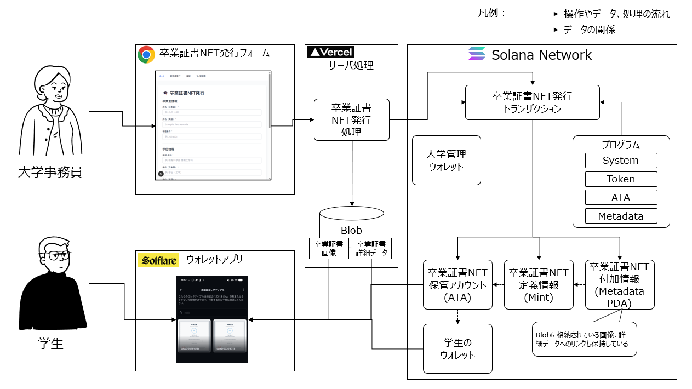
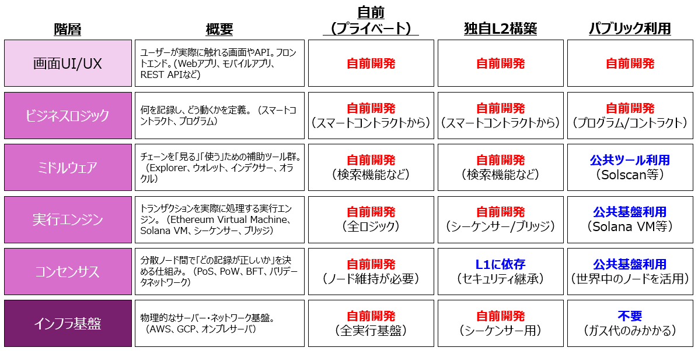
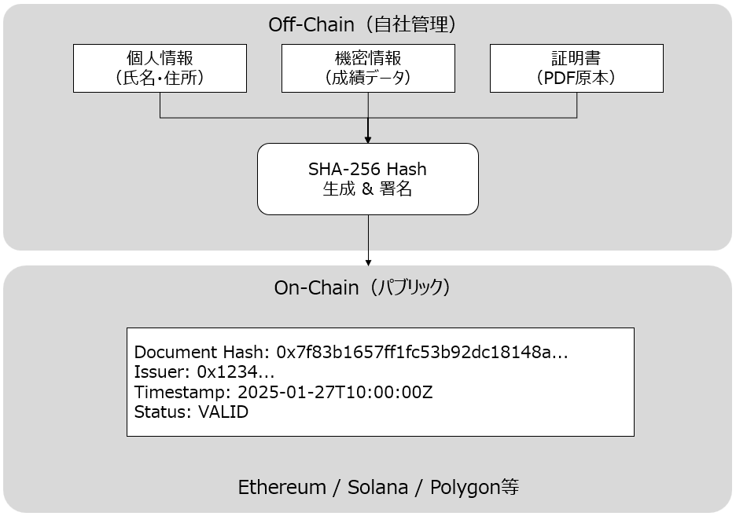
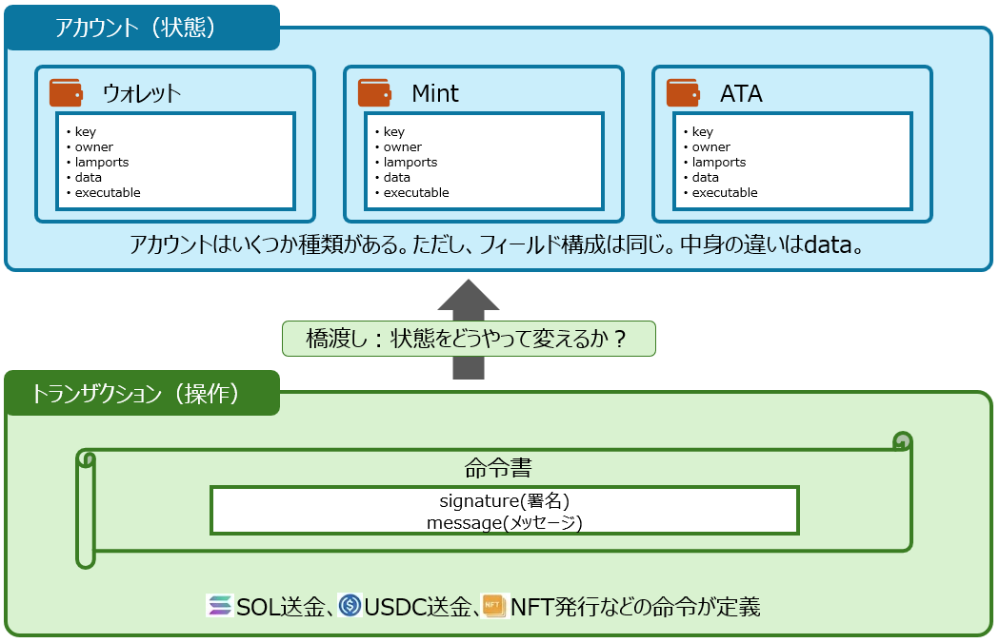
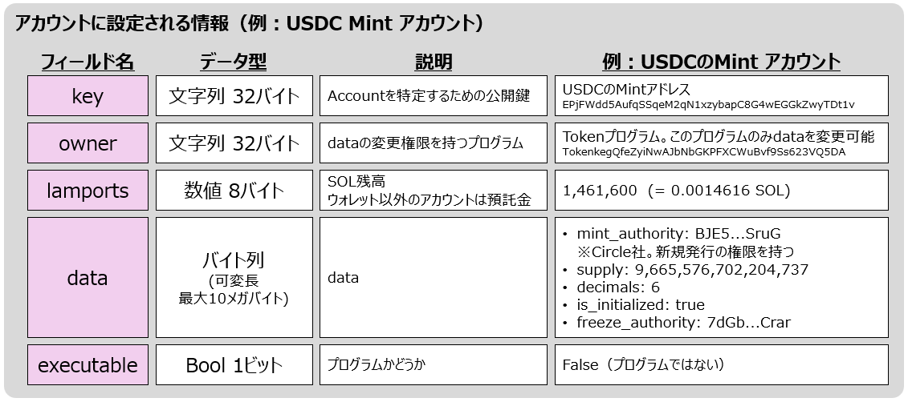
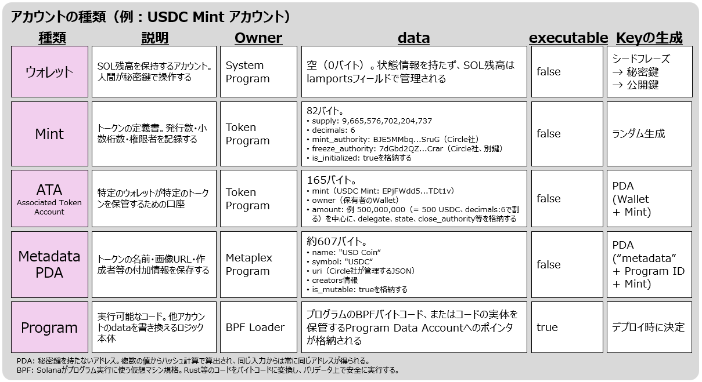
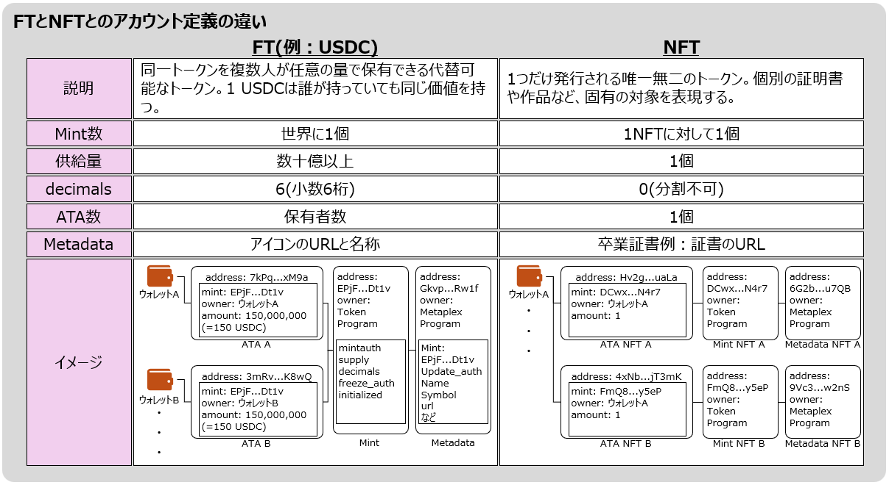
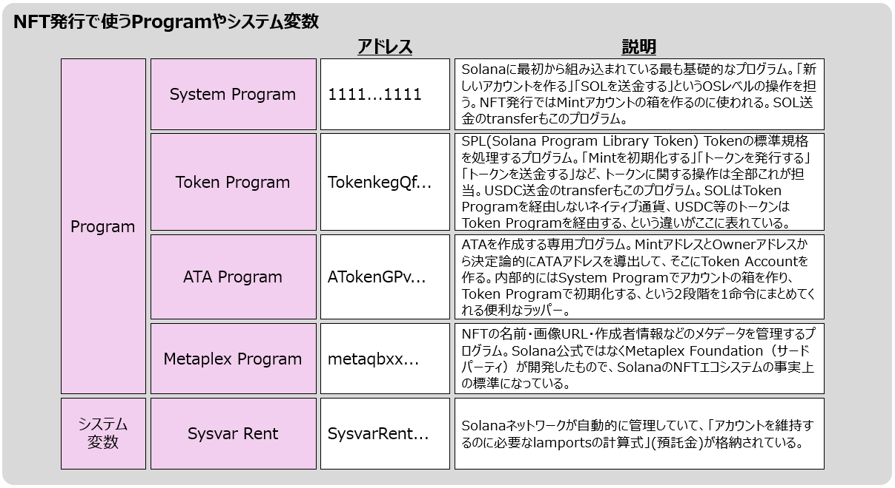
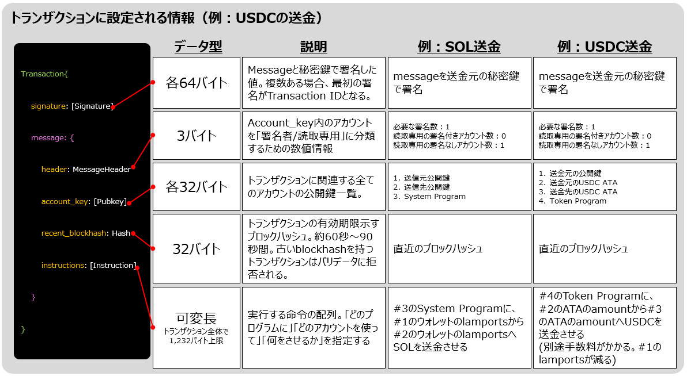
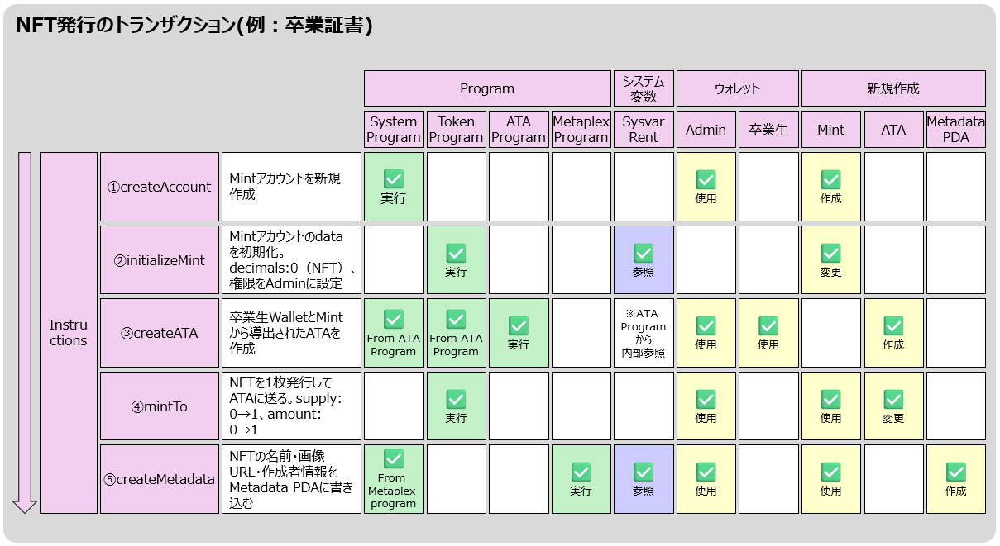

<div class="doc-header">
  <div class="doc-title">ゼロからわかる Solana NFT 開発</div>
  <div class="doc-author">マッサン</div>
</div>

# ゼロからわかる Solana NFT 開発

## はじめに：チャプターの全体像

「ブロックチェーンで NFT を発行する」と聞くと、何か特別で複雑なことをしているように感じます。しかし、Solana の内部構造を理解すると、**その正体は「アカウント（データの箱）をいくつか作って、特定のルールで初期化するだけ」** だと分かります。

本チャプターでは、ブロックチェーンの基礎概念から始めて、最終的に卒業証書 NFT システムの実装コードの 1 行 1 行がチェーン上で何をしているかを解説していきます。

### 本章の構成

本チャプターは大きく 3 部構成です。

**第 1 部：ブロックチェーンの基礎** では、ブロックチェーンとは何か、BTC と Ethereum/Solana のデータモデルの違い、そしてプライベートチェーンとパブリックチェーンのどちらを選ぶべきかを解説します。

**第 2 部：Solana のアカウントとトランザクション** では、Solana の二層構造、5 種類のアカウント、FT と NFT の違い、トランザクションの内部構造を図解します。

**第 3 部：卒業証書 NFT の実装** では、実際のシステムアーキテクチャと、TypeScript の実装コードを理論と照らし合わせて解読します。

> 本章のソースコードは GitHub に公開しています。
> GitHub: 卒業証書 NFT システムのソースコード <span class="footnote">https://github.com/Masa1984a/graduation-certificate-nft-system</span>


*図１：卒業証書 NFT システムの全体像。大学事務員がフォームから情報を入力し、Vercel サーバ処理を経て Solana Network にトランザクションが送信される。学生は Solflare ウォレットで NFT を確認できる*

---

<!-- 強制改ページ -->
<hr class="page-break"/>

## 第 1 部：ブロックチェーンの基礎

## ブロックチェーンとは何か

### 「分散型台帳」の本質

ブロックチェーンを一言で表すなら、**「世界中のコンピュータが同じ帳簿を共有し、誰も単独では改ざんできない仕組み」** です。

従来のシステムでは、データは 1 つの組織が管理するサーバーに保存されています。銀行の残高データ、大学の卒業記録、不動産の登記情報──これらはすべて「管理者を信頼する」ことで成り立っています。管理者がデータを書き換えれば、それが「正」になります。

ブロックチェーンはこの前提を覆します。データの正しさを、特定の管理者ではなく、**ネットワーク全体の合意（コンセンサス）** によって保証します。

### エンジニア向けの理解

技術的に見ると、ブロックチェーンは以下の 3 つの要素で構成されています。

**暗号学的ハッシュチェーン：** 各ブロックが前のブロックのハッシュ値を含むことで、過去のデータを 1 ビットでも変更すると、それ以降のすべてのブロックのハッシュが変わります。改ざんを検知可能にする仕組みです。

**分散コンセンサス：** 世界中のノード（コンピュータ）が「このデータは正しい」と合意するプロセスです。PoW（Proof of Work）、PoS（Proof of Stake）、PoH（Proof of History）など、チェーンによって合意方法は異なります。

**経済的インセンティブ：** ノードがネットワークに参加し続ける動機付けです。ブロック生成報酬やトランザクション手数料がこれにあたります。不正をするより正直に参加した方が経済的に合理的になるよう設計されています。

### ブロックチェーンが解く問題

ブロックチェーンの核心的価値は **「第三者による検証」** です。

発行者でも管理者でもない、世界中の独立したノードがデータの正しさを検証できる──これこそが、従来のデータベースにはない固有の価値です。この性質が、改ざん検知、存在証明、所有権証明といった応用を可能にしています。

---

<!-- 強制改ページ -->
<hr class="page-break"/>

## BTC と Ethereum/Solana の根本的な違い

ブロックチェーン開発を始める際、まず疑問となるのが「Bitcoin と Ethereum/Solana との違い」です。

### Bitcoin：UTXO モデル ── 「現金」のデジタル化

ビットコインのブロックチェーン上には、どこを探しても **「A さんの残高 = 10 BTC」というレコードは存在しません。** あるのは「取引（Transaction）の履歴」だけです。

この仕組みを **UTXO（Unspent Transaction Output）** モデルと呼びます。「残高」とは、**「まだ誰にも送金していない過去の Output(受取高) の総和」** として算出されます。ウォレットアプリが裏側で UTXO を集計して「残高」として表示しているに過ぎません。

これは **「現金（Cash）」** の物理的な挙動をデータ化したものです。手元に 1,000 円札が 1 枚あり、300 円を支払いたい場合、1,000 円札を使って 300 円を払い、700 円のお釣りを受け取ります。使った 1,000 円札は消滅し、新たに 300 円と 700 円の 2 つの UTXO が生まれます。

```json
{
  "inputs": [
    { "prev_tx": "過去に受け取った1000円札のトランザクションID", "output_index": 0 }
  ],
  "outputs": [
    { "to": "お店のアドレス", "amount": 300 },
    { "to": "自分のお釣り用アドレス", "amount": 700 }
  ]
}
```

> **💡ポイント:** 「ウォレットのアドレス」と「自分のお釣り用のアドレス」が異なるように記載されていますが問題ありません。後者は、HDウォレットと呼ばれ、1つのシードフレーズから複数アドレスを階層的に導出する仕組みで、すべてのアドレスの秘密鍵はシードから再計算可能です。つまりアドレスが異なっても、同一シードの管理下にあるため資金の所有権を失うことはありません。

> **💡ポイント:** 実際のBTCトランザクションでは、Input合計とOutput合計の差分がマイナー手数料（Transaction Fee）になります。明示的な手数料フィールドは存在しません。

### Ethereum/Solana：アカウントモデル ── 「銀行口座」のデジタル化

一方、Ethereum や Solana は、RDBMS や KVS に近い **「アカウントモデル」** を採用しています。

ブロックチェーン上に「Global State」と呼ばれる巨大なデータストアがあり、アドレスをキーとしてアカウント情報（残高、コントラクトコード、ストレージなど）がマッピングされています。トランザクションは、この Global State を書き換える **状態更新命令** として機能します。

```sql
-- ETH/SOLの処理イメージ（擬似SQL）
BEGIN TRANSACTION;
UPDATE accounts SET balance = balance - 300 WHERE address = '0xSender...';
UPDATE accounts SET balance = balance + 300 WHERE address = '0xReceiver...';
COMMIT;
```

### 比較まとめ

| 特徴 | UTXO モデル (BTC) | アカウントモデル (ETH / SOL) |
| :-- | :-- | :-- |
| **データ構造** | トランザクションの連鎖（Linked List 的） | Key-Value Store（Global State） |
| **残高の概念** | 未使用 Output（UTXO）の集計結果 | State に記録された数値 |
| **状態管理** | Stateless | Stateful |
| **スマートコントラクト** | 困難（状態を保持しない） | 容易（DeFi・NFT 等に最適） |
| **エンジニア的な例え** | Git のコミットログ（差分の積み重ね） | RDB のレコード（最新状態を保持） |

### Solana が Ethereum より高速な理由：PoH（Proof of History）

Ethereum と Solana はどちらもアカウントモデルですが、処理速度には大きな差があります。Ethereum が約 15〜30 TPS なのに対し、Solana は理論値 65,000 TPS 以上です。

この差を生むのが **PoH（Proof of History）** です。Solana はデータ自体に暗号学的タイムスタンプを埋め込むことで、ノード間の通信なしに時系列順序が確定します。順序が確定しているため、互いに干渉しないトランザクションを CPU のマルチコアで **並列処理（Sealevel Runtime）** できます。

> **💡ポイント:** レジの例えでいうと、Ethereum が「全員が一列に並んで 1 つのレジで会計」だとすれば、Solana は「整理券（PoH）で順番が保証されているので、空いている複数のレジで同時に会計」している状態です。

---

<!-- 強制改ページ -->
<hr class="page-break"/>

## 自前で作るべきか、パブリックを活用すべきか

### 3 つの構成案

ブロックチェーンを活用したシステム開発では、以下の 3 つの構成が考えられます。

| 構成 | 概要 |
| :-- | :-- |
| **① 自前（プライベートチェーン）** | Hyperledger Fabric 等で社内サーバーに構築 |
| **② 独自 L2 構築** | OP Stack、Polygon CDK 等を利用 |
| **③ パブリック利用（ハイブリッド）** | Ethereum、Solana 等のメインネットを利用 |

> **💡ポイント:** 
> 
> **自前（プライベート）チェーンとは：** 許可制のブロックチェーンを自社サーバーで運用する構成。サーバー 3〜4 台以上、スマートコントラクト開発、証明書管理等が必要。構築より運用負荷が高いと言われています。
>
> **独自 L2 とは：** L1 が「本店」、L2 は「支店」。支店では店長（シーケンサー）が即決で処理し、1 日の終わりに圧縮データを本店に送ります。自前は"信用して"と頼む構造ですが、L2 は"疑うなら L1 で検証して"と言えます。

### 比較表


*図２：パブリック利用の場合、画面 UI/UX やビジネスロジックに注力できる。独自 L2 の場合、特にブリッジ管理がセキュリティリスクの鬼門*

### 年間コスト試算（10 万トランザクション/年）

| 構成 | 年間コスト | 内訳 |
| :-- | :-- | :-- |
| **パブリック（Solana）** | 約 0.5〜1 万円 | tx 単価 ≈ $0.00025 × 100,000 |
| **パブリック（Ethereum L2）** | 約 1〜5 万円 | Polygon, Arbitrum 等 |
| **独自 L2 構築・運用** | 300 万円〜 | EC2/GCE + 運用工数 |
| **自前プライベート** | 300 万円〜 | オンプレ or クラウド + 運用工数 |

**年間 1,000 万 tx 超のような大規模でない限り、多くのケースで「パブリック利用」が合理的です。** 中小規模で L2 や自前チェーンを構築するのは、「コンビニに行くためにプライベートジェットを買う」ような過剰投資と言えます。

### 自前チェーンの罠：「俺が正義」のパラドックス

プライベートチェーンのノード管理者が全員「身内」である場合、**自社が発行したデータを、自社のサーバーで『正しい』と言っているだけ** になります。これは RDBMS + デジタル署名と本質的に変わりません。ブロックチェーンの核心的価値である「第三者による検証」が機能しないのです。

### パブリックは信用できない？ ── 企業採用の現実

「パブリックチェーンは誰が管理しているか分からなくて怖い」という声はよく聞きますが、現実には世界の大企業が続々と採用しています。

**Visa** は Solana でのステーブルコイン決済を正式採用し、年間 35 億ドル以上の決済量に達しています。**Google Cloud** は Solana のバリデータを運用し、BigQuery で全データを検索可能にしています。**Sony** は Ethereum L2「Soneium」をメインネットローンチ。**千葉工業大学** は日本の大学で初めて学位証明書を NFT（SBT）として発行しました。

### 結論：ハイブリッド構成から始めよう


*図３：ハイブリッド構成のアーキテクチャ概要。個人情報はオフチェーン、証明（ハッシュ値）はオンチェーンに格納する*

パブリックチェーンで個人情報を守るには **ハイブリッド構成** を採用します。個人情報はチェーンに流さず、ハッシュ値だけをパブリックに刻む。これにより、個人情報を保護しつつ、第三者証明のメリットを享受できます。

---

<!-- 強制改ページ -->
<hr class="page-break"/>

## 第 2 部：Solana のアカウントとトランザクション

## Solana の二層構造：「状態」と「操作」

Solana のデータモデルは、**アカウント（状態）** と **トランザクション（操作）** の 2 つの層で構成されています。


*図４：アカウント（状態）とトランザクション（操作）の二層構造。アカウントはいくつか種類があるが、フィールド構成は同じ。中身の違いは data*

**アカウント** は Solana 上のすべてのデータの入れ物です。ウォレットの残高も、トークンの定義も、NFT のメタデータも、すべて「アカウント」として存在します。重要なのは、**アカウントは種類が異なってもフィールド構成は全種類で共通** ということです。違うのは `data` フィールドの中身だけです。

**トランザクション** はアカウントの状態を変更するための命令書です。`signature`（署名）と `message`（メッセージ）で構成され、message の中に複数の `instructions`（命令）を含められます。NFT 発行では 5 つの命令を 1 トランザクションにパッケージングします。

### アカウントの内部構造：5 つのフィールド

すべての Solana アカウントは、以下の 5 つのフィールドで構成されています。


*図５：USDC Mint アカウントの実際のデータを例に、各フィールドの意味を解説。owner はデータ変更権限を持つ「プログラム」を指す。*

| フィールド | サイズ | 役割 |
| :-- | :-- | :-- |
| **key** | 32 バイト | アカウントを特定する公開鍵（住所） |
| **owner** | 32 バイト | data の変更権限を持つ **プログラム** のアドレス |
| **lamports** | 8 バイト | SOL 残高（1 SOL = 10 億 lamports） |
| **data** | 可変長（最大 10MB） | アカウント種類ごとに異なる本体データ |
| **executable** | 1 ビット | 実行可能なプログラムかどうか |

> **💡ポイント:** アカウントフィールドの `owner` と、ATA における「トークンの所有者（ウォレット）」は別の概念です。owner は「data の書き換え権限を持つプログラム」、所有者は「data 内に記録された人間のウォレットアドレス」です。

---

<!-- 強制改ページ -->
<hr class="page-break"/>

## 5 種類のアカウントとその役割


*図６：5 種類のアカウント一覧。Owner（data の管理プログラム）、data 内容、executable、key の生成方法がそれぞれ異なる*

**① ウォレット（Wallet Account）：** SOL 残高を保持。owner は System Program、data は空（0 バイト）。残高は lamports フィールドで管理。

**② Mint Account：** トークンの「定義書」。発行数（supply）、小数桁数（decimals）、発行権限者を記録。owner は Token Program、data は 82 バイト固定。USDC の Mint アドレスは世界に 1 つだけ存在します。

**③ ATA（Associated Token Account）：** 「特定のウォレットが特定のトークンを保管するための口座」。Mint アドレスと Owner アドレスから PDA（Program Derived Address）として決定論的に導出。owner は Token Program、data は 165 バイト。

> **💡ポイント:** 銀行で言えば、Mint は「通貨の定義（円、ドル等）」、ATA は「特定の人の、特定の通貨の口座」に相当します。

**④ Metadata PDA：** トークンの名前、シンボル、画像 URL、作成者情報などの付加情報を保存。owner は Metaplex Program（NFT エコシステムの事実上の標準）。key は `["metadata", Program ID, Mint Address]` の 3 つのシード値から PDA として導出。

**⑤ Program Account：** 実行可能なコード本体を保持。executable が `true` になる唯一のアカウント種別。

> **💡ポイント:** PDA（Program Derived Address）は秘密鍵を持たないアドレスです。複数の値からハッシュ計算で算出され、同じ入力からは常に同じアドレスが得られます。「この組み合わせなら、このアドレスにある」と計算で特定できるため、チェーン上を探し回る必要がありません。

---

<!-- 強制改ページ -->
<hr class="page-break"/>

## FT と NFT：「アカウント設計」の違いで理解する

FT（Fungible Token、代替可能トークン）と NFT は、**同じアカウント構造** を使い、**設定値が異なるだけ** です。


*図７：FT（例: USDC）と NFT のアカウント構成を比較。Mint 数、供給量、decimals、ATA 数、Metadata の用途が異なる*

### なぜ NFT は「唯一」なのか

NFT の「唯一性」は、技術的には 2 つの条件で実現されています。

1. **supply = 1：** その Mint からトークンが 1 枚しか発行されない
2. **decimals = 0：** 小数分割ができない（0.5 枚が存在しない）

この 2 つを組み合わせることで「世界に 1 つしか存在しない、分割不可能なトークン」が成立します。**特別な「NFT 用のプログラム」があるわけではなく、既存の Token Program を NFT 用のパラメータで呼び出しているだけ** なのです。

### アカウント構成の違い

**FT（USDC）の場合：** 1 つの Mint に対して多数の ATA が紐づきます。ウォレット A が 150 枚、ウォレット B が 150 枚持っていれば、それぞれ別の ATA に amount が記録されます。Mint と Metadata は共通で 1 つずつ。

**NFT の場合：** 1 つの NFT ごとに Mint、ATA、Metadata が 1 セットずつ存在します。卒業証書 A と B があれば、それぞれ独立したアカウントセットを持ちます。

---

<!-- 強制改ページ -->
<hr class="page-break"/>

## NFT 発行で使う Program とトランザクション構造

### 4 つの Program と 1 つのシステム変数


*図８：各 Program の役割とアドレス。SOL は Token Program を経由しないネイティブ通貨で、USDC 等のトークンは Token Program が管理する*

| Program | 役割 |
| :-- | :-- |
| **System Program** | アカウント作成、SOL 送金（OS レベル） |
| **Token Program** | Mint 初期化、トークン発行・送金 |
| **ATA Program** | ATA の決定論的作成（便利なラッパー） |
| **Metaplex Program** | NFT 名前・画像 URL・作成者情報の管理 |
| **Sysvar Rent** | アカウント維持に必要な預託金の計算式 |

### トランザクションの内部構造


*図９：SOL 送金と USDC 送金のトランザクションを比較。account_key の数や instructions の内容が異なる*

トランザクションは、**signature**（署名）と **message**（header、account_key、recent_blockhash、instructions）で構成されます。`recent_blockhash` は約 60〜90 秒間のみ有効で、リプレイ攻撃を防止しています。

> **💡ポイント:** SOL 送金は System Program に「lamports を移動して」と命令。USDC 送金は Token Program に「ATA の amount を移動して」と命令。操作対象が `lamports` か `data 内の amount` かの違いです。

---

<!-- 強制改ページ -->
<hr class="page-break"/>

## 第 3 部：卒業証書 NFT の実装

## NFT 発行トランザクションの全貌：5 つの Instruction

NFT 発行トランザクションは、5 つの Instruction で構成されています。


*図１０：5 つの Instruction が、どの Program を実行し、どのアカウントを使用/作成/変更するかを一覧化*

### ① createAccount（Mint アカウントの箱を作る）

System Program が、新しい Mint アカウント用の「空の箱」をブロックチェーン上に作成します。

```typescript
SystemProgram.createAccount({
  fromPubkey: adminKeypair.publicKey,    // 手数料を払う人
  newAccountPubkey: mintKeypair.publicKey, // 新しいMintのアドレス
  space: MINT_SIZE,                       // 82バイト
  lamports,                               // 預託金
  programId: TOKEN_PROGRAM_ID,            // ownerとなるプログラム
})
```

### ② initializeMint（Mint アカウントの data を初期化）

Token Program が、空の箱にトークン定義情報を書き込みます。`decimals: 0` で「NFT 用の Mint」として初期化。

```typescript
createInitializeMintInstruction(
  mintKeypair.publicKey,  // 対象のMintアカウント
  0,                      // decimals = 0（NFTなので分割不可）
  adminKeypair.publicKey, // mint authority
  adminKeypair.publicKey, // freeze authority
)
```

### ③ createATA（卒業生のトークン口座を作る）

ATA Program が、卒業生のウォレットに紐づく ATA を作成します。卒業生が特に何かする必要はなく、大学側が代わりに口座を開設できます。

```typescript
createAssociatedTokenAccountInstruction(
  adminKeypair.publicKey, // 手数料を払う人（大学）
  associatedTokenAccount, // 作成されるATAのアドレス
  recipientPubkey,        // 卒業生のウォレットアドレス
  mintKeypair.publicKey,  // どのMintのATA？
)
```

### ④ mintTo（NFT を 1 枚発行して ATA に送る）

Token Program が、Mint の supply を 0→1 に、ATA の amount を 0→1 に更新します。

```typescript
createMintToInstruction(
  mintKeypair.publicKey,  // どのMintから？
  associatedTokenAccount, // どのATAへ？
  adminKeypair.publicKey, // mint authority
  1,                      // amount = 1（NFTなので1枚だけ）
)
```

### ⑤ createMetadata（NFT の名前・画像 URL 等を書き込む）

Metaplex Program が、Metadata PDA を作成し、NFT の付加情報を書き込みます。

```typescript
createMetadataAccountV3(umi, {
  mint: umiMint,
  mintAuthority: umiMintAuthority,
  data: {
    name: "GRAD-2025-0001",
    symbol: "GRAD",
    uri: metadataUri,
    creators: [{ address: umiUpdateAuthority, verified: true, share: 100 }],
  },
  isMutable: false, // 改ざん防止：一度書き込んだら変更不可
})
```

`isMutable: false` は卒業証書 NFT において極めて重要です。発行後にメタデータを変更できなくなり、**発行者自身も改ざんできない** という信頼性を担保します。

> **アトミック性：** これら 5 つの Instruction はすべて 1 つのトランザクションにまとめられます。途中で失敗した場合は **すべてがロールバック** されます。「Mint は作れたけど ATA の作成に失敗して中途半端な状態になった」ということは起きません。

---

<!-- 強制改ページ -->
<hr class="page-break"/>

## 実装全体像：卒業証書 NFT システム

### システムアーキテクチャ


*図１１：(卒業証書 NFT システムの全体像を再掲)大学事務員がフォームから情報を入力し、Vercel サーバ処理を経て Solana Network にトランザクションが送信される。学生は Solflare ウォレットで NFT を確認できる*

<!-- textlint-disable -->

```
大学事務員
    ↓ ① フォーム入力（学生名、学位、卒業日、ウォレットアドレス）
Next.js フロントエンド
    ↓ ② API呼び出し（Bearer認証）
Vercel サーバ処理
    ├─ ③ 証書画像・詳細データ → Vercel Blobに保存
    └─ ④ NFT発行トランザクション → Solana Networkへ送信
         └─ 5つのInstruction（①〜⑤）

Solana Network上に作成されるアカウント:
    ├─ Mintアカウント      ← NFTの定義情報
    ├─ ATAアカウント       ← 学生のウォレットに紐づく保管口座
    └─ Metadata PDA       ← 証書の名前・画像URL・作成者情報
```

<!-- textlint-enable -->

### オフチェーンとオンチェーンの役割分担

このシステムでは、先ほど解説したハイブリッド構成を採用しています。

| データ | 保存先 | 理由 |
| :-- | :-- | :-- |
| 証書画像（PNG/SVG） | Vercel Blob（オフチェーン） | 画像は大きくてオンチェーンだとコスト膨大 |
| 詳細データ（JSON） | Vercel Blob（オフチェーン） | 属性情報を構造化して格納 |
| 画像・詳細データの URL | Metadata PDA（オンチェーン） | URL で参照可能に |
| 発行者・作成者情報 | Metadata PDA（オンチェーン） | 第三者検証に必須 |
| トークン定義（supply, decimals） | Mint アカウント（オンチェーン） | 唯一性の保証 |
| 所有権（誰が持っているか） | ATA（オンチェーン） | 改ざん不可能な所有証明 |

### コードと理論の接続：route.ts の主要部分

**アカウントの準備（PDA 事前計算）：**

```typescript
const mintKeypair = Keypair.generate();              // Mintのキーペア生成
const recipientPubkey = new PublicKey(data.recipientWallet.trim());

// ATAアドレスの計算（PDA導出：Wallet + Mint → ATA）
const associatedTokenAccount = await getAssociatedTokenAddress(
  mintKeypair.publicKey, recipientPubkey,
);

// Metadata PDAアドレスの計算
const metadataPDA = getMetadataPDA(mintKeypair.publicKey);

// Rent（預託金）の計算
const lamports = await getMinimumBalanceForRentExemptMint(connection);
```

ATA と Metadata PDA は決定論的に導出されるため、チェーンに問い合わせなくても計算だけでアドレスが分かります。

**5 つの Instruction を 1 トランザクションに組み立て：**

```typescript
const transaction = new Transaction();
transaction.add(SystemProgram.createAccount({...}));          // ① Mint箱作成
transaction.add(createInitializeMintInstruction(...));         // ② Mint初期化
transaction.add(createAssociatedTokenAccountInstruction(...)); // ③ ATA作成
transaction.add(createMintToInstruction(...));                 // ④ NFT発行
transaction.add(metadataInstruction);                         // ⑤ メタデータ書込
```

**署名と送信：**

```typescript
const signature = await sendAndConfirmTransaction(
  connection, transaction,
  [adminKeypair, mintKeypair], // 署名者2人
  { commitment: 'confirmed' }
);
```

署名者が 2 人必要なのは、`adminKeypair`（大学ウォレット：手数料支払い + mint authority）と `mintKeypair`（Mint アカウント：createAccount の対象）の両方の秘密鍵が必要だからです。

---

<!-- 強制改ページ -->
<hr class="page-break"/>

## まとめ：「NFT 発行」の正体

本章を通じて明らかになったことを整理します。

**第 1 部** では、ブロックチェーンの本質的価値は「第三者による検証」であること、BTC と ETH/SOL のデータモデルの違い、そして多くのケースでパブリックチェーンのハイブリッド構成が最適解であることを確認しました。

**第 2 部** では、Solana の二層構造（アカウントとトランザクション）を理解し、FT と NFT の違いが「コントラクトの種類」ではなく「Mint アカウントの設定値（supply=1, decimals=0）の違い」に過ぎないことを把握しました。

**第 3 部** では、NFT 発行トランザクションの 5 つの Instruction を 1 つずつ分解し、TypeScript の実装コードの各行がどの理論に対応するかを明示しました。

| ステップ | 理解のポイント |
| :-: | :-- |
| **1** | Solana は「アカウント（状態）」と「トランザクション（操作）」の二層構造 |
| **2** | アカウントは種類が違ってもフィールド構成は同じ（違うのは data だけ） |
| **3** | FT と NFT の違いは、Mint の設定値（supply, decimals）の違い |
| **4** | NFT 発行は 5 つの Instruction を 1 トランザクションにまとめた原子的操作 |
| **5** | コードの各行は、特定の Program への命令に 1 対 1 で対応する |

この構造を理解すれば、SBT（Soul Bound Token）への拡張や、Collection NFT、Token Extension（Token-2022 Program）を使った高度なトークン設計にも応用できます。

---

## 参考リンク

<!-- textlint-disable -->

- Solana 公式ドキュメント - Accounts <span class="footnote">https://docs.solana.com/developing/programming-model/accounts</span>
- Solana 公式ドキュメント - Transactions <span class="footnote">https://docs.solana.com/developing/programming-model/transactions</span>
- Metaplex Token Metadata <span class="footnote">https://developers.metaplex.com/token-metadata</span>
- SPL Token Program <span class="footnote">https://spl.solana.com/token</span>
- GitHub: 卒業証書 NFT システム <span class="footnote">https://github.com/Masa1984a/graduation-certificate-nft-system</span>
- GitHub: デジタルハンコシステム <span class="footnote">https://github.com/Masa1984a/Solana_Document_Stamping_System</span>

### 関連記事

- Bitcoin と Ethereum/Solana の根本的な違い：UTXO モデル vs アカウントモデル <span class="footnote">https://zenn.dev/acntechjp/articles/80284cb1849052</span>
- オンチェーン構築はプライベート vs パブリック、どっちにする？ <span class="footnote">https://zenn.dev/acntechjp/articles/3d9da022deec9e</span>
- 【Solana × Next.js】書類の「デジタルハンコ」システムを爆速で作る <span class="footnote">https://zenn.dev/acntechjp/articles/912129811daf99</span>
- Solana のトークン（NFT 含む）を徹底理解する <span class="footnote">https://zenn.dev/acntechjp/articles/6a3d0b04d6db16</span>

<!-- textlint-enable -->
