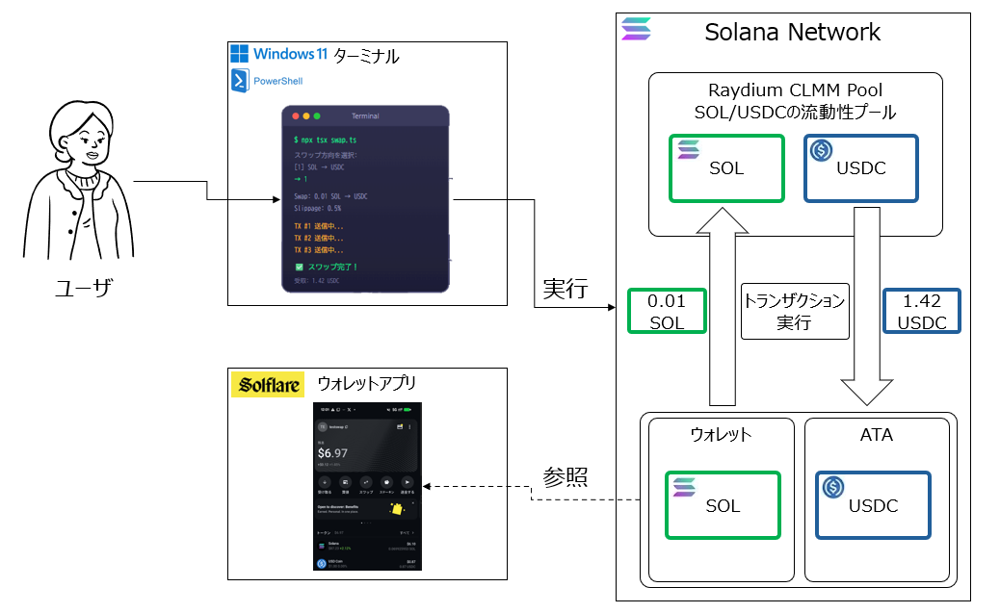
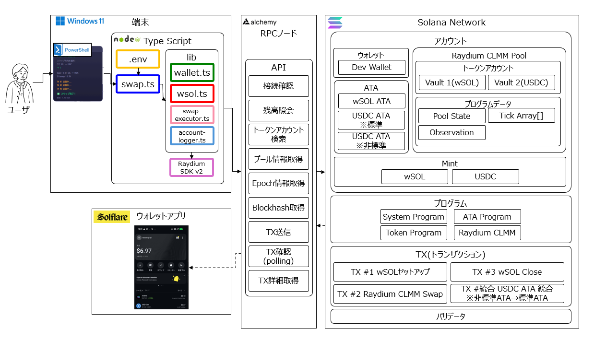
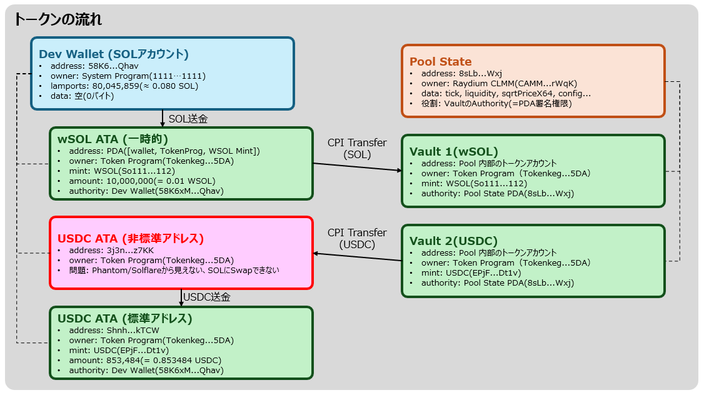
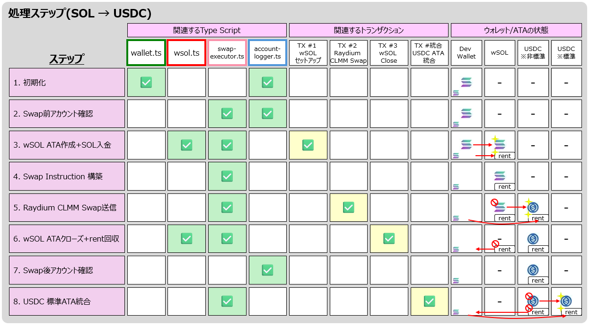

<div class="doc-header">
  <div class="doc-title">Solana の SOL → USDC スワップを徹底理解する</div>
  <div class="doc-author">マッサン</div>
</div>

# Solana の SOL → USDC スワップを徹底理解する

## はじめに：「スワップする」とは、結局何をしているのか

前章では、Solana のアカウント構造から NFT 発行の全貌を解き明かしました。5 種類のアカウント、5 つの Instruction、そして「NFT 発行の正体はアカウントをいくつか作って初期化するだけ」という核心に辿り着きました。

<!-- textlint-disable spellcheck-tech-word -->

本章では、その知識を武器にして **DEX（分散型の取引所）の AMM（自動マーケットメイカー）を使った SOL → USDC スワップ** の内部構造を分解します。コードの 1 行 1 行がチェーン上で何をしているのかまで解説します。

「スワップする」と聞くと、何か魔法のような処理をイメージするかもしれません。しかしその正体は、**「ユーザーが自分のトークンをプールの金庫に送り、プールの金庫から別のトークンを受け取る」という Token Program への 2 回の Transfer 命令** です。Raydium CLMM プログラムが CPI（Cross-Program Invocation）で Token Program を呼び出し、この 2 回の Transfer を安全に実行します。

本章では、Solana Mainnet 上で実際に動作する TypeScript CLI の実装を通じて、スワップの全プロセスを 8 ステップに分解します。各ステップで何が起きているのかを具体的なアカウントアドレスとトランザクション署名とともに解説します。

<!-- textlint-enable spellcheck-tech-word -->

> 本章のソースコードは GitHub に公開しています。
> GitHub: Solana DEX AMM Swap <span class="footnote">https://github.com/Masa1984a/Solana-DEX-AMM.git</span>

<!-- TODO: 画像を配置してください -->

*図１：CLI から Solana Network 上の Raydium CLMM Pool を経由して SOL → USDC スワップを実行する全体像*

### 本章の構成

本チャプターは大きく 3 部構成です。

**第 1 部：スワップのアーキテクチャ** では、システム全体像、スワップに登場する全アカウントの所有関係、トークンの流れを図解します。

<!-- textlint-disable spellcheck-tech-word -->
**第 2 部：8 ステップ・最大 4 トランザクションの詳解** では、SOL → USDC スワップの全処理を 1 ステップずつ分解します。各ステップのコードとオンチェーン上の状態変化を対応づけて解説します。
<!-- textlint-enable spellcheck-tech-word -->

**第 3 部：実装で発見した落とし穴** では、Mainnet テストではじめて発覚した SDK の非標準 ATA 問題への対処をまとめます。WebSocket 非対応への対処や Blockhash のリトライ戦略など、実装上の重要なポイントも扱います。

### この章で得られること

- SOL → USDC スワップの 8 ステップ・最大 4 トランザクションの処理フローの理解
- wSOL（Wrapped SOL）の仕組みと、なぜスワップ前にラップが必要なのか
- Raydium CLMM Pool のアカウント構造（Vault、Pool State PDA、Tick Array）
- SDK の「非標準 ATA」問題と、ウォレットアプリとの互換性問題への対処法
- Mainnet 実行ログに基づく具体的なトランザクション解析

---

<!-- 強制改ページ -->
<hr class="page-break"/>

## 第 1 部：スワップのアーキテクチャ

## システム全体像：3 つのレイヤー

スワップシステムは、**端末 → RPC ノード → Solana Network** の 3 層で構成されています。

<!-- TODO: 画像を配置してください -->

*図２：端末（TypeScript）、RPC ノード（Alchemy）、Solana Network 上のアカウント・プログラム・トランザクション*

### 端末レイヤー（TypeScript）

エントリーポイントの `swap.ts` がオーケストレーターとして全体の処理順序を制御します。ビジネスロジック自体はもたず、各モジュールを正しい順序で呼び出す役割に徹しています。

```
swap.ts                  # エントリーポイント（方向選択 → runSolToUsdc / runUsdcToSol）
lib/wallet.ts            # Keypair読み込み・残高確認・確認プロンプト
lib/wsol.ts              # wSOL ATA 作成・クローズ Instructions構築
lib/swap-executor.ts     # Raydium SDK呼び出し・TX送信（HTTPポーリング）
lib/account-logger.ts    # ボックス形式ログ出力ユーティリティ
```

呼び出しの流れは `.env → swap.ts → lib/*.ts → Raydium SDK → Solana` という一方向です。`swap.ts` が dotenv で環境変数を読み込み、それを各関数の引数として渡します。コードを変更せずに接続先やパラメータを切り替えられる設計です。

### RPC ノード（Alchemy）

端末と Solana Network の橋渡し役です。接続確認、残高照会、トークンアカウント検索、プール情報取得、Epoch 情報取得、Blockhash 取得、TX 送信、TX 確認（ポーリング）、TX 詳細取得といった API を提供します。

<!-- textlint-disable spellcheck-tech-word -->

ここで重要なのは、**Alchemy などの RPC プロバイダーは WebSocket の `signatureSubscribe` に対応していないことがある** 点です。Raydium SDK の `execute({ sendAndConfirm: true })` は WebSocket を前提としています。そのまま使うとタイムアウトエラーになります。この問題への対処は第 3 部で詳しく解説します。

### Solana Network レイヤー

スワップに関わるオンチェーン上の要素は、大きく **アカウント**、**プログラム**、**トランザクション** の 3 つに分類されます。前章で解説した「アカウントの 5 つのフィールド」と「トランザクションの内部構造」がそのまま適用されます。

<!-- textlint-enable spellcheck-tech-word -->

---

<!-- 強制改ページ -->
<hr class="page-break"/>

## スワップに登場する全アカウントと所有関係

前章で解説した「アカウントの 5 つのフィールド」の知識を使って、スワップに登場する全アカウントを整理します。前章で扱った Wallet、Mint、ATA に加えて、**Vault** と **Pool State PDA** という新しいタイプのアカウントが登場します。

<!-- TODO: 画像を配置してください -->

*図３：スワップに関わる 7 種類のアカウント。Owner、data 内容、executable、Key の生成方法の一覧*

### ウォレット（Dev Wallet）

前章と同じ SOL 残高を保持するアカウントです。owner は System Program で、data は空（0 バイト）。スワップの起点となるアカウントで、秘密鍵をもつのはこのアカウントだけです。

### Mint（wSOL / USDC）

トークンの「定義書」です。スワップでは 2 つの Mint アカウントが登場します。wSOL Mint のアドレスは `So11111111111111111111111111111111111111112` です。USDC Mint のアドレスは `EPjFWdd5AufqSSqeM2qN1xzybapC8G4wEGGkZwyTDt1v` です。どちらも前章で解説した Mint アカウントと同じフィールド構成です。owner は Token Program、data は 82 バイト固定長です。

### ATA（Associated Token Account）

前章と同じ「特定のウォレットが特定のトークンを保管するための口座」です。スワップでは 3 つの ATA が登場します。

**wSOL ATA** はスワップのために一時的に作成され、スワップ後にクローズされます。**USDC ATA（標準アドレス）** は Phantom や Solflare が参照する正規のアドレスです。そして **USDC ATA（非標準アドレス）** は Raydium SDK の副作用で作成される問題のあるアカウントです。この対処が本実装の重要なポイントの 1 つです。

### Vault（トークンアカウント：非 ATA）— 新登場

プログラムが独自の seeds で作成したトークン口座です。ATA Program を経由せず、authority に PDA が設定されます。Raydium CLMM Pool の Vault 1（wSOL）と Vault 2（USDC）がこれに該当します。Pool の資金を保管する金庫の役割を果たします。

> **💡ポイント:** authority は「この口座からトークンを動かす権限をもつ者」です。個人の ATA では自分のウォレットが authority ですが、Vault では authority に **PDA（Program Derived Address）** が設定されています。PDA は秘密鍵が存在しないアドレスです。**その PDA を生成したプログラム（ここでは Raydium CLMM）だけが署名を発行できます。** つまり、Vault 内のトークンを動かせるのは Raydium CLMM プログラムだけです。Vault は「Raydium CLMM プログラムしか鍵を開けられない金庫」であり、その鍵の仕組みが PDA です。

### Pool State PDA — 新登場

<!-- textlint-disable spellcheck-tech-word -->

Raydium CLMM プログラムが独自に定義したデータ構造を格納するアカウントです。`tick`、`liquidity`、`sqrtPriceX64`、`config` などのプール状態が記録されています。重要なのは、**Pool State PDA が Vault の authority（署名権限）をもっている** ことです。この PDA の署名を生成できるのは Raydium CLMM プログラムだけなので、不正な Transfer はすべて失敗します。

<!-- textlint-enable spellcheck-tech-word -->

---

<!-- 強制改ページ -->
<hr class="page-break"/>

## トークンの流れ：誰から誰へ、何が移動するのか

スワップの本質は「トークンの移動」です。ここでは、SOL → USDC スワップで実際にどのアカウント間でトークンが移動するのかを図解します。

<!-- TODO: 画像を配置してください -->

*図４：wSOL ATA → Vault 1、Vault 2 → USDC ATA の CPI Transfer と非標準 ATA 統合処理の流れ*

### SOL → wSOL へのラップ

Solana 上の DEX プロトコルは SPL トークン同士の交換を前提としています。ネイティブ SOL は SPL トークンに該当しないため、**wSOL（Wrapped SOL）としてトークンアカウントにラップ** して使います。

前章では、SOL 送金は System Program が直接処理し、USDC 等の SPL トークン送金は Token Program が処理すると解説しました。スワップでは Token Program を経由します。そのため、SOL をいったん wSOL にラップして SPL トークンとして扱います。

ラップの仕組みは次の 3 命令で構成されます。

| # | Instruction | 処理内容 | 実行後の lamports | 実行後の amount |
| :--: | :-- | :-- | :-- | :-- |
| 1 | CreateAssociatedTokenAccount | wSOL ATA を新規作成。**rent（預託金）がウォレットから自動的に支払われる** | 2,039,280（rent） | 0 |
| 2 | SystemProgram.Transfer | スワップしたい 0.01 SOL（10,000,000 lamports）を **rent とは別に** wSOL ATA へ送金 | 12,039,280（rent + 入金） | 0（まだ未同期） |
| 3 | SyncNative | lamports から rent を差し引いた値を amount（トークン残高）に反映する | 12,039,280（変化なし） | 10,000,000（= 0.01 WSOL） |

> **💡ポイント:** amount は Instruction #2 の時点ではまだ 0 のままです。lamports に SOL を入れただけではトークン残高に反映されません。SyncNative が「lamports − rent = 実際のトークン残高」を計算して amount フィールドに書き込みます。これではじめて wSOL として Swap に使えるようになります。
>
> なお、STEP 6 で wSOL ATA を CloseAccount すると、lamports の全額（rent + 残りの wSOL）がウォレットに返却されます。つまり **rent は一時的な預託金であり、最終的に回収されるため実質的なコストにはなりません**。

### CPI Transfer × 2（スワップの核心）

Raydium CLMM Swap_v2 命令の内部では、Token Program への **CPI（Cross-Program Invocation）** が 2 回発生します。

> **💡 CPI とは**
> 「あるプログラムが別のプログラムを呼び出して処理を代行してもらう仕組み」です。トークンの移動（Transfer）は Token Program だけが実行できます。そのため、Raydium CLMM プログラムは自分で直接トークンを動かせません。代わりに「この Vault からユーザーの ATA に USDC を送ってください」と Token Program に依頼します。この依頼が CPI です。
>
> 前章の NFT 発行では、Metaplex Program が Token Program と連携して Metadata PDA を作成していました。スワップでも同様に、Raydium CLMM が Token Program を CPI で呼び出す「プログラム間連携」の構造が使われています。

1. **wSOL ATA → Vault 1（WSOL）** — ユーザーの wSOL をプールの金庫に送る
2. **Vault 2（USDC）→ USDC ATA** — プールの金庫からユーザーに USDC を送る

Vault 1 と Vault 2 の authority は Pool State PDA です。この PDA の署名は Raydium CLMM プログラムだけが `invoke_signed` で生成できます。これが DEX のセキュリティモデルの核心です。

---

<!-- 強制改ページ -->
<hr class="page-break"/>

## 関わるプログラムの責任範囲

前章では System Program、Token Program、ATA Program、Metaplex Program の 4 つが登場しました。スワップでは Metaplex Program の代わりに **Raydium CLMM** が加わります。

| Program | Address | 責任 |
| :-- | :-- | :-- |
| **System Program** | `1111...1111` | アカウント作成、SOL Transfer |
| **Token Program** | `Tokenkeg...5DA` | Transfer、CloseAccount、SyncNative |
| **Associated Token Program** | `ATokenGP...8knL` | PDA 導出で ATA アドレスを決定的に計算 |
| **Raydium CLMM** | `CAMMCzo5...rWqK` | Swap_v2: 価格計算 → CPI で Transfer × 2 |

<!-- textlint-disable spellcheck-tech-word -->

Token Program の責任範囲の広さがポイントです。wSOL ATA、USDC ATA、Vault 1、Vault 2 はすべて `owner = Token Program` です。Transfer、CloseAccount、SyncNative は Token Program だけが実行できます。Raydium CLMM は Swap 命令の中で Token Program に CPI を行います。Vault の authority（Pool State PDA）の署名を `invoke_signed` で提供することで、安全なトークン移動を実現しています。

<!-- textlint-enable spellcheck-tech-word -->

---

<!-- 強制改ページ -->
<hr class="page-break"/>

## 第 2 部：8 ステップ・最大 4 トランザクションの詳解

## 処理ステップマトリックス

SOL → USDC スワップの全処理を 8 ステップに分解します。各ステップで使われる TypeScript モジュール、関連するトランザクション、ウォレット/ATA の状態変化を整理します。

<!-- TODO: 画像を配置してください -->

*図５：8 ステップごとの TypeScript ファイル、トランザクション、各アカウント状態変化の一覧*

---

### STEP 1: 初期化（wallet.ts）

`dev-wallet.json` から Keypair を読み込み、RPC 接続を確立します。SOL 残高が 0.01 SOL 未満の場合は案内を表示して終了します。

```typescript
export function loadWallet(): Keypair {
  const walletPath = path.resolve("dev-wallet.json");
  if (!fs.existsSync(walletPath)) {
    console.error("dev-wallet.json が見つかりません。");
    console.error("solana-keygen new --outfile dev-wallet.json で作成してください。");
    process.exit(1);
  }
  const raw = JSON.parse(fs.readFileSync(walletPath, "utf-8"));
  return Keypair.fromSecretKey(new Uint8Array(raw));
}
```

秘密鍵はこのモジュール内でのみ扱い、ログには公開鍵だけを出力する設計としています。

```
実行ログ:
[STEP 1/7] 初期化
  Network:    Mainnet-Beta
  RPC URL:    https://solana-mainnet.g.alchemy.com/v2/...
  Swap:       0.01 SOL → USDC
  Slippage:   0.5% (50 BPS)

  ウォレット情報:
  ┌────────────────────────────────────────────────────┐
  │ Address:   58K6xM2pkuHeFZEcDAcqqPSmi15kiNwR1zqoGWonQHav │
  │ SOL残高:   0.08004586 SOL (80,045,859 lamports)        │
  └────────────────────────────────────────────────────┘
```

---

### STEP 2: スワップ前アカウント確認（account-logger.ts + swap-executor.ts）

USDC ATA の存在チェックと、Raydium CLMM Pool の現在状態を取得します。プール情報には Pool State アドレス、現在価格、Vault 残高が含まれます。

```typescript
export async function fetchAndLogPoolInfo(
  connection: Connection,
  owner: Keypair
) {
  const raydium = await initRaydium(connection, owner);
  const { poolInfo, poolKeys } = await raydium.clmm.getPoolInfoFromRpc(
    SOL_USDC_POOL_ID.toBase58()
  );
  const price = poolInfo.price?.toFixed(4) ?? "N/A";
  // Pool State, Vault残高, 現在価格をログ出力
}
```

```
実行ログ:
[STEP 2/7] スワップ前のアカウント状態確認

  Raydium CLMM プール情報:
  ┌────────────────────────────────────────────────────┐
  │ Pool State: 8sLbNZoA1cfnvMJLPfp98ZLAnFSY...    │
  │ 現在価格:   1 SOL ≈ 85.3931      USDC                │
  └────────────────────────────────────────────────────┘
```

> **💡ポイント:** Vault の Authority が Pool State PDA であることに注目してください。この PDA の署名を生成できるのは CLMM プログラムだけです。不正な Transfer はすべて失敗します。これが DEX のセキュリティの根幹です。

---

### STEP 3: wSOL ATA 作成 + SOL 入金【TX #1】（wsol.ts）

wSOL ATA の作成と SOL 入金を 1 つのトランザクションにまとめて送信します。前節で解説した 3 つの Instruction で構成されます。

```typescript
export async function buildWsolDepositInstructions(
  payer: PublicKey,
  wsolAta: PublicKey,
  lamportsToDeposit: number
): Promise<TransactionInstruction[]> {
  return [
    // #1 wSOL ATA新規作成
    createAssociatedTokenAccountInstruction(
      payer, wsolAta, payer, WSOL_MINT,
      TOKEN_PROGRAM_ID, ASSOCIATED_TOKEN_PROGRAM_ID
    ),
    // #2 SOLをwSOL ATAへ送金
    SystemProgram.transfer({
      fromPubkey: payer, toPubkey: wsolAta, lamports: lamportsToDeposit,
    }),
    // #3 lamports → amountを同期
    createSyncNativeInstruction(wsolAta, TOKEN_PROGRAM_ID),
  ];
}
```

前章の NFT 発行で `createAssociatedTokenAccountInstruction` を使って卒業生の ATA を作成したのと同じパターンです。違いは、Mint が NFT 用の一時的な Mint ではなく wSOL Mint（`So111...112`）である点です。ATA 作成直後に SOL の入金と残高同期が続きます。

```
実行ログ:
[STEP 3/7] TX #1: wSOL ATA作成 + SOL入金
  ✅ トランザクション成功！
  Signature: 3KXjwoSFMNZnjHKSEQNtkpLWnikTaM7S3G4LoTEAw9KD...
  Slot: 400,576,249 / Fee: 5,000 lamports
```

---

### STEP 4: Swap Instruction 構築（swap-executor.ts）

Raydium SDK を使って Swap Instruction を構築します。この段階ではまだトランザクションは送信せず、Instruction 配列を生成するだけです。

```typescript
const computeResult = PoolUtils.computeAmountOut({
  poolInfo: computePoolInfo,
  tickArrayCache: tickData[SOL_USDC_POOL_ID.toBase58()],
  baseMint: WSOL_MINT,
  epochInfo,
  amountIn: amountInBN,         // 10,000,000 lamports (= 0.01 SOL)
  slippage,                     // 0.005 (= 0.5%)
  priceLimit: new Decimal("0"),
  catchLiquidityInsufficient: false,
});
```

`PoolUtils.computeAmountOut()` は tickArrayCache（価格帯ごとの流動性情報）を使って期待出力量と最低受取量を計算します。CLMM（Concentrated Liquidity Market Maker）では流動性が特定の価格帯に集中しています。そのため、この計算には tick 配列の走査が必要です。

SDK の `raydium.clmm.swap()` を呼ぶと、次の要素を含む Instruction 配列が生成されます。

- `SetComputeUnitLimit(400,000)` — Compute Unit の上限設定
- `SetComputeUnitPrice(Priority Fee)` — Priority Fee の設定
- `CreateATA(USDC)` — USDC ATA が未存在の場合のみ、SDK が自動追加
- `Raydium CLMM Swap_v2` — 本体の Swap 命令

> **💡ポイント:** 前章の NFT 発行では 5 つの Instruction を自分で明示的に組み立てました。スワップでは Raydium SDK が Instruction を自動生成してくれます。ただし内部的には同じ「Instruction を Transaction にまとめて送信する」という Solana の基本パターンです。

---

### STEP 5: Raydium CLMM Swap 送信【TX #2】（swap-executor.ts）

STEP 4 で構築した Instruction を Transaction にまとめて送信します。

```typescript
const sdkInstructions = swapData.builder.AllTxData.instructions;

const { blockhash } = await connection.getLatestBlockhash("confirmed");
const swapTx = new Transaction();
swapTx.recentBlockhash = blockhash;
swapTx.feePayer = owner.publicKey;
swapTx.add(...sdkInstructions);

const signature = await sendAndConfirmWithPolling(connection, swapTx, [owner]);
```

TX #2 の内部では、Raydium CLMM プログラムが Token Program への CPI を 2 回実行します。

1. **Transfer: wSOL ATA → Vault 1（WSOL）** — ユーザーの wSOL がプールの金庫へ
2. **Transfer: Vault 2（USDC）→ USDC ATA** — プールの金庫からユーザーへ USDC

```
実行ログ:
[STEP 5/7] TX #2: Raydium CLMM Swap送信
  期待される出力: ≈ 0.853484 USDC
  ✅ トランザクション成功！
  Signature: （Solscanで確認可能）
```

---

### STEP 6: wSOL ATA クローズ + rent 回収【TX #3】（wsol.ts）

スワップ完了後、不要になった wSOL ATA をクローズして rent（2,039,280 lamports）を回収します。

```typescript
export function buildWsolCloseInstruction(
  wsolAta: PublicKey,
  destination: PublicKey,
  authority: PublicKey,
  programId: PublicKey = TOKEN_PROGRAM_ID
): TransactionInstruction {
  return createCloseAccountInstruction(
    wsolAta, destination, authority, [], programId
  );
}
```

前章の NFT 発行では ATA のクローズは不要でした（卒業生が NFT を保持し続けるため）。スワップでは wSOL ATA は一時的な入れ物に過ぎないため、用が済んだらクローズして rent を取り戻します。

---

### STEP 7: スワップ後アカウント確認（account-logger.ts）

スワップ前後の SOL 残高差分、USDC 受取量、コスト内訳を計算して表示します。

```
実行ログ:
  コスト内訳:
  ┌────────────────────────────────────────────────────┐
  │ スワップ用 WSOL:          0.01000000 SOL                │
  │ USDC ATA rent:           0.00203928 SOL（初回のみ）      │
  │ wSOL ATA rent:           0.00000000 SOL（回収済み）      │
  │ TX手数料 #1（wSOL設定）:  0.00000500 SOL                │
  │ TX手数料 #2（Swap）:      0.00000500 SOL                │
  │ TX手数料 #3（Close）:     0.00000500 SOL                │
  │─────────────────────────────────────────────────────│
  │ SOL消費合計:              0.01205428 SOL                │
  │ USDC受取:                0.853484 USDC                  │
  │ 実効レート:               1 SOL ≈ 85.39 USDC             │
  └────────────────────────────────────────────────────┘
```

wSOL ATA の rent が 0 SOL（回収済み）であることに注目してください。STEP 3 で 2,039,280 lamports を預けましたが、STEP 6 のクローズで全額回収されています。一方、USDC ATA の rent は初回のみ発生し、以降のスワップでは不要です。

---

<!-- 強制改ページ -->
<hr class="page-break"/>

### STEP 8: USDC 標準 ATA 統合【TX #統合】（swap-executor.ts）

**これが Mainnet テストで発見された、当初の設計にはなかった 8 番目のステップです。**

STEP 5 の Swap 後、USDC が非標準 ATA に入っていると、Phantom/Solflare からは USDC が見えません。逆方向の USDC → SOL スワップもできません。

```
標準ATA:    ShnhW9Ky5XApZKjj5gpyWYngQu83PboietR7XRRkTCW  ← ウォレットが参照する
非標準ATA:  3j3nD8VditvXymW8aeNqsMy2UJLMoCeftiebQnbvz7KK  ← SDKが作成、ウォレットから見えない
```

前章で解説したとおり、ATA のアドレスは PDA として `[owner_wallet, token_program_id, mint]` から決定的に導出されます。Phantom や Solflare、Jupiter はこの標準 ATA アドレスを数学的に導出して参照します。そのため、**非標準 ATA に USDC が入っても残高 0 として表示** されます。

この問題を解決するために、非標準 ATA から標準 ATA への統合トランザクションを追加しました。

| # | Instruction | 処理内容 |
| :--: | :-- | :-- |
| 1 | Transfer | 非標準 ATA → 標準 ATA（全額移動） |
| 2 | CloseAccount | 非標準 ATA → 消滅 + rent 回収 |

```typescript
export async function executeConsolidateUsdc(
  connection: Connection,
  owner: Keypair,
  priorityFee: number
) {
  // 標準USDC ATAアドレスを計算（TOKEN_PROGRAM_IDベース）
  const standardUsdcAta = await getAssociatedTokenAddress(
    USDC_MINT, owner.publicKey, false,
    TOKEN_PROGRAM_ID, ASSOCIATED_TOKEN_PROGRAM_ID
  );

  // 全USDCアカウントを検索
  const allUsdcAccounts = await connection.getParsedTokenAccountsByOwner(
    owner.publicKey, { mint: USDC_MINT }
  );

  // 標準ATA以外のアカウントを検出 → Transfer + Close
  for (const { pubkey, account } of allUsdcAccounts.value) {
    if (!pubkey.equals(standardUsdcAta)) {
      // Transfer: 非標準ATA → 標準ATA
      // CloseAccount: 非標準ATA → rent回収
    }
  }
}
```

---

<!-- 強制改ページ -->
<hr class="page-break"/>

## TX の分割が必要な理由

「なぜ全部 1 つのトランザクションにまとめないのか」という疑問が生まれます。

前章の NFT 発行では 5 つの Instruction を 1 つの Transaction にまとめてアトミックに実行しました。しかしスワップでは TX を分割します。その理由は次のとおりです。

<!-- textlint-disable spellcheck-tech-word -->
Raydium SDK の `raydium.clmm.swap()` を呼ぶ時点で、SDK はオンチェーンの wSOL ATA を参照します。wSOL ATA が存在しない場合は `user do not have token account` エラーになります。そのため、**wSOL ATA を作成する TX #1 が confirmed になってから、Swap TX #2 を送信する** 流れが必須です。
<!-- textlint-enable spellcheck-tech-word -->

同様に、TX #3（wSOL Close）は Swap 完了後でないと wSOL ATA にまだ残高がある状態での Close となり失敗します。TX #統合も Swap 後の USDC 着金を確認してから実行します。

---

## 3 つの問いフレームワーク

Solana のトランザクションを理解するために、「3 つの問い」フレームワークを使います。前章の NFT 発行でも同じ構造で分析できます。

### Q1: このアカウントは誰のものか（address + owner）

| アカウント | address | owner（Program） | 備考 |
| :-- | :-- | :-- | :-- |
| Dev Wallet | `58K6xM2p...QHav` | System Program | SOL 残高は lamports フィールド |
| wSOL ATA | PDA 導出 | Token Program | Swap 後に Close → 消滅 |
| USDC ATA | `ShnhW9Ky...kTCW` | Token Program | authority = Dev Wallet |
| Pool State | `8sLbNZoA...Wxj` | Raydium CLMM | Vault の署名権限をもつ PDA |
| Vault 1（WSOL） | Pool 内部 | Token Program | authority = Pool State PDA |
| Vault 2（USDC） | Pool 内部 | Token Program | authority = Pool State PDA |

### Q2: このプログラムは何をするか（Program ID + ロジック）

各プログラムの具体的な処理は前セクションの表のとおりです。特に Raydium CLMM の `Swap_v2` 命令が内部で行う CPI の構造を理解することが重要です。

### Q3: このトランザクションで何が起きたか（Instructions + CPI 結果）

| TX | 名称 | Instructions | 結果 |
| :-- | :-- | :-- | :-- |
| TX #1 | wSOL セットアップ | CreateATA + Transfer + SyncNative | wSOL ATA に 0.01 WSOL が格納された |
| TX #2 | Raydium CLMM Swap | ComputeUnit 設定 + CreateATA（USDC）+ Swap_v2 | 0.01 WSOL → ≈ 0.85 USDC |
| TX #3 | wSOL Close | CloseAccount | 一時アカウント回収完了、rent 返却 |
| TX #統合 | USDC ATA 統合 | Transfer + CloseAccount | Phantom/Solflare で USDC が見える状態に |

---

<!-- 強制改ページ -->
<hr class="page-break"/>

## 第 3 部：実装で発見した落とし穴

## WebSocket 非対応への対処：HTTP ポーリング方式

Alchemy 等の RPC は `signatureSubscribe`（WebSocket）に対応していないことがあります。SDK の `execute({ sendAndConfirm: true })` は使いません。代わりに `builder.AllTxData.instructions` を取り出して手動で Transaction を構築します。確認には `getSignatureStatus` を 3 秒間隔で HTTP ポーリングする方式を採用しています。

> **💡ポイント:** Raydium SDK のデフォルト方式は「荷物が届いたら通知してもらう」（WebSocket＝プッシュ通知）です。しかし一部の RPC プロバイダーはこの通知機能に対応していません。本実装では「配送状況ページを 3 秒ごとに自分でリロードして確認する」（HTTP ポーリング）方式に切り替えています。

```typescript
async function sendAndConfirmWithPolling(
  connection: Connection,
  tx: Transaction,
  signers: Keypair[],
  timeoutMs = 90_000
): Promise<string> {
  tx.sign(...signers);
  const rawTx = tx.serialize();
  const sig = await connection.sendRawTransaction(rawTx, {
    skipPreflight: false,
    preflightCommitment: "confirmed",
  });

  const start = Date.now();
  while (Date.now() - start < timeoutMs) {
    await new Promise((r) => setTimeout(r, 3000));
    const status = await connection.getSignatureStatus(sig, {
      searchTransactionHistory: false,
    });
    const confirmation = status?.value?.confirmationStatus;
    if (confirmation === "confirmed" || confirmation === "finalized") {
      if (status!.value!.err) {
        throw new Error(`TX実行失敗: ${JSON.stringify(status!.value!.err)}`);
      }
      return sig;
    }
  }
  throw new Error(`TX確認タイムアウト（${timeoutMs / 1000}秒）`);
}
```

---

## Blockhash のリトライ戦略

Blockhash には有効期限（約 60〜90 秒）があります。TX 構築から送信まで時間がかかると `Blockhash not found` エラーが発生します。

> **💡ポイント:** Swap Instruction などの「TX の中身」はすでに構築済みです。リトライしているのは「最新の Blockhash を取得 → TX にセット → 署名 → 送信」の部分だけです。Blockhash は「この TX は最近作られたものです」というタイムスタンプのような役割をもちます。期限切れの Blockhash を含む TX はネットワークに拒否されます。

本実装では 4 つの TX を順番に送信しますが、各 TX の確認待ちに最大 90 秒かかる可能性があります。前の TX で取得した Blockhash を使い回すと期限切れのリスクが高くなります。このリトライ処理は TX #1〜TX #統合それぞれに組み込まれています。

```typescript
let retries = 3;
while (retries > 0) {
  try {
    const { blockhash } = await connection.getLatestBlockhash("confirmed");
    // TX構築・送信
  } catch (err: any) {
    retries--;
    if (err?.message?.includes("Blockhash not found") && retries > 0) {
      await new Promise((r) => setTimeout(r, 2000));
      continue;
    }
    throw err;
  }
}
```

---

## SDK の非標準 ATA 問題と `associatedOnly: false` の設計判断

Raydium SDK は `associatedOnly: false` オプションにより、**標準 ATA 以外のアドレスに USDC のトークンアカウントを作成する** ことがあります。

素朴に考えれば `associatedOnly: true` にすれば標準 ATA だけを使ってくれそうです。しかし `true` にした場合、SDK は **標準 ATA しか検索・参照しなくなります**。すると、過去の Swap やエアドロップ等で非標準アドレスにトークンが入っている場合、そのトークンを SDK が認識できません。「残高がない」と判断して Swap に失敗します。

つまり、`false` は「標準 ATA 以外のアカウントもみつけて使えるようにする」ための設定です。その副作用として **出力先の ATA も非標準アドレスに作成されることがある** というトレードオフがあります。

本実装ではこのトレードオフを受け入れた上で、STEP 8 の統合トランザクションで事後的に標準 ATA へ移動するアプローチを採用しています。なお、`associatedOnly` は SDK 内部の固定値ではありません。`raydium.clmm.swap()` の呼び出し時に引数として渡すパラメータです。`swap-executor.ts` の 1 行を `true` に変えるだけで切り替えられます。

---

## wSOL Close 時の programId 判定

SDK が TOKEN_2022 で作成したアカウントを TOKEN_PROGRAM_ID で Close しようとすると `InvalidAccountData` エラーが発生します。`getParsedTokenAccountsByOwner` で取得した `account.owner` フィールドを使って programId を判定します。

前章の NFT 発行では Token Program（`Tokenkeg...5DA`）一種類だけで済みました。スワップでは Raydium SDK が TOKEN_2022_PROGRAM_ID でアカウントを作成する可能性があります。そのため、CloseAccount の呼び出し時に正しい programId を渡す分岐が必要です。

---

<!-- 強制改ページ -->
<hr class="page-break"/>

## まとめ：「スワップ」の正体

本章を通じて明らかになったのは、「SOL を USDC にスワップする」という行為の正体です。

1. **SOL を wSOL にラップする**（トークンアカウント作成 → SOL 送金 → SyncNative で残高同期）
2. **自分の wSOL をプールの金庫（Vault）に送る**（CPI 経由の Token Transfer）
3. **プールの金庫から USDC を受け取る**（CPI 経由の Token Transfer）
4. **一時アカウント（wSOL ATA）をクローズして rent を回収する**
5. **非標準 ATA の USDC を標準 ATA に統合する**（ウォレットアプリとの互換性確保）

<!-- textlint-disable spellcheck-tech-word -->

特別な「スワップ用の送金機能」があるわけではありません。前章で解説した Token Program の Transfer 命令を Raydium CLMM プログラムが CPI で 2 回呼び出しているだけです。DEX スワップの核心は「プログラム間の連携（CPI）」と「PDA によるアクセス制御」という、Solana の基本的な仕組みの組み合わせに過ぎません。

<!-- textlint-enable spellcheck-tech-word -->

### 前章からの発展

| 前章（NFT 発行） | 本章（SOL → USDC スワップ） |
| :-- | :-- |
| Mint、ATA、Metadata PDA の 3 種類 | + Vault、Pool State PDA の 2 種類 |
| 5 Instruction × 1 Transaction | 最大 4 Transaction × 複数 Instruction |
| Token Program への直接呼び出し | Raydium CLMM → Token Program への CPI |
| ATA は作成して保持 | wSOL ATA は一時作成 → クローズ回収 |
| 標準 ATA のみ | 非標準 ATA 問題の発見と統合処理 |

### 理解のステップ

| ステップ | 内容 |
| :-: | :-- |
| **1** | ネイティブ SOL は SPL トークンではないため、wSOL にラップしてからスワップする |
| **2** | スワップの実体は Token Program への「CPI Transfer × 2」であり、Vault 経由でトークンが交換される |
| **3** | Vault の authority（PDA）により、Raydium CLMM プログラム以外は金庫のトークンを動かせない |
| **4** | SDK の副作用（非標準 ATA）は Mainnet テストではじめて発覚し、統合 TX の追加で対処した |
| **5** | Blockhash の有効期限、WebSocket 非対応、programId 判定など、実装上の課題は実際に動かしてはじめてみつかる |

<!-- textlint-disable spellcheck-tech-word -->

この構造を理解すれば、USDC → SOL の逆方向スワップへの応用や、他の DEX プロトコル（Orca、Jupiter）の内部構造の理解へと知識を広げられます。さらに CLMM の流動性提供（LP: Liquidity Provider）側の仕組みへも展開できます。

<!-- textlint-enable spellcheck-tech-word -->

---

## 参考リンク

<!-- textlint-disable -->

- Solana 公式ドキュメント - Accounts <span class="footnote">https://docs.solana.com/developing/programming-model/accounts</span>
- Solana 公式ドキュメント - Transactions <span class="footnote">https://docs.solana.com/developing/programming-model/transactions</span>
- Raydium CLMM SDK <span class="footnote">https://github.com/raydium-io/raydium-sdk-V2</span>
- SPL Token Program <span class="footnote">https://spl.solana.com/token</span>
- GitHub: Solana DEX AMM Swap <span class="footnote">https://github.com/Masa1984a/Solana-DEX-AMM.git</span>

### 関連記事

- SolanaのSOL→USDCスワップを徹底理解する <span class="footnote">https://zenn.dev/acntechjp/articles/b5653bf1630123</span>

<!-- textlint-enable -->
