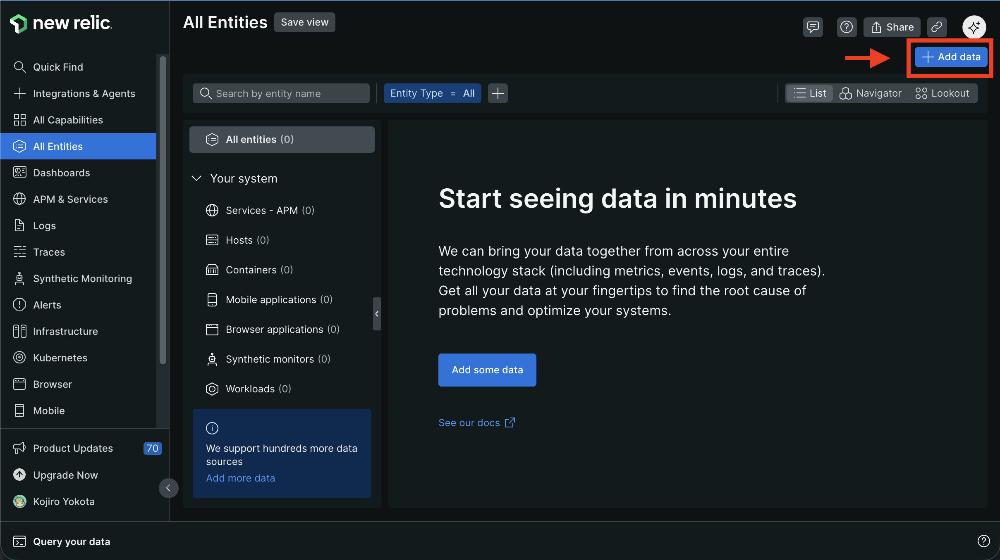
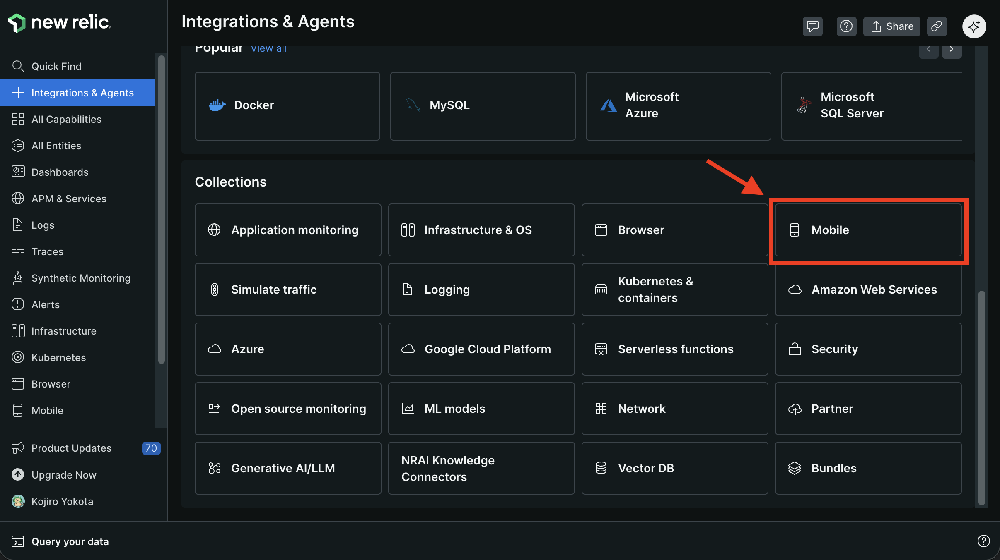
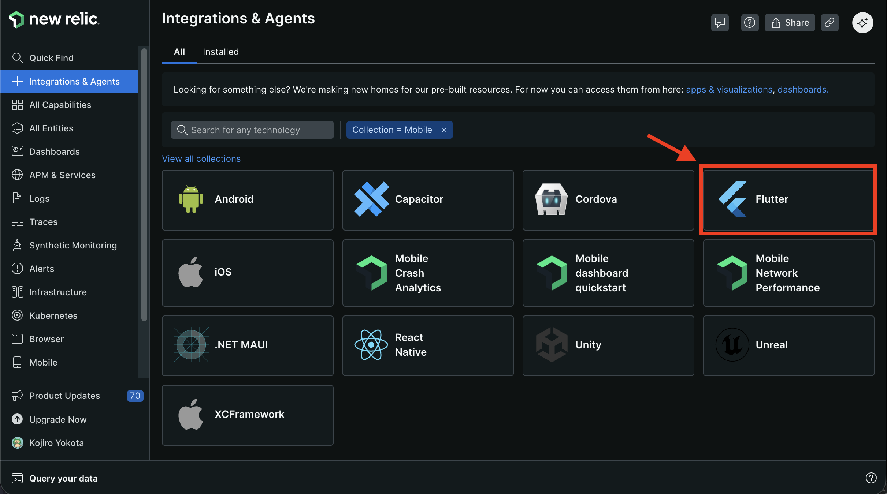
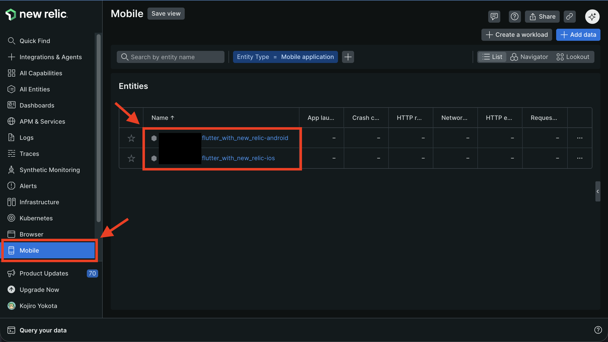
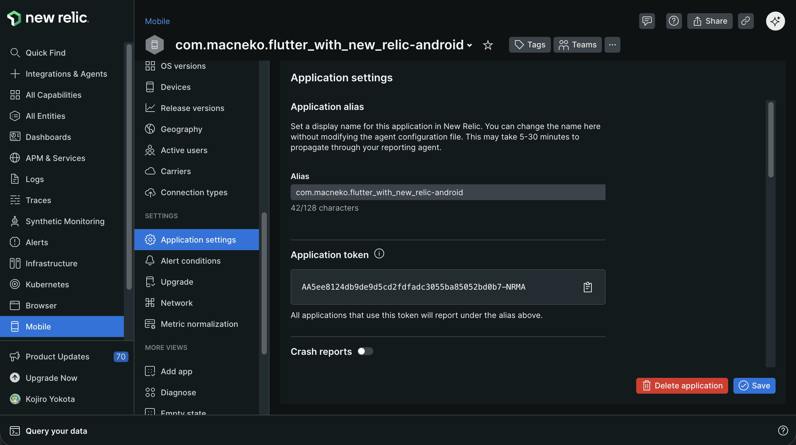

<div class="doc-header">
  <div class="doc-title">Flutter アプリに New Relic を導入してモバイル監視を始めよう</div>
  <div class="doc-author">横田 孝次郎</div>
</div>

# Flutter アプリに New Relic を導入してモバイル監視を始めよう

## はじめに

モバイルアプリを本番環境で運用していると、「ユーザーから問い合わせが来て初めてクラッシュしていたことに気づいた」「どの機能がよく使われているのかデータがない」という状況に陥りがちです。

New Relicはアプリケーションの監視・分析を行うプラットフォームで、モバイルアプリ向けの機能も充実しています。クラッシュの自動検知から、ユーザーがどの操作をしたかのイベント記録まで、アプリの「見えない部分」を可視化できます。

本記事では、Flutter製のGitHubリポジトリ検索アプリを題材に、New Relicの導入手順と主要機能を一通り紹介します。

## サンプルアプリの概要

本記事で使用するアプリは、GitHubのリポジトリを検索・閲覧・お気に入り登録できるFlutterアプリです。

アプリは4つの画面で構成されています。

検索画面は、テキストを入力するとGitHub APIを通じてリポジトリを検索します。検索結果はスター数・フォーク数・更新日時などでソートでき、ソートボタンをタップするとボトムシートから並び順を選べます。一覧を下にスクロールすると追加で読み込まれる無限スクロールにも対応しています。各リポジトリの行をタップすると詳細画面に遷移し、ハートアイコンをタップするとお気に入りに登録できます。

<!-- TODO: 検索画面・ソートボトムシートのスクリーンショット -->

お気に入り画面は、登録したリポジトリの一覧を表示します。SharedPreferencesで永続化されているため、アプリを終了しても内容は保持されます。

<!-- TODO: お気に入り画面のスクリーンショット -->

リポジトリ詳細画面では、スター数・フォーク数・ウォッチャー数・使用言語といった詳細情報を確認できます。

<!-- TODO: リポジトリ詳細画面のスクリーンショット -->

デバッグ画面は、Control+Dキーで開く隠しページです。強制クラッシュや非同期例外などのエラーを意図的に発生させるボタンが並んでおり、New Relicの動作確認に使います。

<!-- TODO: デバッグ画面のスクリーンショット -->

技術スタックは状態管理にRiverpod、画面遷移に型安全なGo Router、モデル定義にFreezerを採用しています。

## New Relicとは

New Relic[^newrelic]は、Webサービスからモバイルアプリまで幅広い用途に対応するオブザーバビリティプラットフォームです。アプリの内部状態をリアルタイムで収集・分析でき、問題の検知から原因の特定まで一つのダッシュボードで完結します。

[^newrelic]: https://newrelic.com/jp

Flutter向けには `newrelic_mobile`[^newrelic_package] というパッケージが公式に提供されており、次に挙げたような機能を利用できます。

| 機能 | 概要 |
|------|------|
| クラッシュ自動キャプチャ | クラッシュ発生時のスタックトレース・デバイス情報を自動収集 |
| エラー手動記録 | try-catchで捕捉したエラーを属性付きで送信（Handled Exceptions） |
| ログ記録 | `logDebug` / `logInfo` / `logWarning` / `logError` でレベル別にログを残す |
| ブレッドクラム | クラッシュ・エラー発生前の操作履歴を時系列で記録 |
| カスタムイベント | 任意のユーザー行動データをイベント名と属性で送信 |
| ネットワーク監視 | HTTPリクエストのレスポンスタイムや成功・失敗を自動追跡 |
| スクリーン遷移追跡 | NavigationObserverと連携して画面遷移を自動記録 |

収集したデータはNRQLというSQLライクなクエリ言語で自由に検索・集計でき、独自のダッシュボードを作成することもできます。

[^newrelic_package]: https://pub.dev/packages/newrelic_mobile

## 導入と初期設定

New Relic が用意しているガイドやドキュメント[^ドキュメント]にしたがってステップ・バイ・ステップで進めることで、New Relic のセットアップが可能です。しかし、ガイドやドキュメントの記述内容に齟齬があったり、記載内容の古い箇所が散見されたりしてセットアップに苦労したため、本記事では一部の手順のみウィザードを利用し、それ以外の手順は個別のトピックとして切り出して紹介します。

[^ドキュメント]: https://docs.newrelic.com/docs/mobile-monitoring/new-relic-mobile-flutter/monitor-your-flutter-application/

### New Relic の Mobile Entities を追加する

New Relic を Flutter アプリから利用するためには、New Relic の Mobile Entities を追加します。  
まずNew Relicのダッシュボードを開き、「All Entiites」→「Add Data」をクリックします。



続いて、「Mobile」をクリックします。



続いて、「Fluter」をクリックします。



最後に iOS アプリの Bundle Identifier と Android の Package name をテキストフィールドに入力して、テキストフィールドの下にある Create をクリックすると、Mobile Entities が作成されます。

作成された Mobile Entities はダッシュボードの左ペインから「Mobile」をクリックすると、右ペインに表示されます。今回は iOS と Android を追加したため、2 つ作成されています。  
Entities の名称にはルールがあり、iOS の場合は Bundle Identifier の末尾に`-ios` が付与されたもの、Android の場合は Package name の末尾に `-android` が付与されたものになり、末尾に追加される suffix を含めて 128 文字以内という制約があります。。



### New Relic のアプリケーショントークンを取得する

New Relic のアプリケーショントークンは iOS と Android で別個のトークンが生成されます。  
生成されたトークンは Entity の「Application settings」で確認できます。まず Mobile Entities から任意の Entity をクリックします。続いて、表示された画面の左ペインから「Application settings」をクリックすると、右ペインに Application Token が表示されます。



### アプリケーショントークンを Flutter アプリに組み込む

取得したトークンを Flutter アプリに組み込む際はセキュリティの観点からソースコードに直接ベタ書きすることは避けたいので、`--dart-define` を使って外部から渡します。プロジェクトルートに `.dart_define.json` を作成し、トークンを記述します。

```json
{
  "NEW_RELIC_ANDROID_TOKEN": "ここにAndroid用のトークン",
  "NEW_RELIC_IOS_TOKEN": "ここにiOS用のトークン"
}
```

このファイルはトークンが含まれるため、`.gitignore` に追加してリポジトリにはコミットしません。代わりに `.dart_define.json.example` などのテンプレートをコミットしておくと、チームメンバーが参照しやすくなります。

アプリを実行・ビルドする際は `--dart-define-from-file` オプションでファイルを指定します。

```bash
# 開発用
flutter run --dart-define-from-file=.dart_define.json

# リリースビルド
flutter build ios --dart-define-from-file=.dart_define.json
flutter build apk --dart-define-from-file=.dart_define.json
```

VSCodeを使っている場合は `.vscode/launch.json` の各設定に `toolArgs` を追加しておくと、F5キーで起動するだけで自動的に読み込まれます。

```json
{
  "configurations": [
    {
      "name": "flutter_with_new_relic",
      "request": "launch",
      "type": "dart",
      "toolArgs": ["--dart-define-from-file", ".dart_define.json"]
    }
  ]
}
```

### パッケージの追加

`pubspec.yaml` に `newrelic_mobile` を追加して `flutter pub get` を実行します。

```yaml
dependencies:
  go_router: ^16.3.0
  newrelic_mobile: ^1.1.21
```

`newrelic_mobile 1.1.17` 以降は `go_router >=7.0.0 <17.0.0` への依存が追加されています。そのため、`go_router ^17.x` を使用しているプロジェクトでは競合が発生します。本記事では `go_router` を `^16.3.0` に固定して利用しています。

### Androidの設定

`android/settings.gradle.kts` の `plugins` ブロックにNew RelicのGradleプラグインを追加します。

```kotlin
plugins {
    id("com.newrelic.agent.android") version "7.6.7" apply false
}
```

`android/app/build.gradle.kts` の `plugins` ブロックでプラグインを適用します。

```kotlin
plugins {
    id("com.newrelic.agent.android")
}
```

### iOSの設定

`newrelic_mobile 1.1.21` からiOS 16が最低動作要件になっています。プロジェクトのiOS最小ターゲットが16未満の場合は、2箇所の変更が必要です。

まず `ios/Podfile` のプラットフォーム指定を更新します。

```ruby
platform :ios, '16.0'
```

次に、Xcodeで `ios/Runner.xcodeproj` を開き、Runnerターゲットを選択して「General」タブの「Minimum Deployments」にある「iOS」のバージョンを `16.0` 以上に変更します。

### main.dartの初期化

SDKの初期化は `main()` の先頭で行います。`NewrelicMobile.instance.start()` にConfigとアプリ起動処理を渡す形です。`String.fromEnvironment()` で `--dart-define` で渡した値を読み込みます。

```dart
import 'dart:io';
import 'dart:async';
import 'package:newrelic_mobile/newrelic_mobile.dart';
import 'package:newrelic_mobile/config.dart';

void main() async {
  WidgetsFlutterBinding.ensureInitialized();

  const androidToken = String.fromEnvironment('NEW_RELIC_ANDROID_TOKEN');
  const iosToken = String.fromEnvironment('NEW_RELIC_IOS_TOKEN');
  final appToken = Platform.isAndroid ? androidToken : iosToken;

  final config = Config(
    accessToken: appToken,
    analyticsEventEnabled: true,
    crashReportingEnabled: true,
    networkRequestEnabled: true,
    interactionTracingEnabled: true,
  );

  FlutterError.onError = NewrelicMobile.onError;

  final prefs = await SharedPreferences.getInstance();

  runZonedGuarded(
    () {
      NewrelicMobile.instance.start(config, () {
        runApp(
          ProviderScope(
            overrides: [
              sharedPreferencesProvider.overrideWithValue(prefs),
            ],
            child: const MyApp(),
          ),
        );
      });
    },
    (error, stackTrace) {
      NewrelicMobile.instance.recordError(error, stackTrace);
    },
  );
}
```

Configの設定項目は用途に応じてオン・オフできます。`crashReportingEnabled` でクラッシュの自動収集、`networkRequestEnabled` でHTTPリクエストの自動追跡、`analyticsEventEnabled` でカスタムイベントの送信がそれぞれ有効になります。

`FlutterError.onError = NewrelicMobile.onError;` の1行で、WidgetツリーのビルドエラーなどFlutter固有のエラーも自動的にNew Relicへ送られます。

`runZonedGuarded` で囲むことで、`Future` や `Stream` 内で発生した非同期エラーも `recordError()` に渡せます。

### スクリーン遷移の追跡

Go RouterのルーターにNavigationObserverを渡すことで、画面遷移が自動記録されます。

```dart
import 'package:newrelic_mobile/newrelic_navigationobserver.dart';

final router = GoRouter(
  observers: [NewRelicNavigationObserver()],
  routes: [
    // ...
  ],
);
```

## 機能①：クラッシュ監視

クラッシュ監視は、`crashReportingEnabled: true` を設定するだけで有効になります。アプリがクラッシュすると、次回起動時にスタックトレース・デバイスのOS・バージョン・機種情報などが自動的にNew Relicへ送信されます。追加のコードは不要です。

サンプルアプリのデバッグ画面には「強制クラッシュ」ボタンがあり、タップすると `throw Exception()` が実行されてアプリが落ちます。アプリを再起動するとNew Relicにレポートが届きます。

収集したクラッシュはダッシュボードの「Crash analysis」で確認できます。クラッシュ率の推移グラフ、影響を受けたユーザー数、スタックトレースの詳細、クラッシュが多く発生しているOSバージョンの内訳などが一覧できます。

<!-- TODO: New Relic「Crash analysis」ダッシュボードのスクリーンショット -->

## 機能②：エラー監視（Handled Exceptions）

クラッシュに至らないエラー、つまり `try-catch` で捕捉しているエラーは自動では収集されません。このようなエラーは `recordError()` を使って手動で送信します。

```dart
try {
  // 処理
} catch (error, stackTrace) {
  NewrelicMobile.instance.recordError(
    error,
    stackTrace,
    attributes: {
      'screen': 'search',
      'action': 'fetch_repositories',
    },
  );
}
```

`attributes` に任意のキーバリューを渡すことで、エラーが発生した画面やアクションといった文脈情報を付加できます。同じ例外クラスのエラーでも、attributesで絞り込んで原因を特定しやすくなります。

サンプルアプリのデバッグ画面にある「非同期例外」ボタンは、`Future` 内でエラーを発生させて `recordError()` で送信するデモです。

送信したエラーはダッシュボードの「Handled exceptions」で確認できます。

<!-- TODO: New Relic「Handled exceptions」ダッシュボードのスクリーンショット -->

## 機能③：ログとブレッドクラム

New RelicはFlutterのloggerライクなAPIを提供しています。

```dart
NewrelicMobile.instance.logDebug('検索クエリ: $query');
NewrelicMobile.instance.logInfo('検索完了: $totalCount 件');
NewrelicMobile.instance.logWarning('検索結果が0件でした');
NewrelicMobile.instance.logError('APIレスポンスの解析に失敗しました');
```

ブレッドクラムは、クラッシュやエラーが発生した際に「そこに至るまでの操作履歴」を辿るための機能です。クラッシュレポートにブレッドクラムが紐付いて表示されるため、再現手順の調査が容易になります。

```dart
NewrelicMobile.instance.recordBreadcrumb(
  'SearchExecuted',
  eventAttributes: {
    'query': query,
    'sort': currentSort.name,
  },
);
```

サンプルアプリでは `search_provider.dart` 内のGitHub API呼び出し処理にブレッドクラムを追加することで、「どんなクエリでいつ検索を実行したか」の履歴を残せます。

記録したログやブレッドクラムはダッシュボードから確認できます。

<!-- TODO: New Relicブレッドクラム一覧のスクリーンショット -->

## 機能④：カスタムイベントでユーザー行動を分析する

クラッシュやエラーだけでなく、「どのリポジトリがよくタップされているか」「どのソート順が使われているか」といったユーザー行動のデータも取得できます。これには `recordCustomEvent()` を使います。

```dart
NewrelicMobile.instance.recordCustomEvent(
  'RepositoryTapped',
  eventAttributes: {
    'author': repository.owner.login,
    'repositoryName': repository.name,
    'source': 'search',
  },
);
```

第1引数がイベント名、`eventAttributes` にそのイベントに紐付けたい属性を渡します。あとはNRQLでイベント名を指定して自由に集計できます。

サンプルアプリで計測するイベントは次のとおりです。

| イベント名 | 発生タイミング | 送信する属性 |
|-----------|-------------|------------|
| `RepositoryTapped` | リポジトリをタップしたとき | author, repositoryName, source（検索またはお気に入り画面） |
| `SortOrderChanged` | ソート順を変更したとき | sortOrder（enum名）, sortLabel（表示テキスト） |
| `FavoriteAdded` | お気に入りに追加したとき | author, repositoryName |
| `FavoriteRemoved` | お気に入りを解除したとき | author, repositoryName |

NRQLクエリを使った活用例をいくつか紹介します。

よくタップされたリポジトリのランキングは次のクエリで取得できます。

```sql
SELECT count(*) FROM RepositoryTapped
FACET repositoryName
SINCE 1 day ago
ORDER BY count(*) DESC
LIMIT 10
```

ソート機能がどのように使われているかは次のクエリで把握できます。

```sql
SELECT count(*) FROM SortOrderChanged
FACET sortLabel
SINCE 7 days ago
```

お気に入りの追加と解除の件数を比較するには次のようにします。

```sql
SELECT count(*) FROM FavoriteAdded, FavoriteRemoved
FACET eventType()
SINCE 7 days ago
```

これらのクエリをダッシュボードに並べておくことで、アプリの利用傾向を継続的にモニタリングできます。

<!-- TODO: NRQLクエリ結果またはカスタムダッシュボードのスクリーンショット -->

## まとめ

本記事ではNew Relicを導入する手順を説明しました。

New Relicを導入することで、クラッシュが発生した際にはスタックトレースとデバイス情報が自動で届き、捕捉したエラーにはコンテキスト情報を付加して送れます。ユーザーがどのリポジトリに興味を持ち、どう操作しているかもNRQLで集計・可視化できます。

`newrelic_mobile` の導入自体は `pubspec.yaml` へのパッケージ追加と `main.dart` の初期化コードを書くだけで完了します。あとは記録したいイベントやログを送信するための数行のコードを追加していくだけなので、既存プロジェクトへの組み込みも難しくありません。

## 参考

- [newrelic_mobile | pub.dev](https://pub.dev/packages/newrelic_mobile)
- [Monitor your Flutter application | New Relic Docs](https://docs.newrelic.com/docs/mobile-monitoring/new-relic-mobile-flutter/monitor-your-flutter-application/)
