# Flutter アプリに New Relic を導入してモバイル監視・分析を始める

## はじめに

モバイルアプリを本番環境で運用していると、「ユーザーから問い合わせが来て初めてクラッシュしていたことに気づいた」「どの機能がよく使われているのかデータがない」という状況に陥りがちです。

New Relic はアプリケーションの監視・分析を行うプラットフォームで、モバイルアプリ向けの機能も充実しています。クラッシュの自動検知から、ユーザーがどの操作をしたかのイベント記録まで、アプリの「見えない部分」を可視化できます。

本記事では、Flutter 製の GitHub リポジトリ検索アプリを題材に、New Relic の導入手順と主要機能を一通り紹介します。

## サンプルアプリの概要

本記事で使用するアプリは、GitHub のリポジトリを検索・閲覧・お気に入り登録できる Flutter アプリです。

アプリは4つの画面で構成されています。

検索画面では、テキストを入力すると GitHub API を通じてリポジトリを検索します。検索結果はスター数・フォーク数・更新日時などでソートでき、ソートボタンをタップするとボトムシートから並び順を選べます。一覧を下にスクロールすると追加で読み込まれる無限スクロールに対応しています。各リポジトリの行をタップすると詳細画面に遷移し、ハートアイコンをタップするとお気に入りに登録できます。

お気に入り画面は、登録したリポジトリの一覧を表示します。SharedPreferences で永続化されているため、アプリを終了しても内容は保持されます。

リポジトリ詳細画面では、スター数・フォーク数・ウォッチャー数・使用言語といった詳細情報を確認できます。

デバッグ画面は、iOS Simulator または Android Emulator でアプリを起動した際に左 Shift+D キーで開く隠しページです。強制クラッシュや非同期例外などのエラーを意図的に発生させるボタンが並んでおり、New Relic の動作確認に使います。

| 検索 | お気に入り | リポジトリ詳細 | デバッグ |
| --- | --- | --- | --- |
| 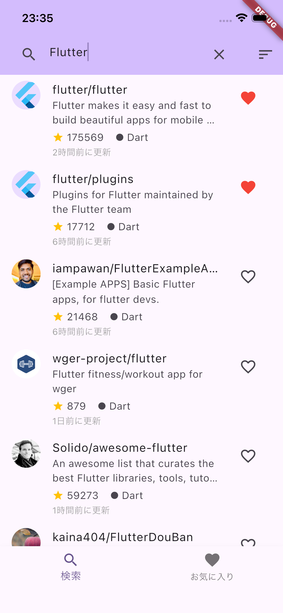 | 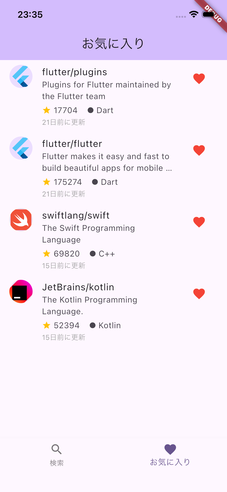 | 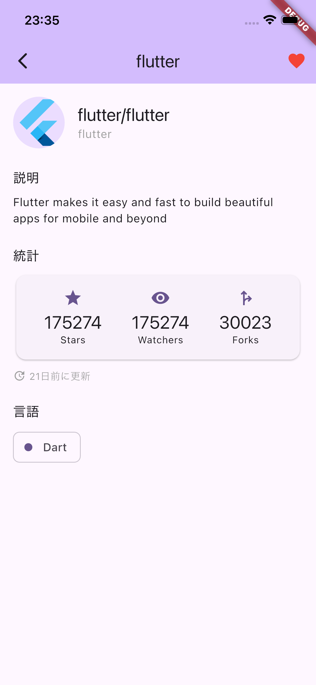 | 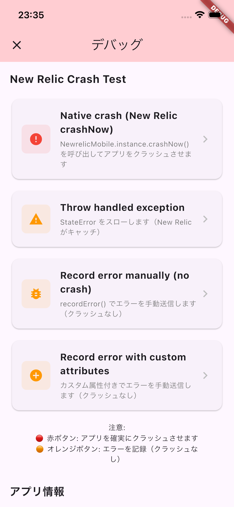 |

技術スタックは状態管理に Riverpod、画面遷移に Go Router、モデル定義に Freezed を採用しています。

GitHub でサンプルアプリを公開しておりますので、参考にしてください。


## New Relicとは

New Relic[^newrelic] は、Web サービスからモバイルアプリまで幅広い用途に対応するアプリケーションの監視・分析を行うプラットフォームです。アプリの内部状態をリアルタイムで収集・分析でき、問題の検知から原因の特定まで一つのダッシュボードで完結します。

[^newrelic]: https://newrelic.com/jp

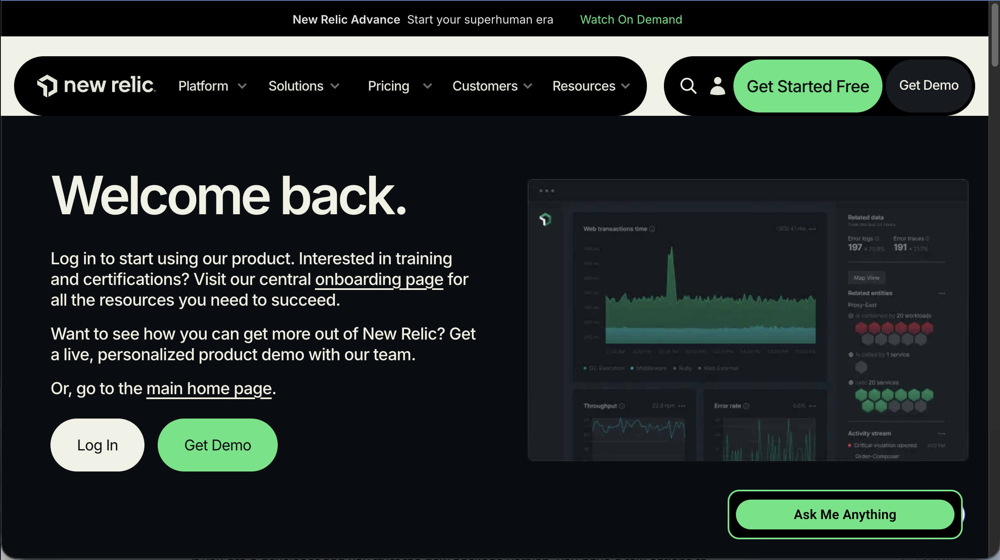

Flutter 向けには `newrelic_mobile`[^newrelic_package] というパッケージが公式に提供されており、次に挙げたような機能を利用できます。

| 機能 | 概要 |
|------|------|
| クラッシュ自動キャプチャ | クラッシュ発生時のスタックトレース・デバイス情報を自動収集 |
| エラー手動記録 | try-catch で捕捉したエラーを属性付きで送信（Handled Exceptions ＝捕捉した例外） |
| ログ記録 | `logDebug` / `logInfo` / `logWarning` / `logError` でレベル別にログを残す |
| ブレッドクラム | クラッシュ・エラー発生前の操作履歴を時系列で記録 |
| カスタムイベント | 任意のユーザー行動データをイベント名と属性で送信 |
| ネットワーク監視 | HTTP リクエストのレスポンスタイムや成功・失敗を自動追跡 |
| スクリーン遷移追跡 | NavigationObserver と連携して画面遷移を自動記録 |

収集したデータは NRQL[^nrql] という SQL ライクなクエリ言語で自由に検索・集計でき、`SELECT` / `FROM` / `WHERE` / `FACET` などで集計やダッシュボード作成ができます。

[^nrql]: https://docs.newrelic.com/docs/nrql/get-started/introduction-nrql-new-relics-query-language

[^newrelic_package]: https://pub.dev/packages/newrelic_mobile

## 導入と初期設定

New Relic が用意しているガイドやドキュメント[^ドキュメント]にしたがってステップ・バイ・ステップで進めることで、New Relic のセットアップが可能です。しかし、ガイドやドキュメントの記述内容に齟齬があったり、記載内容の古い箇所が散見されたりしてセットアップに苦労したため、本記事では一部の手順のみウィザードを利用し、それ以外の手順は個別のトピックとして切り出して紹介します。

手順の流れは、まず New Relic のダッシュボードで Mobile Entity を作成してアプリケーショントークンを取得したのち、Flutter プロジェクトではパッケージの追加、iOS/Android のネイティブ設定、`main.dart` での初期化の順で進めます。

[^ドキュメント]: https://docs.newrelic.com/docs/mobile-monitoring/new-relic-mobile-flutter/monitor-your-flutter-application/

### New Relic の Mobile Entities を追加する

このステップで行うことは、ダッシュボードで iOS 用・Android 用の Entity を作成し、のちに Flutter アプリから利用するトークンの取得元を用意することです。

New Relic では、1 つの Mobile Entity が 1 プラットフォーム（iOS 用または Android 用）に対応する単位でアプリを登録します。Flutter アプリから利用するには、少なくとも iOS 用と Android 用の 2 つの Entity を追加します。

まず New Relic のダッシュボードを開き、「All Entities」→「Add Data」をクリックします。

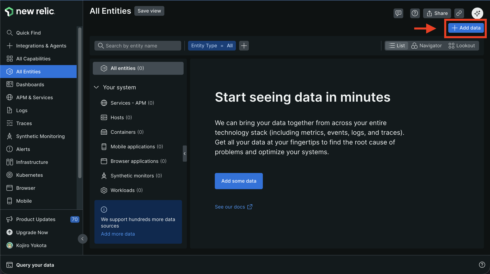

続いて、「Mobile」をクリックします。

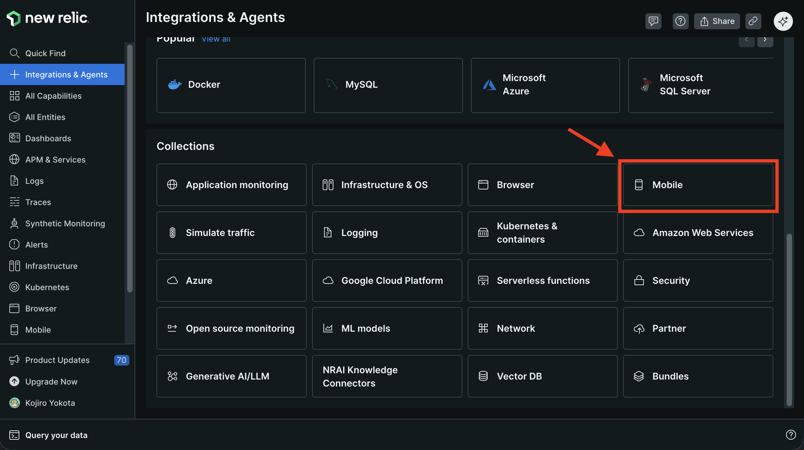

続いて、「Flutter」をクリックします。

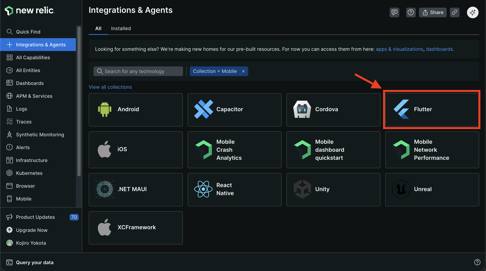

最後に iOS アプリの Bundle Identifier と Android の Package name をテキストフィールドに入力して、テキストフィールドの下にある Create をクリックすると、Mobile Entities が作成されます。

作成された Mobile Entities はダッシュボードの左ペインから「Mobile」をクリックすると、右ペインに表示されます。今回は iOS と Android を追加したため、2 つ作成されています。

Entities の名称にはルールがあり、iOS の場合は Bundle Identifier の末尾に`-ios` が付与されたもの、Android の場合は Package name の末尾に `-android` が付与されたものになり、末尾に追加される suffix を含めて 128 文字以内という制約があります。

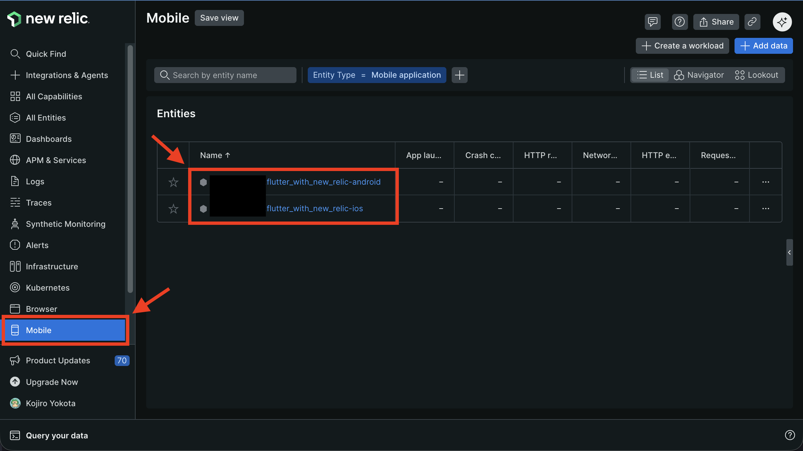

### New Relic の Application Token を取得する

このステップで行うことは、各 Mobile Entity に紐づく Application Token を確認し、Flutter アプリに渡すために控えておくことです。

New Relic の Application Token は iOS用 と Android用 で別個のトークンが生成されます。

生成されたトークンは Entity の「Application settings」で確認できます。まず Mobile Entities から任意の Entity をクリックします。続いて、表示された画面の左ペインから「Application settings」をクリックすると、右ペインに Application Token が表示されます。

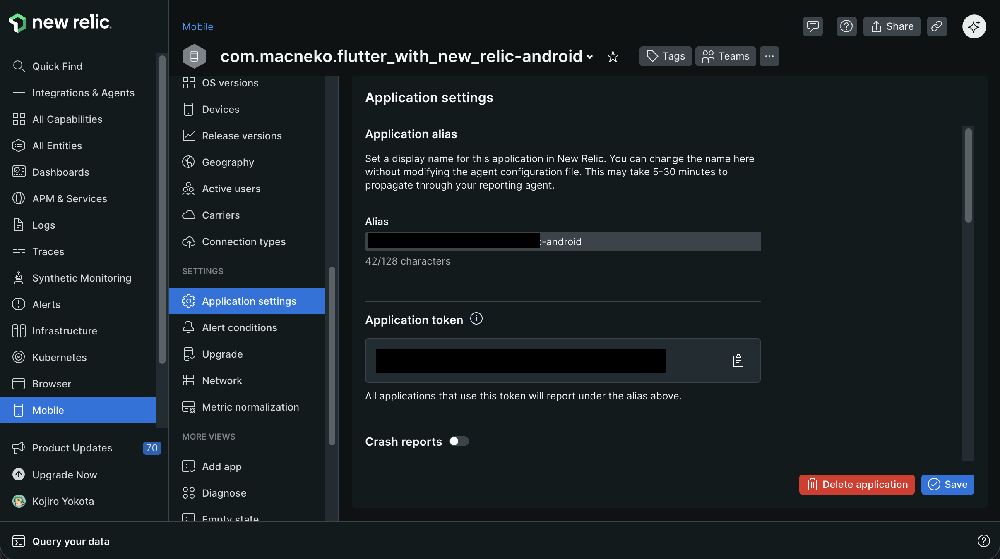

### アプリケーショントークンを Flutter アプリに組み込む

取得したトークンを Flutter アプリに組み込む際はセキュリティの観点からソースコードに直接ベタ書きすることは避けたいので、`--dart-define` を使って外部から渡します。プロジェクトルートに `.dart_define.json` を作成し、トークンを記述します。

```json
{
  "NEW_RELIC_ANDROID_TOKEN": "ここにAndroid用のトークン",
  "NEW_RELIC_IOS_TOKEN": "ここにiOS用のトークン"
}
```

このファイルはトークンが含まれるため、`.gitignore` に追加してリポジトリにはコミットしません。代わりに `.dart_define.json.example` などのテンプレートをコミットしておくと、チームメンバーが参照しやすくなります。

アプリを実行・ビルドする際は `--dart-define-from-file` オプションでファイルを指定します。

```bash
# 開発用
flutter run --dart-define-from-file=.dart_define.json

# リリースビルド
flutter build ios --dart-define-from-file=.dart_define.json
flutter build apk --dart-define-from-file=.dart_define.json
```

VSCode を使っている場合は `.vscode/launch.json` の各設定に `toolArgs` を追加しておくと、VSCode からアプリを起動する際に自動的に読み込まれます。

```json
{
  "configurations": [
    {
      "name": "flutter_with_new_relic",
      "request": "launch",
      "type": "dart",
      "toolArgs": ["--dart-define-from-file", ".dart_define.json"]
    }
  ]
}
```

### パッケージの追加

`pubspec.yaml` に `newrelic_mobile` を追加して `flutter pub get` を実行します。

```yaml
dependencies:
  go_router: ^16.3.0
  newrelic_mobile: ^1.1.21
```

記事執筆時点では、`newrelic_mobile` の v1.1.17 以降で `go_router >=7.0.0 <17.0.0` への依存が追加されています。そのため、`go_router` の `v17.x` 以上を使用しているプロジェクトでは競合が発生します。本記事では `go_router` を `^16.3.0` に固定して利用しています。

### iOS の設定

`newrelic_mobile` の `v1.1.21` から iOS 16 が最低動作要件になっています。プロジェクトの iOS 最小ターゲットが 16 未満の場合は、2 箇所の変更が必要です。

まず `ios/Podfile` のプラットフォーム指定を更新します。

```ruby
platform :ios, '16.0'
```

次に、Xcodeで `ios/Runner.xcodeproj` を開き、Runner ターゲットを選択して「General」タブの「Minimum Deployments」にある「iOS」のバージョンを `16.0` 以上に変更します。

### Android の設定

`android/settings.gradle.kts` の `plugins` ブロックに New Relic の Gradle プラグインを追加します。

```kotlin
plugins {
    id("com.newrelic.agent.android") version "7.6.7" apply false
}
```

`android/app/build.gradle.kts` の `plugins` ブロックでプラグインを適用します。

```kotlin
plugins {
    id("com.newrelic.agent.android")
}
```

### main.dartの初期化

SDK の初期化は `main()` のできるだけ早い段階で行います。`NewrelicMobile.instance.startAgent(config)` で Config を渡してエージェントを起動し、`String.fromEnvironment()` で `--dart-define` から渡したトークンを読み込みます。また、アプリで先に `SharedPreferences.getInstance()` を取得し、そのあと `runApp` で `ProviderScope` に渡すことで、他プロバイダから同期的に参照できるようにしています。

```dart
import 'dart:io';
import 'dart:async';
import 'package:newrelic_mobile/newrelic_mobile.dart';
import 'package:newrelic_mobile/config.dart';

void main() async {
  WidgetsFlutterBinding.ensureInitialized();

  const androidToken = String.fromEnvironment('NEW_RELIC_ANDROID_TOKEN');
  const iosToken = String.fromEnvironment('NEW_RELIC_IOS_TOKEN');
  final appToken = Platform.isAndroid ? androidToken : iosToken;

  final config = Config(
    accessToken: appToken,
    analyticsEventEnabled: true,
    crashReportingEnabled: true,
    networkRequestEnabled: true,
    interactionTracingEnabled: true,
  );

  final prefs = await SharedPreferences.getInstance();

  await runZonedGuarded(
    () async {
      FlutterError.onError = NewrelicMobile.onError;
      await NewrelicMobile.instance.startAgent(config);
    },
    (error, stackTrace) {
      NewrelicMobile.instance.recordError(error, stackTrace);
    },
  );

  runApp(
    ProviderScope(
      overrides: [sharedPreferencesProvider.overrideWithValue(prefs)],
      child: const MyApp(),
    ),
  );
}
```

Config の設定項目は用途に応じてオン・オフできます。`crashReportingEnabled` でクラッシュの自動収集、`networkRequestEnabled` で HTTP リクエストの自動追跡、`analyticsEventEnabled` でカスタムイベントの送信がそれぞれ有効になります。

`FlutterError.onError = NewrelicMobile.onError;` の 1 行で、Widget ツリーのビルドエラーなど Flutter 固有のエラーも自動的に New Relic へ送られます。

`runZonedGuarded` で囲むことで、`Future` や `Stream` 内で発生した非同期エラーも `recordError()` に渡せます。

### スクリーン遷移の追跡

Go Router のインスタンス生成処理で `observers` に `NewRelicNavigationObserver` を渡すと、画面遷移を自動的に記録できます。

```dart
import 'package:newrelic_mobile/newrelic_navigation_observer.dart';

final router = GoRouter(
  observers: [NewRelicNavigationObserver()],
  routes: $appRoutes,
);
```

`NewRelicNavigationObserver` は Go Router の `RouteObserver` を拡張したクラスで、画面遷移のたびに `recordBreadcrumb()` を自動で呼び出します。Breadcrumb はクラッシュやエラーが発生した際に「そこに至るまでの操作履歴」を辿るための機能で、New Relic に送信されたレポート（たとえばクラッシュレポート）の「Event Tail」から遷移履歴を確認できます。

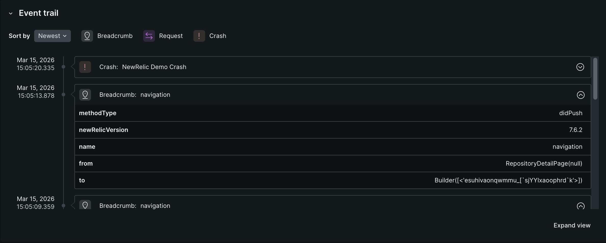

一方、タブの切り替えは Go Router を経由しないため画面遷移として自動記録されません。そのため、タブをタップした際に `NewrelicMobile.instance.recordBreadcrumb()` を呼び出して、操作履歴として記録するようにしています。

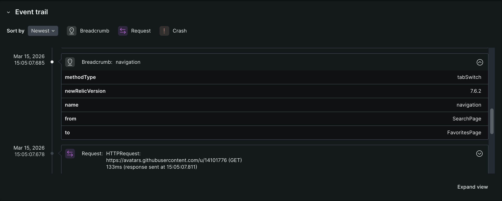

```dart
void _onItemTapped(int index) {
  NewrelicMobile.instance.recordBreadcrumb(
    'navigation',
    eventAttributes: {
      'methodType': 'tabSwitch',
      'from': _tabNames[_selectedIndex],
      'to': _tabNames[index],
    },
  );
  setState(() {
    _selectedIndex = index;
  });
}
```

## 監視・分析機能の活用

New Relic が提供する監視・分析機能のうち、今回のサンプルアプリで利用した 3 つを紹介します。

### クラッシュ監視

クラッシュ監視は、`crashReportingEnabled: true` を設定するだけで有効になります。Firebase Crashlytics などと同様に、アプリがクラッシュすると次回起動時にスタックトレース・デバイスの OS・バージョン・機種情報などが自動的に New Relic へ送信されます。追加のコードは不要です。

サンプルアプリのデバッグ画面には「強制クラッシュ」ボタンがあり、タップすると `NewrelicMobile.instance.crashNow()` が実行されてアプリがクラッシュします。アプリを再起動すると New Relic にレポートが届きます。

収集したクラッシュはダッシュボードの「Crashes」で確認できます。クラッシュ率の推移グラフ、影響を受けたユーザー数、スタックトレースの詳細、クラッシュが多く発生している OS バージョンの内訳などが一覧できます。

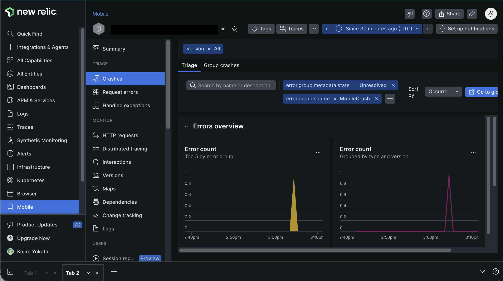

### エラー監視（Handled Exceptions＝捕捉した例外）

クラッシュに至らないエラーを手動で New Relic に記録するには `recordError()` を使います。New Relic ではこの種の記録を Handled Exceptions（捕捉した例外）と呼びます。サンプルアプリのデバッグ画面には、このパターンを確認できる 2 種類のボタンがあります。

「Throw handled exception」ボタンは `throw StateError(...)` を実行します。スローされた例外は `FlutterError.onError` 経由で New Relic が自動的にキャッチします。アプリはクラッシュせず、Handled Exception として記録されます。

「Record error with custom attributes」ボタンは `recordError()` を直接呼び出します。`attributes` に任意の Key/Value を渡すことで、エラーが発生した状況の文脈情報を付加できます。

```dart
NewrelicMobile.instance.recordError(
  Exception('Test: Error with custom attributes'),
  StackTrace.current,
  attributes: {
    'testType': 'manual',
    'userId': 'test_user_123',
    'feature': 'crash_test',
  },
);
```

送信したエラーはダッシュボードの「Handled exceptions」で確認できます。

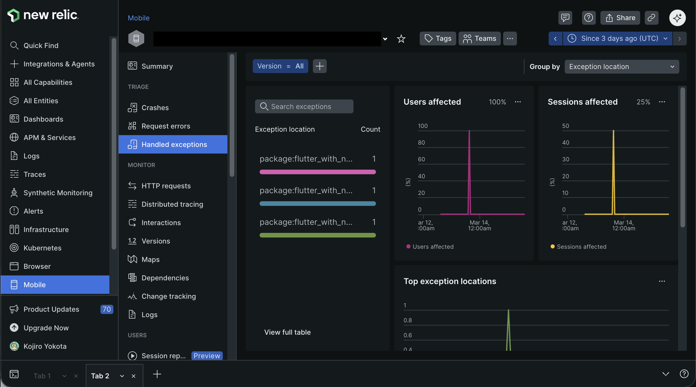

### カスタムイベントでユーザー行動を分析する

クラッシュやエラーだけでなく、「どのソート順が使われているか」といったユーザー行動のデータも取得できます。これには `recordCustomEvent()` を使います。

```dart
NewrelicMobile.instance.recordCustomEvent(
  'SortOrderChanged',
  eventAttributes: {
    'sortOrder': order.name,
    'sortLabel': order.label,
  },
);
```

第 1 引数がイベント名（サンプルコードでは `SortOrderChanged` の部分）、`eventAttributes` にそのイベントに紐付けたい属性を渡します。あとは NRQL でイベント名を指定して自由に集計できます。

サンプルアプリでは、ボトムシートからソート順を変更したタイミングで次のイベントを送信しています。

| イベント名 | 発生タイミング | 送信する属性 |
|-----------|-------------|------------|
| `SortOrderChanged` | ソート順を変更したとき | sortOrder（enum名）、sortLabel（表示テキスト） |

ソート機能がどのように使われているかは次の NRQL クエリで把握できます。

```sql
SELECT count(*) FROM SortOrderChanged
FACET sortLabel
SINCE 7 days ago
```

このクエリをダッシュボードに追加しておくことで、どのソート順が好まれているかを継続的にモニタリングできます。

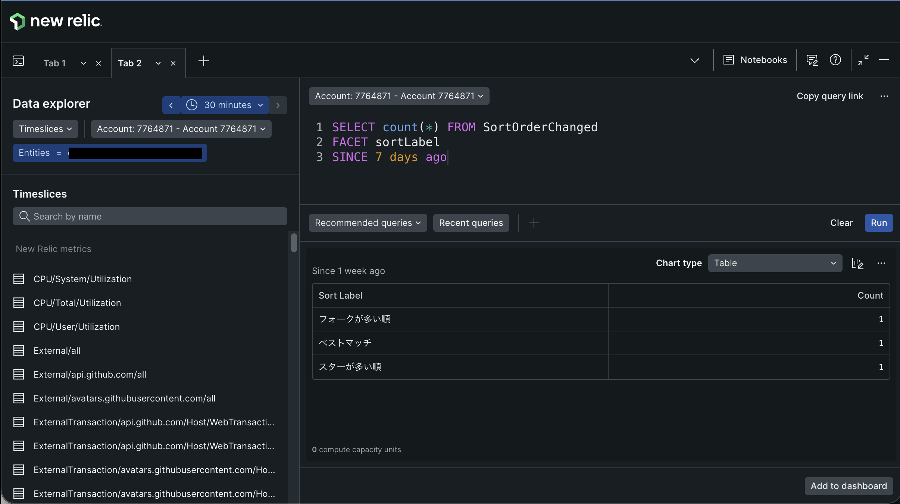

## まとめ

本記事では New Relic を導入する手順を説明しました。

New Relic を導入することで、クラッシュが発生した際にはスタックトレースとデバイス情報が自動で届き、捕捉したエラーにはコンテキスト情報を付加して送れます。ユーザーがどのソート順をよく使うかといった行動データも NRQL で集計・可視化できます。

`newrelic_mobile` の導入自体は `pubspec.yaml` へのパッケージ追加と `main.dart` の初期化コードを書くだけで完了します。あとは記録したいイベントやログを送信するための数行のコードを追加していくだけなので、既存プロジェクトへの組み込みも難しくありません。

## 参考

- [newrelic_mobile | pub.dev](https://pub.dev/packages/newrelic_mobile)
- [Monitor your Flutter application | New Relic Docs](https://docs.newrelic.com/docs/mobile-monitoring/new-relic-mobile-flutter/monitor-your-flutter-application/)
- [Get started with NRQL | New Relic Docs](https://docs.newrelic.com/docs/nrql/get-started/introduction-nrql-new-relics-query-language)
